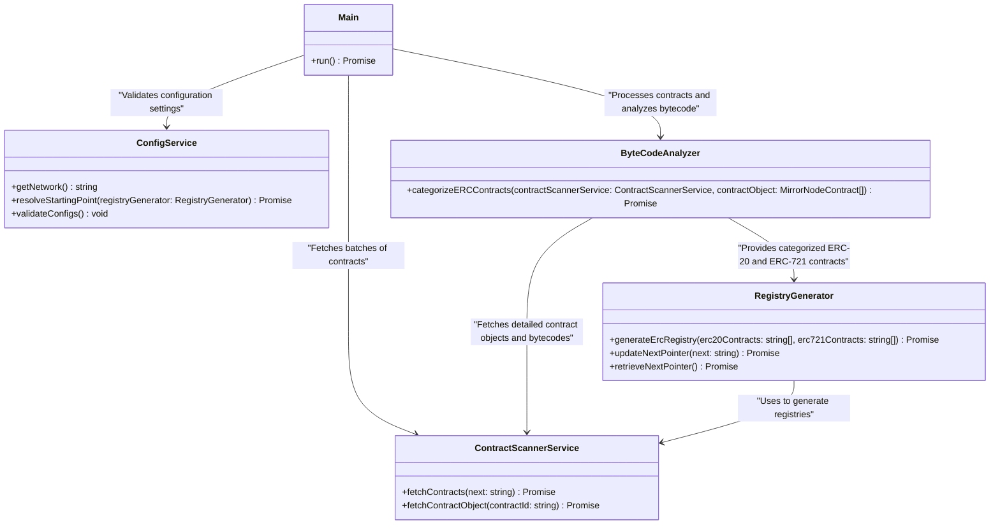

<!-- Filename: .github/workflows_documentation.md -->
# Hedera Smart Contracts Workflows

A detailed overview of how you can use hedera-smart-contract's github workflows for testing purposes. Besides examples, there will be explanations of what is happening under the hood.

## Actions

### Migration Testing

When there is a new version released, no matter if it is network-node, mirror-node, or relay, we want to make sure the entire ecosystem is working as expected and there are not any critical regressions introduced.

Another concern with switching the network node's versions is "the migration" that is running under the hood. It occurs every time a node has been started and detects if there is data for migration. The migration testing workflow offers this type of testing where we can choose versions for pre/post image tags.

Available workflow inputs are:

- **initialNetworkNodeTag** - Specify the initial Network Node image tag
- **initialMirrorNodeTag** - Specify the initial Mirror Node image tag
- **initialRelayTag** - Specify the initial Relay image tag
- **targetNetworkNodeTag** - Specify target Network Node image tag
- **targetMirrorNodeTag** - Specify the target Mirror Node image tag
- **targetRelayTag** - Specify the target Relay image tag
- **preMigrationTestTags** - Specify the pre-migration test tags. Default: @pre-migration. It could be every tag we want (e.g. **@OZERC20**)
- **postMigrationTestTags** - Specify the post-migration test tags. Default: @post-migration. It could be every tag we want (e.g. **@OZERC20**)

Examples:

- if we want to test possible state corruption between mono and mod versions, we could use a setup like this:
  - initialNetworkNodeTag: 0.48.1 # last tag for mono module
  - initialMirrorNodeTag: 0.103.0
  - initialRelayTag: 0.47.0
  - targetNetworkNodeTag: 0.49.7 # first stable tag for modular module
  - targetMirrorNodeTag: 0.103.0
  - targetRelayTag: 0.47.0
  - preMigrationTestTags: @pre-migration
  - postMigrationTestTags: @post-migration
- if we want to check for regressions on @OZERC20 suite after the relay's version update, we could use a setup like this:
  - initialNetworkNodeTag: 0.49.7
  - initialMirrorNodeTag: 0.104.0
  - initialRelayTag: 0.47.0
  - targetNetworkNodeTag: 0.49.7
  - targetMirrorNodeTag: 0.104.0
  - targetRelayTag: 0.48.0
  - preMigrationTestTags: @OZERC20
  - postMigrationTestTags: @OZERC20
- if we want to simulate the mirror node's version update, we could use a setup like this:
  - initialNetworkNodeTag: 0.49.7
  - initialMirrorNodeTag: 0.103.0
  - initialRelayTag: 0.47.0
  - targetNetworkNodeTag: 0.49.7
  - targetMirrorNodeTag: 0.104.0
  - targetRelayTag: 0.47.0
  - preMigrationTestTags: @pre-migration
  - postMigrationTestTags: @post-migration

The testing matrix offers pretty big coverage as we can see. All options and combinations rely on us, and what's our end goal.

### Opcode logger Testing

In order to make opcode logger testing easier, we decided to use Besu's **debug_traceTransaction** responses as a source of truth for executed opcodes. The pipeline execution is as follows:
- installs dependencies
- compiles contracts
- executes `npm run besu:start` - A helper script that starts the local Besu node, the version is hardcoded to 24.6.0 and it uses an official docker image. Exposed ports are:
  - *8540* which is mapped to Besu's HTTP json-rpc relay
  - *8541* which is mapped to Besu's WS json-rpc relay

  All the overridden node properties as miner address, enabled and included apis including custom genesis file are defined in *utils/besu-configs/customConfigFile.toml*. A custom genesis file (defined in *utils/besu-configs/customGenesisFile.toml*) is needed because starting block number of all existing forks till now must be set to 0 when Besu's node is used as a local private testing network. Start-up accounts are included in *customGenesisFile.json* as well and they easily can be expanded with new user-defined ones.
- executes specific tests - These tests have custom before and after methods that detect the target network, and if it is Besu, then execute **debug_traceTransaction** against Besu node and save the opcodes response into JSON file. That step doesn't gain us any coverage, it's needed to generate a source of truth when the same tests are executed against the Hedera local node.
- starts Hedera local node
- executes specific tests - These tests have custom before and after methods that detect the target network, and if it is Hedera, then execute **debug_traceTransaction** against Hedera local node and compare response opcodes with these generated against Besu and saved in JSON several steps above.

Entire Besu's prerequisites and responses generation are required because each time a solidity's compiler version in the **hardhat.config.js** is changed, the developer, who did the update, must locally run these tests against Besu to generate a new hardcoded JSON which will be used for further comparison. That would be needed because let's get for example changes from solidity *0.8.23* and *0.8.24*. Contracts compiled with the older version will not include EIP-5656 (for `MCOPY` opcode) and EIP-1153 (for `TSTORE` and `TLOAD` opcodes) and **debug_traceTransaction** will return opcodes based on the contract's bytecode. When a solidity version is updated to *0.8.24* in **hardhat.config.js**, contracts will be precompiled and the new opcodes (from EIP-5656 and EIP-1153) will be introduced in the contracts bytecodes, so when we run the tests and compare **debug_traceTransaction** responses with the hardcoded ones (generated with contracts compiled with solidity *0.8.23*) they will differ. After using a CI as above, the solidity version update is not binding to developers and they shouldn't take extra care for new "source of truth" JSON generation.
<!-- Filename: FOUNDRY_TESTING.md -->
## Foundry

**Foundry is a blazing fast, portable and modular toolkit for Ethereum application development written in Rust.**

Foundry consists of:

- **Forge**: Ethereum testing framework (like Truffle, Hardhat and DappTools).
- **Cast**: Swiss army knife for interacting with EVM smart contracts, sending transactions and getting chain data.
- **Anvil**: Local Ethereum node, akin to Ganache, Hardhat Network.
- **Chisel**: Fast, utilitarian, and verbose solidity REPL.

## Documentation

https://book.getfoundry.sh/

## Usage

### Build

```shell
$ forge build
```

### Test

```shell
$ forge test
```

### Format

```shell
$ forge fmt
```

### Gas Snapshots

```shell
$ forge snapshot
```

### Anvil

```shell
$ anvil
```

### Deploy

```shell
$ forge script script/Counter.s.sol:CounterScript --rpc-url <your_rpc_url> --private-key <your_private_key>
```

### Cast

```shell
$ cast <subcommand>
```

### Help

```shell
$ forge --help
$ anvil --help
$ cast --help
```
<!-- Filename: README.md -->
:warning: :bangbang: ***All examples and contracts in this repository are exploration code and have NOT been audited. Use them at your own risk!*** :bangbang: :warning:

# Hedera Smart Contracts

Reference library for Smart Contracts utilized by the Hedera network with supporting files and examples.

## Overview

The Hedera network utilizes system contracts at a reserved contract address on the EVM to surface HAPI service functionality through EVM processed transactions.
These system contracts are precompiled smart contracts whose function selectors are mapped to defined network logic.
In this way EVM users can utilize exposed HAPI features natively in their smart contracts.

The system contract functions are defined in this library and implemented by the [Hedera Services](https://github.com/hashgraph/hedera-services) repo as part of consensus node functionality.

### Hedera Token Service (HTS) System Contract

The Hedera Token Service (HTS) functionality is defined by the [IHederaTokenService.sol](contracts/system-contracts/hedera-token-service/IHederaTokenService.sol) interface smart contract as defined in [HIP 206](https://hips.hedera.com/hip/hip-206), [HIP 376](https://hips.hedera.com/hip/hip-376) and [HIP 514](https://hips.hedera.com/hip/hip-514). The contract is exposed via the `0x167` address.
Reference smart contracts to call these functions as well as examples can be found under [contracts/system-contracts/hedera-token-service](contracts/system-contracts/hedera-token-service)

For further details on methods, hashes and availability please refer to [HTS System Contract Methods](contracts/system-contracts/hedera-token-service/README.md)

- Solidity files updated on April 20, 2022 to add token create support
- Solidity files updated on Jan 18, 2022

### Hedera Account Service (HAS) System Contract

The Hedera Account Service (HAS) functionality is defined by the [IHederaAccountService.sol](contracts/system-contracts/hedera-account-service/IHederaAccountService.sol) interface smart contract as defined in [HIP 632](https://hips.hedera.com/hip/hip-632) and [HIP 906](https://hips.hedera.com/hip/hip-906). The contract is exposed via the `0x16a` address.
Reference smart contracts to call these functions as well as examples can be found under [contracts/system-contracts/hedera-account-service](contracts/system-contracts/hedera-account-service)

For further details on methods, hashes and availability please refer to [HAS System Contract Methods](contracts/system-contracts/hedera-account-service/README.md)

### Exchange Rate System Contract

The Exchange Rate functionality is defined by the [IExchangeRate.sol](contracts/system-contracts/exchange-rate/IExchangeRate.sol) interface smart contract as defined in [HIP 475](https://hips.hedera.com/hip/hip-475) and exposed via the `0x168` address.
Reference smart contracts to call these functions as well as examples can be found under [contracts/system-contracts/exchange-rate](contracts/system-contracts/exchange-rate)

For further details on methods, hashes and availability please refer to [Exchange Rate System Contract Methods](contracts/system-contracts/exchange-rate/README.md)

### Prng System Contract

The PRNG functionality is defined by the [IPrngSystemContract.sol](contracts/system-contracts/pseudo-random-number-generator/IPrngSystemContract.sol) interface smart contract as defined in [HIP 351](https://hips.hedera.com/hip/hip-351) and exposed via the `0x169` address.
Reference smart contracts to call these functions as well as examples can be found under [contracts/system-contracts/pseudo-random-number-generator](contracts/system-contracts/pseudo-random-number-generator)

For further details on methods, hashes and availability please refer to [PRNG System Contract Methods](contracts/system-contracts/pseudo-random-number-generator/README.md)

## Development guidelines

This project is set up using the Hardhat development environment. To get started, please follow this [test setup guide](./TEST_SETUP.md).

For using this project as a library in a Foundry project see [Foundry Testing](FOUNDRY_TESTING.md)

## Support

If you have a question on how to use the product, please see our
[support guide](https://github.com/hashgraph/.github/blob/main/SUPPORT.md).

## Contributing

Contributions are welcome. Please see the
[contributing guide](https://github.com/hashgraph/.github/blob/main/CONTRIBUTING.md)
to see how you can get involved.

## Code of Conduct

This project is governed by the
[Contributor Covenant Code of Conduct](https://github.com/hashgraph/.github/blob/main/CODE_OF_CONDUCT.md). By
participating, you are expected to uphold this code of conduct. Please report unacceptable behavior
to [oss@hedera.com](mailto:oss@hedera.com).

## License

[Apache License 2.0](LICENSE)

## Smart contracts - testing

[Smart contracts tests - documentation](https://raw.githubusercontent.com/hashgraph/hedera-smart-contracts/main/test/README.md)
<!-- Filename: TEST_SETUP.md -->
# TEST_SETUP

## Requirements

- [git](https://git-scm.com/)
- [npm](https://www.npmjs.com/)
- [docker](https://www.docker.com/)
- [node (version 18)](https://nodejs.org/en/)
- [contributing guide](https://github.com/hashgraph/.github/blob/main/CONTRIBUTING.md#pull-requests)
- [Hedera accounts](https://docs.hedera.com/hedera/getting-started/introduction#create-hedera-portal-profile-faucet)
- [prettier pluggin](https://prettier.io/) (recommended)

**_Notes_**: If your IDE does not support the Prettier plugin, please follow the [code formatter guidelines](TEST_SETUP.md#code-formatter) to maintain the consistent code format.

## Building and Running the Project

#### 1. Install dependencies

```
   npm install
```

#### 2. Configure environment variables

At root, create a `.env` file using the `example.env` as the template and fill out the variables.

| Variable         | Description                                                                                                               |
| ---------------- | ------------------------------------------------------------------------------------------------------------------------- |
| `OPERATOR_ID_A`  | This is the `Account ID` which can be found in your account portal.                                                       |
| `OPERATOR_KEY_A` | This is the `DER Encoded Private Key` which can be found in your account portal.                                          |
| `PRIVATE_KEYS`   | This is the `HEX Encoded Private Key` list which can be found in your account portal. It supports up to six private keys. |

**_Notes_**: At least two accounts are required for the `HEX_PRIVATE_KEY` fields. See [Create Hedera Portal Profile](https://docs.hedera.com/hedera/getting-started/introduction#create-hedera-portal-profile-faucet) on how to create accounts on Hedera networks. Six accounts will be needed if you want to run the solidity voting example. The local.env file uses ECDSA accounts listed when starting the local node.

**_Important_**: While Hedera supports both ECDSA and ED25519 accounts, please use ECDSA since Ethereum only supports ECDSA.

#### 3. Configure Hardhat

Adjust the `defaultNetwork` field in the [hardhat.config.js](hardhat.config.js) file based on the network your accounts (specified in the .env file) are associated with.

Available Networks:

- local for reference and how to setup a local besu node please follow the [link](https://docs.hedera.com/hedera/sdks-and-apis/sdks/set-up-your-local-network)
- testnet
- previewnet
- besu_local for reference and how to setup a local besu node please follow the [link](https://besu.hyperledger.org/)

#### 4. Installing the `foundry-rs` toolkit for the `forge` testing framework

**_Motivation_**: This step is necessary for the project as it utilizes the `hardhat-foundry` plugin, enabling Hardhat to use dependencies from the `./lib` folder, which are installed using `forge`. Consequently, the plugin attempts to execute `forge install` to make these dependencies accessible to Hardhat. Therefore, it is crucial to install the `forge` testing framework, which is a part of the `foundry-rs` toolkit.

**_Notes_**: If you already have `foundry-rs` and `forge` correctly installed locally, you can skip this step.

##### 4.a. First, download the `foundry-rs` installer by running the following command:

```bash
curl -L https://foundry.paradigm.xyz | bash
```

##### 4.b. Next, to install `Foundry` and `forge`, simply execute:

```bash
foundryup
```

#### 5. Compile smart contracts

```
    npx hardhat compile
```

#### 6. Test smart contracts

##### 6.1 Set up `Hedera Local Node`

- Use the default env variables provided in [local.env](./local.env) for your `.env` file.

- Ensure that the `defaultNetwork` in [hardhat.config.js](./hardhat.config.js) is set to `NETWORKS.local.name`.

- From the root of your project directory, execute the following command to start up a `Hedera local node`:

```
   npx hedera start -d
```

**_Important_**: Before running the `hedera local node`, verify that there are no other instances of Hedera docker containers or json-rpc-relay running in the background, as they might interfere with the functionality of the `hedera local node`.

##### 6.2 Execute test suites

Run below command to execute the tests

```
   npx hardhat test
```

**_Note_**: For more information on testing, follow the instructions in the [test guide](test/README.md).

## Code Formatter

Before committing your new changes, please run command below to format all files:

```
   npx prettier . --write
```

**_Notes_**: This is applicable only in cases where you haven't configured prettier within your IDE.
<!-- Filename: contracts/README.md -->
# Hedera Smart Contracts

This folder serves as a comprehensive collection of smart contracts developed and meticulously maintained by the Hedera Smart Contract team. As a library, it encompasses various folders, each housing distinct implementations and patterns.

## Layout:

| Folder                                                                                              | Description                                                                                                                     |
| --------------------------------------------------------------------------------------------------- | ------------------------------------------------------------------------------------------------------------------------------- |
| [base/](base)                                                                                       | Base contract that provides an abstract contract for preventing delegatecall to methods in a child contract.                    |
| [bls-signature/](bls-signature)                                                                     | Contracts related to BLS (Boneh-Lynn-Shacham) signature schemes.                                                                |
| [cancun/](cancun)                                                                                   | Contracts showcasing features or optimizations related to the Cancun upgrade.                                                   |
| [diamond-pattern/](diamond-pattern)                                                                 | Smart contracts implementing the diamond pattern.                                                                               |
| [discrepancies/](discrepancies)                                                                     | Contracts highlighting or addressing discrepancies in implementations.                                                          |
| [hip-583/](hip-583)                                                                                 | Implements alias support expansion in CryptoCreate & CryptoTransfer Transactions.                                               |
| [hip-719-proxy/](hip-719-proxy)                                                                     | Implements proxy functionality as described in HIP-719.                                                                         |
| [multicaller/](multicaller)                                                                         | Smart contracts facilitating multiple function calls.                                                                           |
| [openzeppelin/](openzeppelin)                                                                       | Smart contracts demonstrating support for OpenZeppelin standard contracts on the Hedera network.                                |
| [oracles/](oracles)                                                                                 | Contracts related to oracle functionality.                                                                                      |
| [precompile/](precompile)                                                                           | Demonstrates the use of the Ethereum precompiled ecRecover function for signature verification and address recovery.            |
| [shanghai-opcodes/](shanghai-opcodes)                                                               | Smart contracts showcases the support of the new OPCODEs introduced in Shanghai.                                                |
| [solidity/](solidity)                                                                               | A diverse collection of smart contracts that exemplify the equivalence of Solidity at the language layer on the Hedera network. |
| [state-registry/](state-registry)                                                                   | Contracts managing state registry functionality.                                                                                |
| [system-contracts/](system-contracts)                                                               | Collection of core Hedera System Contracts.                                                                                     |
| [system-contracts/exchange-rate/](system-contracts/exchange-rate)                                   | System contracts related to exchange rate functionality.                                                                        |
| [system-contracts/hedera-account-service/](system-contracts/hedera-account-service)                 | System contracts related to Hedera account services.                                                                            |
| [system-contracts/hedera-token-service/](system-contracts/hedera-token-service)                     | System contracts related to Hedera token services.                                                                              |
| [system-contracts/pseudo-random-number-generator/](system-contracts/pseudo-random-number-generator) | System contracts for generating pseudo-random numbers.                                                                          |
| [yul/](yul)                                                                                         | Smart contracts showcasing Yul inline-assembly equivalence on the Hedera network.                                               |

## Usage:

- Explore individual folders for specific implementations.
- Refer to the provided example contracts for understanding patterns and best practices.
<!-- Filename: contracts/system-contracts/exchange-rate/README.md -->
## Exchange Rate System Contract Functions

The Exchange Rate System Contract is accessible at address `0x168` on the Hedera network. This contract interface provides methods for retrieving and managing exchange rates between HBAR and US dollars.

The table below outlines the available methods in the Exchange Rate System Contract:
| Function Name | Function Selector Hash | Consensus Node Release Version | HIP | Method Interface |
| --------------------- | ------------ | ---------------------------------------------------------------------------- | ---------------------------------------------- | ------------------------------ |
| `tinycentsToTinybars` | `0x2e3cff6a` | [0.26](https://docs.hedera.com/hedera/networks/release-notes/services#v0.26) | [HIP 475](https://hips.hedera.com/hip/hip-475) | `tinycentsToTinybars(uint256)` |
| `tinybarsToTinycents` | `0x43a88229` | [0.26](https://docs.hedera.com/hedera/networks/release-notes/services#v0.26) | [HIP 475](https://hips.hedera.com/hip/hip-475) | `tinybarsToTinycents(uint256)` |
<!-- Filename: contracts/system-contracts/hedera-account-service/README.md -->
## Hedera Account Service (HAS) System Contract Functions

The Hedera Account Service (HAS) System Contract is accessible at address `0x16a` on the Hedera network. This contract interface introduces a new account proxy contract to interact with other contracts for functionality such as HBAR allowances. It enables querying and granting HBAR approval to a spender account from within smart contracts, allowing developers to grant, retrieve, and manage HBAR allowances directly in their code. Additionally, HAS can verify whether a given address (Hedera account or EVM address) is authorized based on a provided message hash and signature through the `isAuthorizedRaw` method.

The table below outlines the available Hedera Account Service System Contract functions:

| Function Name     | Function Selector Hash | Consensus Node Release Version                                               | HIP                                            | Method Interface                                                           |
| ----------------- | ---------------------- | ---------------------------------------------------------------------------- | ---------------------------------------------- | -------------------------------------------------------------------------- |
| `hbarAllowance`   | `0xbbee989e`           | [0.52](https://docs.hedera.com/hedera/networks/release-notes/services#release-v0.52) | [HIP 906](https://hips.hedera.com/hip/hip-906) | `hbarAllowance(address spender)`                                           |
| `hbarApprove`     | `0x86aff07c`           | [0.52](https://docs.hedera.com/hedera/networks/release-notes/services#release-v0.52) | [HIP 906](https://hips.hedera.com/hip/hip-906) | `hbarApprove(address spender, int256 amount)`                              |
| `isAuthorizedRaw` | `0xb2a31da4`           | [0.52](https://docs.hedera.com/hedera/networks/release-notes/services#release-v0.52) | [HIP 632](https://hips.hedera.com/hip/hip-632) | `isAuthorizedRaw(address, bytes /*messageHash*/, bytes /*signatureBlob*/)` |
| `isAuthorized`    | `0xb2526367`           | [0.56](https://docs.hedera.com/hedera/networks/release-notes/services#release-v0.56) | [HIP 632](https://hips.hedera.com/hip/hip-632) | `isAuthorizedRaw(address, bytes /*messageHash*/, bytes /*signatureBlob*/)` |

The Hedera network also make facade contract calls available to EOAs for improved experience.
Facade function allow for EOAs to make calls without requiring a deployed contract
The table below outlines the available Hedera Account Service (HAS) System Contract facade functions:

| Function Name                          | Function Selector Hash | Consensus Node Release Version                                               | HIP                                            | Method Interface                                                                                                                                                              | Comments                                                       |
| -------------------------------------- | ---------------------- | ---------------------------------------------------------------------------- | ---------------------------------------------- | ----------------------------------------------------------------------------------------------------------------------------------------------------------------------------- | -------------------------------------------------------------- |
| `setUnlimitedAutomaticAssociations`   | `0xf5677e99`  | [0.56](https://docs.hedera.com/hedera/networks/release-notes/services#release-v0.56)  | [HIP 904](https://hips.hedera.com/hip/hip-904) | `setUnlimitedAutomaticAssociations(bool enableAutoAssociations) external returns (int64 responseCode)` |<!-- Filename: contracts/system-contracts/hedera-schedule-service/README.md -->
## Hedera Schedule Service (HSS) System Contract Functions

The Hedera Schedule Service (HSS) System Contract is accessible at address `0x16b` on the Hedera network. This contract interface introduces a new schedule transaction proxy contract to interact with other contracts for functionality such as creating and signing scheduled transactions. It also enables querying information about certain scheduled transactions.

The table below outlines the available Hedera Schedule Service System Contract functions:

| Function Name     | Function Selector Hash | Consensus Node Release Version                                               | HIP                                            | Method Interface                                                           |
| -----------------  | ---------------------- | ---------------------------------------------------------------------------- | ---------------------------------------------- | -------------------------------------------------------------------------- |
| `authorizeSchedule` | `0xf0637961`           | [0.57](https://docs.hedera.com/hedera/networks/release-notes/services#release-v0.57) | [HIP 755](https://hips.hedera.com/hip/hip-755) | `authorizeSchedule(address schedule) external returns (int64 responseCode)`                                           |
| `signSchedule`     | `0x358eeb03`           | [0.59](https://docs.hedera.com/hedera/networks/release-notes/services#release-v0.59) | [HIP 755](https://hips.hedera.com/hip/hip-755) | `signSchedule(address schedule, bytes memory signatureMap) external returns (int64 responseCode`                              |
| `scheduleNative` | `0xca829811`           | [0.59](https://docs.hedera.com/hedera/networks/release-notes/services#release-v0.59) | [HIP 756](https://hips.hedera.com/hip/hip-756) | `scheduleNative(address systemContractAddress, bytes memory callData, address payer) external returns (int64 responseCode, address scheduleAddress)` |
| `getScheduledCreateFungibleTokenInfo`    | `0xda2d5f8f`           | [0.59](https://docs.hedera.com/hedera/networks/release-notes/services#release-v0.59) | [HIP 756](https://hips.hedera.com/hip/hip-756) | `getScheduledCreateFungibleTokenInfo(address scheduleAddress) external returns (int64 responseCode, IHederaTokenService.FungibleTokenInfo memory fungibleTokenInfo)` |
| `getScheduledCreateNonFungibleTokenInfo`    | `0xd68c902c`           | [0.59](https://docs.hedera.com/hedera/networks/release-notes/services#release-v0.59) | [HIP 756](https://hips.hedera.com/hip/hip-756) | `getScheduledCreateNonFungibleTokenInfo(address scheduleAddress) external returns (int64 responseCode, IHederaTokenService.NonFungibleTokenInfo memory nonFungibleTokenInfo)` |

The Hedera network also make facade contract calls available to EOAs for improved experience.
Facade function allow for EOAs to make calls without requiring a deployed contract
The table below outlines the available Hedera Schedule Service (HSS) System Contract facade functions:

| Function Name                          | Function Selector Hash | Consensus Node Release Version                                               | HIP                                            | Method Interface                                                                                |
| -------------------------------------- | ---------------------- | ---------------------------------------------------------------------------- | ---------------------------------------------- | ----------------------------------------------------------------------------------------------------------------------------------------------------------------------------- | 
| `signSchedule`   | `0x06d15889`  | [0.57](https://docs.hedera.com/hedera/networks/release-notes/services#release-v0.57)  | [HIP 755](https://hips.hedera.com/hip/hip-755) | `signSchedule() external returns (int64 responseCode)` <!-- Filename: contracts/system-contracts/hedera-token-service/README.md -->
## Hedera Token Service (HTS) System Contract Functions

The Hedera Token Service (HTS) System Contract is accessible at address `0x167` on the Hedera network. This contract interface provides a comprehensive set of methods for creating, managing, and interacting with various types of tokens on the Hedera network.

The table below outlines the available Hedera Token Service (HTS) System Contract functions:

| Function Name                          | Function Selector Hash | Consensus Node Release Version                                               | HIP                                            | Method Interface                                                                                                                                                              | Comments                                                       |
| -------------------------------------- | ---------------------- | ---------------------------------------------------------------------------- | ---------------------------------------------- | ----------------------------------------------------------------------------------------------------------------------------------------------------------------------------- | -------------------------------------------------------------- |
| `airdropTokens`                       | `0x2f348119`           | [0.56](https://docs.hedera.com/hedera/networks/release-notes/services#v0.56) | [HIP 904](https://hips.hedera.com/hip/hip-904) | `airdropTokens(TokenTransferList[] memory tokenTransfers)`                                                                                                                    |
| `allowance`                            | `0x927da105`           | [0.26](https://docs.hedera.com/hedera/networks/release-notes/services#v0.26) | [HIP 514](https://hips.hedera.com/hip/hip-514) | `allowance(address token, address owner, address spender)`                                                                                                                    |
| `allowance`                            | `0xdd62ed3e`           | [0.26](https://docs.hedera.com/hedera/networks/release-notes/services#v0.26) | [HIP 376](https://hips.hedera.com/hip/hip-376) | `allowance(address owner, address spender)`                                                                                                                                   | ERC allowance                                                  |
| `approve`                              | `0xe1f21c67`           | [0.26](https://docs.hedera.com/hedera/networks/release-notes/services#v0.26) | [HIP 514](https://hips.hedera.com/hip/hip-514) | `approve(address token, address to, uint256 tokenId)`                                                                                                                         |
| `approve`                              | `0x95ea7b3`            | [0.26](https://docs.hedera.com/hedera/networks/release-notes/services#v0.26) | [HIP 376](https://hips.hedera.com/hip/hip-376) | `approve(address to, uint256 tokenId)`                                                                                                                                        | ERC approve                                                    |
| `approveNFT`                           | `0x7336aaf0`           | [0.28](https://docs.hedera.com/hedera/networks/release-notes/services#v0.28) | [HIP 514](https://hips.hedera.com/hip/hip-514) | `approveNFT(address token, address to, uint256 tokenId)`                                                                                                                      |
| `associateToken`                       | `0x49146bde`           | [0.22](https://docs.hedera.com/hedera/networks/release-notes/services#v0.22) | [HIP 206](https://hips.hedera.com/hip/hip-206) | `associateToken(address account, address token)`                                                                                                                              |
| `associateTokens`                      | `0x2e63879b`           | [0.22](https://docs.hedera.com/hedera/networks/release-notes/services#v0.22) | [HIP 206](https://hips.hedera.com/hip/hip-206) | `associateTokens(address account, address[] memory tokens)`                                                                                                                   |
| `burnToken`                            | `0xacb9cff9`           | [0.22](https://docs.hedera.com/hedera/networks/release-notes/services#v0.22) | [HIP 206](https://hips.hedera.com/hip/hip-206) | `burnToken(address token, uint64 amount, int64[] memory serialNumbers)`                                                                                                       |
| `burnToken`                            | `0xd6910d06`           | [0.32](https://docs.hedera.com/hedera/networks/release-notes/services#v0.32) | [HIP 206](https://hips.hedera.com/hip/hip-206) | `burnToken(address token, int64 amount, int64[] memory serialNumbers)`                                                                                                        | v2. Update amount int64                                        |
| `cancelAirdrops`                       | `0x012ebcaf`           | [0.56](https://docs.hedera.com/hedera/networks/release-notes/services#v0.56) | [HIP 904](https://hips.hedera.com/hip/hip-904) | `cancelAirdrops(PendingAirdrop[] memory pendingAirdrops) external returns (int64 responseCode)`                                                                              |
| `claimAirdrops`                       | `0x05961641`           | [0.56](https://docs.hedera.com/hedera/networks/release-notes/services#v0.56) | [HIP 904](https://hips.hedera.com/hip/hip-904) | `claimAirdrops(PendingAirdrop[] memory pendingAirdrops) external returns (int64 responseCode)`                                                                            |
| `createFungibleToken`                  | `0x7812a04b`           | [0.25](https://docs.hedera.com/hedera/networks/release-notes/services#v0.25) | [HIP 358](https://hips.hedera.com/hip/hip-358) | `createFungibleToken(HederaToken memory token, uint initialTotalSupply, uint decimals)`                                                                                       |
| `createFungibleToken`                  | `0xc23baeb6`           | [0.30](https://docs.hedera.com/hedera/networks/release-notes/services#v0.30) | [HIP 358](https://hips.hedera.com/hip/hip-358) | `createFungibleToken(HederaToken memory token, uint64 initialTotalSupply, uint32 decimals)`                                                                                   | v2. Update initialTotalSupply to uint64 and decimals to uint32 |
| `createFungibleToken`                  | `0x0fb65bf3`           | [0.32](https://docs.hedera.com/hedera/networks/release-notes/services#v0.32) | [HIP 358](https://hips.hedera.com/hip/hip-358) | `createFungibleToken(HederaToken memory token, int64 initialTotalSupply, int32 decimals)`                                                                                     | v3. Update initialTotalSupply to int64 and decimals to int32   |
| `createFungibleTokenWithCustomFees`    | `0x4c381ae7`           | [0.25](https://docs.hedera.com/hedera/networks/release-notes/services#v0.25) | [HIP 358](https://hips.hedera.com/hip/hip-358) | `createFungibleTokenWithCustomFees(HederaToken memory token, uint initialTotalSupply, uint decimals, FixedFee[] memory fixedFees, FractionalFee[] memory fractionalFees)`     |
| `createFungibleTokenWithCustomFees`    | `0xb937581a`           | [0.25](https://docs.hedera.com/hedera/networks/release-notes/services#v0.25) | [HIP 358](https://hips.hedera.com/hip/hip-358) | `createFungibleTokenWithCustomFees(HederaToken memory token, uint64 initialTotalSupply, uint32 decimals, FixedFee[] memory fixedFees, FractionalFee[] memory fractionalFees)` | v2.                                                            |
| `createFungibleTokenWithCustomFees`    | `0x2af0c59a`           | [0.30](https://docs.hedera.com/hedera/networks/release-notes/services#v0.30) | [HIP 358](https://hips.hedera.com/hip/hip-358) | `createFungibleTokenWithCustomFees(HederaToken memory token, int64 initialTotalSupply, int32 decimals, FixedFee[] memory fixedFees, FractionalFee[] memory fractionalFees)`   | v3.                                                            |
| `createNonFungibleToken`               | `0x9dc711e0`           | [0.32](https://docs.hedera.com/hedera/networks/release-notes/services#v0.32) | [HIP 358](https://hips.hedera.com/hip/hip-358) | `createNonFungibleToken(HederaToken memory token)`                                                                                                                            |
| `createNonFungibleToken`               | `0x9c89bb35`           | [0.25](https://docs.hedera.com/hedera/networks/release-notes/services#v0.25) | [HIP 358](https://hips.hedera.com/hip/hip-358) | `createNonFungibleToken(HederaToken memory token)`                                                                                                                            | v2. HederaToken field maxSupply updated to int64               |
| `createNonFungibleToken`               | `0xea83f293`           | [0.25](https://docs.hedera.com/hedera/networks/release-notes/services#v0.25) | [HIP 358](https://hips.hedera.com/hip/hip-358) | `createNonFungibleToken(HederaToken memory token)`                                                                                                                            | v3.                                                            |
| `createNonFungibleTokenWithCustomFees` | `0x5bc7c0e6`           | [0.25](https://docs.hedera.com/hedera/networks/release-notes/services#v0.25) | [HIP 358](https://hips.hedera.com/hip/hip-358) | `createNonFungibleTokenWithCustomFees(HederaToken memory token, FixedFee[] memory fixedFees, RoyaltyFee[] memory royaltyFees)`                                                |
| `createNonFungibleTokenWithCustomFees` | `0x45733969`           | [0.30](https://docs.hedera.com/hedera/networks/release-notes/services#v0.30) | [HIP 358](https://hips.hedera.com/hip/hip-358) | `createNonFungibleTokenWithCustomFees(HederaToken memory token, FixedFee[] memory fixedFees, RoyaltyFee[] memory royaltyFees)`                                                | v2.                                                            |
| `createNonFungibleTokenWithCustomFees` | `0xabb54eb5`           | [0.32](https://docs.hedera.com/hedera/networks/release-notes/services#v0.32) | [HIP 358](https://hips.hedera.com/hip/hip-358) | `createNonFungibleTokenWithCustomFees(HederaToken memory token, FixedFee[] memory fixedFees, RoyaltyFee[] memory royaltyFees)`                                                | v3.                                                            |
| `cryptoTransfer`                       | `0x189a554c`           | [0.22](https://docs.hedera.com/hedera/networks/release-notes/services#v0.22) | [HIP 206](https://hips.hedera.com/hip/hip-206) | `cryptoTransfer(TokenTransferList[] memory tokenTransfers)`                                                                                                                   |
| `cryptoTransfer`                       | `0x0e71804f`           | Unreleased                                                                   | [HIP 206](https://hips.hedera.com/hip/hip-206) | `cryptoTransfer(TransferList memory transferList, TokenTransferList[] memory tokenTransfers) external returns (int64 responseCode)`                                           | v2. Atomic transfers                                           |
| `deleteToken`                          | `0xf069f712`           | [0.29](https://docs.hedera.com/hedera/networks/release-notes/services#v0.29) | [HIP 514](https://hips.hedera.com/hip/hip-514) | `deleteToken(address token)`                                                                                                                                                  |
| `dissociateToken`                      | `0x099794e8`           | [0.22](https://docs.hedera.com/hedera/networks/release-notes/services#v0.22) | [HIP 206](https://hips.hedera.com/hip/hip-206) | `dissociateToken(address account, address token)`                                                                                                                             |
| `dissociateTokens`                     | `0x78b63918`           | [0.22](https://docs.hedera.com/hedera/networks/release-notes/services#v0.22) | [HIP 206](https://hips.hedera.com/hip/hip-206) | `dissociateTokens(address account, address[] memory tokens)`                                                                                                                  |
| `freezeToken`                          | `0x5b8f8584`           | [0.29](https://docs.hedera.com/hedera/networks/release-notes/services#v0.29) | [HIP 514](https://hips.hedera.com/hip/hip-514) | `freezeToken(address token, address account)`                                                                                                                                 |
| `getApproved`                          | `0x081812fc`           | [0.26](https://docs.hedera.com/hedera/networks/release-notes/services#v0.26) | [HIP 376](https://hips.hedera.com/hip/hip-376) | `getApproved(uint256 tokenId)`                                                                                                                                                | ERC                                                            |
| `getApproved`                          | `0x098f2366`           | [0.26](https://docs.hedera.com/hedera/networks/release-notes/services#v0.26) | [HIP 376](https://hips.hedera.com/hip/hip-376) | `getApproved(address token, uint256 tokenId)`                                                                                                                                 |
| `getFungibleTokenInfo`                 | `0x3f28a19b`           | [0.29](https://docs.hedera.com/hedera/networks/release-notes/services#v0.29) | [HIP 514](https://hips.hedera.com/hip/hip-514) | `getFungibleTokenInfo(address token)`                                                                                                                                         |
| `getNonFungibleTokenInfo`              | `0x287e1da8`           | [0.29](https://docs.hedera.com/hedera/networks/release-notes/services#v0.29) | [HIP 514](https://hips.hedera.com/hip/hip-514) | `getNonFungibleTokenInfo(address token, int64 serialNumber)`                                                                                                                  |
| `getTokenCustomFees`                   | `0xae7611a0`           | [0.29](https://docs.hedera.com/hedera/networks/release-notes/services#v0.29) | [HIP 514](https://hips.hedera.com/hip/hip-514) | `getTokenCustomFees(address token)`                                                                                                                                           |
| `getTokenDefaultFreezeStatus`          | `0xa7daa18d`           | [0.29](https://docs.hedera.com/hedera/networks/release-notes/services#v0.29) | [HIP 514](https://hips.hedera.com/hip/hip-514) | `getTokenDefaultFreezeStatus(address token)`                                                                                                                                  |
| `getTokenDefaultKycStatus`             | `0x335e04c1`           | [0.29](https://docs.hedera.com/hedera/networks/release-notes/services#v0.29) | [HIP 514](https://hips.hedera.com/hip/hip-514) | `getTokenDefaultKycStatus(address token)`                                                                                                                                     |
| `getTokenExpiryInfo`                   | `0xd614cdb8`           | [0.30](https://docs.hedera.com/hedera/networks/release-notes/services#v0.30) | [HIP 514](https://hips.hedera.com/hip/hip-514) | `getTokenExpiryInfo(address token)`                                                                                                                                           |
| `getTokenInfo`                         | `0x1f69565f`           | [0.29](https://docs.hedera.com/hedera/networks/release-notes/services#v0.29) | [HIP 514](https://hips.hedera.com/hip/hip-514) | `getTokenInfo(address token)`                                                                                                                                                 |
| `getTokenKey`                          | `0x3c4dd32e`           | [0.30](https://docs.hedera.com/hedera/networks/release-notes/services#v0.30) | [HIP 514](https://hips.hedera.com/hip/hip-514) | `getTokenKey(address token, uint256 keyType)`                                                                                                                                 |
| `getTokenType`                         | `0x93272baf`           | [0.30](https://docs.hedera.com/hedera/networks/release-notes/services#v0.30) | [HIP 514](https://hips.hedera.com/hip/hip-514) | `getTokenType(address token)`                                                                                                                                                 |
| `grantTokenKyc`                        | `0x8f8d7f99`           | [0.29](https://docs.hedera.com/hedera/networks/release-notes/services#v0.29) | [HIP 514](https://hips.hedera.com/hip/hip-514) | `grantTokenKyc(address  token, address account)`                                                                                                                              |
| `isApprovedForAll`                     | `0xf49f40db`           | [0.26](https://docs.hedera.com/hedera/networks/release-notes/services#v0.26) | [HIP 376](https://hips.hedera.com/hip/hip-376) | `isApprovedForAll(address token, address owner, address operator)`                                                                                                            | ERC                                                            |
| `isApprovedForAll`                     | `0xe985e9c5`           | [0.26](https://docs.hedera.com/hedera/networks/release-notes/services#v0.26) | [HIP 376](https://hips.hedera.com/hip/hip-376) | `isApprovedForAll(address token, address owner, address operator)`                                                                                                            |
| `isFrozen`                             | `0x46de0fb1`           | [0.29](https://docs.hedera.com/hedera/networks/release-notes/services#v0.29) | [HIP 514](https://hips.hedera.com/hip/hip-514) | `isFrozen(address token, address account)`                                                                                                                                    |
| `isKyc`                                | `0xf2c31ff4`           | [0.29](https://docs.hedera.com/hedera/networks/release-notes/services#v0.29) | [HIP 514](https://hips.hedera.com/hip/hip-514) | `isKyc(address token, address account)`                                                                                                                                       |
| `isToken`                              | `0x19f37361`           | [0.30](https://docs.hedera.com/hedera/networks/release-notes/services#v0.30) | [HIP 514](https://hips.hedera.com/hip/hip-514) | `isToken(address token)`                                                                                                                                                      |
| `mintToken`                            | `0x278e0b88`           | [0.22](https://docs.hedera.com/hedera/networks/release-notes/services#v0.22) | [HIP 206](https://hips.hedera.com/hip/hip-206) | `mintToken(address token, uint64 amount, bytes[] memory metadata)`                                                                                                            |
| `mintToken`                            | `0xe0f4059a`           | [0.32](https://docs.hedera.com/hedera/networks/release-notes/services#v0.32) | [HIP 206](https://hips.hedera.com/hip/hip-206) | `mintToken(address token, int64 amount, bytes[] memory metadata)`                                                                                                             | v2. Update amount to int64                                     |
| `redirectForToken`                     | `0x618dc65e`           | [0.30](https://docs.hedera.com/hedera/networks/release-notes/services#v0.24) | [HIP 218](https://hips.hedera.com/hip/hip-218) | `redirectForToken(address token, bytes memory data)`                                                                                                                          |
| `rejectTokens`                       | `0xebd595e0`           | [0.56](https://docs.hedera.com/hedera/networks/release-notes/services#v0.56) | [HIP 904](https://hips.hedera.com/hip/hip-904) | `rejectTokens(address rejectingAddress, address[] memory ftAddresses, NftID[] memory nftIDs)`                                                                   |
| `revokeTokenKyc`                       | `0xaf99c633`           | [0.29](https://docs.hedera.com/hedera/networks/release-notes/services#v0.29) | [HIP 514](https://hips.hedera.com/hip/hip-514) | `revokeTokenKyc(address token, address account)`                                                                                                                              |
| `setApprovalForAll`                    | `0xa22cb465`           | [0.26](https://docs.hedera.com/hedera/networks/release-notes/services#v0.26) | [HIP 376](https://hips.hedera.com/hip/hip-376) | `setApprovalForAll(address operator, bool approved)`                                                                                                                          | ERC                                                            |
| `setApprovalForAll`                    | `0x367605ca`           | [0.26](https://docs.hedera.com/hedera/networks/release-notes/services#v0.26) | [HIP 376](https://hips.hedera.com/hip/hip-376) | `setApprovalForAll(address token, address operator, bool approved)`                                                                                                           |
| `transferFrom`                         | `0x23b872dd`           | [0.26](https://docs.hedera.com/hedera/networks/release-notes/services#v0.26) | [HIP 376](https://hips.hedera.com/hip/hip-376) | `transferFrom(address from, address to, uint256 tokenId)`                                                                                                                     | ERC                                                            |
| `transferFrom`                         | `0x15dacbea`           | [0.26](https://docs.hedera.com/hedera/networks/release-notes/services#v0.26) | [HIP 376](https://hips.hedera.com/hip/hip-376) | `transferFrom(address token, address from, address to, uint256 tokenId)`                                                                                                      |
| `transferFromNFT`                      | `0x9b23d3d9`           | [0.26](https://docs.hedera.com/hedera/networks/release-notes/services#v0.26) | [HIP 376](https://hips.hedera.com/hip/hip-376) | `transferFromNFT(address token, address from, address to, uint256 serialNumber)`                                                                                              |
| `transferNFT`                          | `0x5cfc9011`           | [0.22](https://docs.hedera.com/hedera/networks/release-notes/services#v0.22) | [HIP 206](https://hips.hedera.com/hip/hip-206) | `transferNFT(address token,  address sender, address recipient, int64 serialNum)`                                                                                             |
| `transferNFTs`                         | `0x2c4ba191`           | [0.22](https://docs.hedera.com/hedera/networks/release-notes/services#v0.22) | [HIP 206](https://hips.hedera.com/hip/hip-206) | `transferNFTs(address token, address[] memory sender, address[] memory receiver, int64[] memory serialNumber)`                                                                |
| `transferToken`                        | `0xeca36917`           | [0.22](https://docs.hedera.com/hedera/networks/release-notes/services#v0.22) | [HIP 206](https://hips.hedera.com/hip/hip-206) | `transferToken(address token, address sender, address recipient, int64 amount)`                                                                                               |
| `transferTokens`                       | `0x82bba493`           | [0.22](https://docs.hedera.com/hedera/networks/release-notes/services#v0.22) | [HIP 206](https://hips.hedera.com/hip/hip-206) | `transferTokens(address token, address[] memory accountId, int64[] memory amount)`                                                                                            |
| `unfreezeToken`                        | `0x52f91387`           | [0.29](https://docs.hedera.com/hedera/networks/release-notes/services#v0.29) | [HIP 514](https://hips.hedera.com/hip/hip-514) | `unfreezeToken(address token, address account)`                                                                                                                               |
| `unpauseToken`                         | `0x3b3bff0f`           | [0.29](https://docs.hedera.com/hedera/networks/release-notes/services#v0.29) | [HIP 514](https://hips.hedera.com/hip/hip-514) | `unpauseToken(address token)`                                                                                                                                                 |
| `updateTokenExpiryInfo`                | `0x593d6e82`           | [0.30](https://docs.hedera.com/hedera/networks/release-notes/services#v0.30) | [HIP 514](https://hips.hedera.com/hip/hip-514) | `updateTokenExpiryInfo(address token, Expiry expiry)`                                                                                                                         |
| `updateTokenExpiryInfo`                | `0xd27be6cd`           | [0.32](https://docs.hedera.com/hedera/networks/release-notes/services#v0.32) | [HIP 514](https://hips.hedera.com/hip/hip-514) | `updateTokenExpiryInfo(address token, Expiry expiry)`                                                                                                                         | v2.                                                            |
| `updateTokenInfo`                      | `0x2cccc36f`           | [0.30](https://docs.hedera.com/hedera/networks/release-notes/services#v0.29) | [HIP 514](https://hips.hedera.com/hip/hip-514) | `updateTokenInfo(address token, HederaToken hederaToken)`                                                                                                                     |
| `updateTokenInfo`                      | `0x18370d34`           | [0.30](https://docs.hedera.com/hedera/networks/release-notes/services#v0.30) | [HIP 514](https://hips.hedera.com/hip/hip-514) | `updateTokenInfo(address token, HederaToken hederaToken)`                                                                                                                     | v2.                                                            |
| `updateTokenInfo`                      | `0x7d305cfa`           | [0.32](https://docs.hedera.com/hedera/networks/release-notes/services#v0.32) | [HIP 514](https://hips.hedera.com/hip/hip-514) | `updateTokenInfo(address token, HederaToken hederaToken)`                                                                                                                     | v3.                                                            |
| `updateTokenKeys`                      | `0x6fc3cbaf`           | [0.30](https://docs.hedera.com/hedera/networks/release-notes/services#v0.30) | [HIP 514](https://hips.hedera.com/hip/hip-514) | `updateTokenKeys(address token, Expiry expiry)`                                                                                                                               |
| `wipeTokenAccount`                     | `0x9790686d`           | [0.29](https://docs.hedera.com/hedera/networks/release-notes/services#v0.29) | [HIP 514](https://hips.hedera.com/hip/hip-514) | `wipeTokenAccount(address token, address account, uint32 amount)`                                                                                                             |
| `wipeTokenAccount`                     | `0xefef57f9`           | [0.32](https://docs.hedera.com/hedera/networks/release-notes/services#v0.32) | [HIP 514](https://hips.hedera.com/hip/hip-514) | `wipeTokenAccount(address token, address account, int64 amount)`                                                                                                              | v2. Update amount to int64                                     |
| `wipeTokenAccountNFT`                  | `0xf7f38e26`           | [0.29](https://docs.hedera.com/hedera/networks/release-notes/services#v0.29) | [HIP 514](https://hips.hedera.com/hip/hip-514) | `wipeTokenAccountNFT(address token, address account, int64[] serialNumbers)`                                                                                                  |


The Hedera network also make facade contract calls available to EOAs for improved experience.
Facade function allow for EOAs to make calls without requiring a deployed contract
The table below outlines the available Hedera Token Service (HTS) System Contract facade functions:

| Function Name                          | Function Selector Hash | Consensus Node Release Version                                               | HIP                                            | Method Interface                                                                                                                                                              | Comments                                                       |
| -------------------------------------- | ---------------------- | ---------------------------------------------------------------------------- | ---------------------------------------------- | ----------------------------------------------------------------------------------------------------------------------------------------------------------------------------- | -------------------------------------------------------------- |
| `associate`     | `0x0a754de6`  | [0.38](https://docs.hedera.com/hedera/networks/release-notes/services#v0.38)  | [HIP 719](https://hips.hedera.com/hip/hip-904) | `associate() external returns (int64 responseCode)` |
| `cancelAirdropFT`     | `0xcef5b705`  | [0.56](https://docs.hedera.com/hedera/networks/release-notes/services#release-v0.56)  | [HIP 904](https://hips.hedera.com/hip/hip-904) | `cancelAirdropFT(address receiverAddress) external returns (int64 responseCode)` |
| `cancelAirdropNFT`    | `0xad4917cf`  | [0.56](https://docs.hedera.com/hedera/networks/release-notes/services#release-v0.56)  | [HIP 904](https://hips.hedera.com/hip/hip-904) | `cancelAirdropNFT(address receiverAddress, int64 serialNumber) external returns (int64 responseCode)` |
| `claimAirdropFT`      | `0xa83bc5b2`  | [0.56](https://docs.hedera.com/hedera/networks/release-notes/services#release-v0.56)  | [HIP 904](https://hips.hedera.com/hip/hip-904) | `claimAirdropFT(address senderAddress) external returns (int64 responseCode)` |
| `claimAirdropNFT`     | `0x63ada5d7`  | [0.56](https://docs.hedera.com/hedera/networks/release-notes/services#release-v0.56)  | [HIP 904](https://hips.hedera.com/hip/hip-904) | `claimAirdropNFT(address senderAddress, int64 serialNumber) external returns (int64 responseCode)` |
| `dissociate`          | `0x5c9217e0`  | [0.38](https://docs.hedera.com/hedera/networks/release-notes/services#v0.38) | [HIP 719](https://hips.hedera.com/hip/hip-719) | `dissociate(int64 responseCode)`  |
| `isAssociated`        | `0x4d8fdd6d`  | [0.53](https://docs.hedera.com/hedera/networks/release-notes/services#release-v0.53) | [HIP 719](https://hips.hedera.com/hip/hip-719) | `isAssociated(bool associated)`  |
| `rejectTokenFT`       | `0x76c6b391`  | [0.56](https://docs.hedera.com/hedera/networks/release-notes/services#release-v0.56)  | [HIP 904](https://hips.hedera.com/hip/hip-904) | `rejectTokenFT() external returns (int64 responseCode)` |
| `rejectTokenNFTs`     | `0xa869c78a`  | [0.56](https://docs.hedera.com/hedera/networks/release-notes/services#release-v0.56)  | [HIP 904](https://hips.hedera.com/hip/hip-904) | `rejectTokenNFTs(int64[] memory serialNumbers) external returns (int64 responseCode)` |
<!-- Filename: contracts/system-contracts/pseudo-random-number-generator/README.md -->
## Pseudo-Random Number Generator (PRNG) System Contract Functions

The Pseudo-Random Number Generator (PRNG) System Contract is accessible at address `0x169` on the Hedera network. This contract interface provides methods for generating pseudo-random numbers on the Hedera network.

The table below outlines the available Pseudo-Random Number Generator (PRNG) System Contract functions:

| Function Name         | Function Selector Hash | Consensus Node Release Version                                               | HIP                                            | Method Interface        |
| --------------------- | ---------------------- | ---------------------------------------------------------------------------- | ---------------------------------------------- | ----------------------- |
| `getPseudorandomSeed` | `0xd83bf9a1`           | [0.28](https://docs.hedera.com/hedera/networks/release-notes/services#v0.28) | [HIP 351](https://hips.hedera.com/hip/hip-351) | `getPseudorandomSeed()` |
<!-- Filename: contracts/wrapped-tokens/README.md -->
### WHBAR

The WHBAR contract for Wrapped HBAR to help transactions that use native token payments.

##### Properties:
- name - ```string``` "Wrapped HBAR"
- symbol - ```string``` "WHBAR"decimals
- decimals - ```uint8``` 8
- balanceOf - ``` mapping(address => uint256) balanceOf```
- allowance - ```mapping(address => mapping(address => uint256)) allowance```

##### Events:
- Approval - ```event Approval(address src, address guy, uint256 wad)```
- Transfer - ``` event Transfer(address src, address dst, uint256 wad)```
- Deposit - ``` event Deposit(address dst, uint256 wad)```
- Withdrawal - ``` event Withdrawal(address src, uint256 wad)```

##### Errors:
- InsufficientFunds - ```error InsufficientFunds()```
- InsufficientAllowance - ```error InsufficientAllowance()```
- SendFailed - ```error SendFailed()```

##### Methods:
- receive - ```receive() external payable```
- fallback - ```fallback() external payable```
- deposit - ```function deposit() external payable```
- withdraw - ```function withdraw(uint256 wad) external```
- totalSupply - ```function totalSupply() public view returns (uint256)```
- approve - ```function approve(address guy, uint256 wad) public returns (bool)```
- transfer - ```function transfer(address dst, uint256 wad) public returns (bool)```
- transferFrom - ```function transferFrom(address src, address dst, uint256 wad) public returns (bool)```
<!-- Filename: lib/layer-zero/README.md -->
# Layer Zero examples

### OApp

Message-passing interface to send and receive arbitrary pieces of data between contracts existing on different chains.

##### Action steps:

- Deploying the oapp contract on each network we're going to interact

- In order to connect oapps together, we need to set the peer of the target oapp, more info can be found here https://docs.layerzero.network/v2/developers/evm/getting-started#connecting-your-contracts

- Now, we're sending messages from one chain to another and vice versa

- Wait a couple of minutes, the LZ progress can be tracked on https://testnet.layerzeroscan.com/tx/<tx_hash>

- Finally we're checking whether the messages are received on both chains

### OFT

Allows fungible tokens to be transferred across multiple chains.

##### Action steps:

- Deploying OFT tokens which under the hood are ERC20s and contain the messaging between chains functionality provided by LZ

- In order to connect OFTs together, we need to set the peer of the target OFT, more info can be found here https://docs.layerzero.network/v2/developers/evm/getting-started#connecting-your-contracts

- Now, we're sending tokens between chains. That means we're burning tokens on the source chain and minting new ones on the destination chain

- Wait a couple of minutes, the LZ progress can be tracked on https://testnet.layerzeroscan.com/tx/<tx_hash>

- Finally we're checking whether the token balances are as expected on both the source and destination chains.

### OFT Adapter

If your token already exists on the chain you want to connect, you can deploy the OFT Adapter contract to act as an intermediary lockbox for the token.

##### Action steps:

- Deploying ERC20 tokens on each chain

- Deploying an OFT Adapters which will be used as a lockbox of ERC20s deployed the step above, you can use an already existing HTS token as well

- In order to connect OFT Adapters together, we need to set the peer of the target OFT Adapter, more info can be found here https://docs.layerzero.network/v2/developers/evm/getting-started#connecting-your-contracts

- We're funding the Adapter on both chains with some liquidity and after that we're approving it to spend the signer's token

- Now, we're sending already existing tokens that are used by OFT Adapter between different chains

- Wait a couple of minutes, the LZ progress can be tracked on https://testnet.layerzeroscan.com/tx/<tx_hash>

- Finally we're checking the balances on each chain

### ONFT

Allows non-fungible tokens to be transferred across multiple chains.

##### Action steps:

- Deploying ONFT tokens which under the hood are ERC721s and contain the messaging between chains functionality provided by LZ

- In order to connect ONFTs together, we need to set the peer of the target ONFT, more info can be found here https://docs.layerzero.network/v2/developers/evm/getting-started#connecting-your-contracts

- Now, we're sending NFTs between chains. That means we're burning the NFT on the source chain and minting new one on the destination chain

- Wait a couple of minutes, the LZ progress can be tracked on https://testnet.layerzeroscan.com/tx/<tx_hash>

- Finally we're checking whether the NFTs are transferred successfully

### ONFT Adapter

If your NFT contract already exists on the chain you want to connect, you can deploy the ONFT Adapter contract to act as an intermediary lockbox.

##### Action steps:

- Deploying ERC721s on each chain we want to connect

- Deploying an ONFT Adapter which will be used as a lockbox of ERC721s deployed the step above

- In order to connect ONFT Adapters together, we need to set the peer of the target ONFT Adapter, more info can be found here https://docs.layerzero.network/v2/developers/evm/getting-started#connecting-your-contracts

- First, we have to mint some NFTs on each chain

- Then, we have to approve the Adapter to be able to spend the NFT we want to send to another chain

- Now, we're sending already existing NFTs between chains

- Wait a couple of minutes, the LZ progress can be tracked on https://testnet.layerzeroscan.com/tx/<tx_hash>

- Finally we're checking whether the NFTs are transferred successfully

### HTS Connector

That's a variant of OFT but using an HTS token. Due to several incompatibilities between ERC20 and HTS tokens, we're not able to use them out of the box. All of them are described in the "HTS Adapter vs HTS Connector" section below.

##### Action steps:

- Deploying OFT on an EVM chain and HTS Connector on the Hedera chain. The HTS Connector extends OFTCore and creates HTS token within its constructor. Also, overrides OFTCore _debit and _credit with related HTS mint and burn precompile calls

- In order to connect OFTs together, we need to set the peer of the target OFT, more info can be found here https://docs.layerzero.network/v2/developers/evm/getting-started#connecting-your-contracts

- Approving HTS Connector to use some signer's tokens

- Now, we're sending tokens from an EVM chain to Hedera and receiving HTS tokens and vice versa

- Wait a couple of minutes, the LZ progress can be tracked on https://testnet.layerzeroscan.com/tx/<tx_hash>

Finally we're checking whether the balances are expected on both source and destination chains

### HTS Connector for existing HTS token

That's a variant of OFT but using an already existing HTS token. Keep in mind that "supply key" of the token must contains the HTS Connector contract's address.

##### Action steps:

- Create an HTS token

- Deploying OFT on an EVM chain and HTS Connector on the Hedera chain. The HTS Connector for existing token extends OFTCore and receives the HTS tokens address as constructor parameter. Also, overrides OFTCore _debit and _credit with related HTS mint and burn precompile calls

- In order to connect OFTs together, we need to set the peer of the target OFT, more info can be found here https://docs.layerzero.network/v2/developers/evm/getting-started#connecting-your-contracts

- Adding the HTSConnectorExistingToken contract's address as a supply key of the existing HTS token

- Funding the HTSConnectorExistingToken contract

- Approving HTS Connector to use some signer's tokens

- Now, we're sending tokens from an EVM chain to Hedera and receiving HTS tokens and vice versa

- Wait a couple of minutes, the LZ progress can be tracked on https://testnet.layerzeroscan.com/tx/<tx_hash>

- Finally we're checking whether the balances are expected on both source and destination chains

### Useful information:
- The addresses of endpoints [here](https://github.com/hashgraph/hedera-json-rpc-relay/blob/1030-lz-setup/tools/layer-zero-example/hardhat.config.js#L60) are the official LZ endpoints. A entire list of LZ supported endpoints can be found on https://docs.layerzero.network/v2/developers/evm/technical-reference/deployed-contracts.

### HTS Adapter vs HTS Connector
- You could use a HTS Adapter when you already have an existing HTS token on the fly.
- You could use a HTS Connector when you want to create a new token.
- You could use a HTS Connector with the existing HTS token but you have to add the HTS Connector contract as the Supply Key of the HTS token in order to execute the needed burnToken/mintToken precompile calls.
- The main reason of using a HTS Connector instead of HTS Adapter is to avoid liquidity logic.
<!-- Filename: system-contract-dapp-playground/README.md -->
<p align="center">
<br />
<a href="https://hedera.com/">
<h1 align="center"> Hedera System Smart Contracts Dapp Playground </h1>
<h5 align="center"> 🪜 Work In Progress... 🪜</h5>
</p>

## Overview

An intuitive low-code playground that eliminates the complexities, reduces learning curves, and allows developers to effortlessly interact with the Hedera’s powerful system contracts.

## Getting started

### Requirements

- [git](https://git-scm.com/)
- [npm](https://www.npmjs.com/)
- [nodejs](https://nodejs.org/en/)
- [contributing guide](https://github.com/hashgraph/.github/blob/main/CONTRIBUTING.md#pull-requests)
- [Metamask wallet plugin](https://metamask.io/download/)
- [prettier plugin](https://prettier.io/) (recommended)

## Quickstart

```
git clone https://github.com/hashgraph/hedera-smart-contracts.git
cd ./hedera-smart-contracts/system-contract-dapp-playground
npm install
```

## Initial account and wallet setup (important)

**_Important_**: Before proceeding, ensure your `Metamask wallet` points to the correct `Hedera network` (localnet, previewnet, testnet or mainnet) and is associated with a valid ECDSA based `Hedera account` that was auto-created or lazy-created with an evmAddress alias set as highlighted in [HIP 583](https://hips.hedera.com/hip/hip-583). This is crucial for the project's proper functioning. If you haven't configured these settings yet, please follow the guidelines below.

**_note_**: The information shared below is specifically targeted at individuals who do not currently hold a `Hedera Portal` account and/or have not connected the `Hedera network` to their `Metamask` wallet. Feel free to proceed directly to [Project Execution](README.md#project-execution) if you have already configured your Hedera account and Metamask wallet appropriately

#### 1. Create Hedera Portal Profile

- Visit the [Hedera Portal](https://portal.hedera.com/register), follow the instructions to create a **_Hedera Test_** account on previewnet or testnet.

- Once you have completed the instructions, you will receive a Hedera account ID (0.0.x) and your private/public key pair on your portal page. You will need to save the **_HEX Encoded Private Key_** as later, we will be using it to import the account into your `Metamask` wallet.


**_Important_**: While Hedera supports both ECDSA and ED25519 accounts, please use ECDSA since the EVM is designed to operate with ECDSA accounts.

#### 2. Wallet setup (Metamask)

- Inside your `Metamask` wallet, navigate to Settings > Networks > Add network > Add a network manually. A form will appear, where you can input the required network details. It should look similar to the following:


- Please use the provided information below to complete the form and add the desired network based on environment.

##### a. Hedera Mainnet

| Field              | Data                                  |
| ------------------ | ------------------------------------- |
| Network name       | Hedera Mainnet                        |
| New RPC URL        | https://mainnet.hashio.io/api         |
| Chain ID           | 295                                   |
| Currency symbol    | HBAR                                  |
| Block explorer URL | https://hashscan.io/mainnet/dashboard |

##### b. Hedera Testnet

| Field              | Data                                  |
| ------------------ | ------------------------------------- |
| Network name       | Hedera Testnet                        |
| New RPC URL        | https://testnet.hashio.io/api         |
| Chain ID           | 296                                   |
| Currency symbol    | HBAR                                  |
| Block explorer URL | https://hashscan.io/testnet/dashboard |

##### c. Hedera Previewnet

| Field              | Data                                     |
| ------------------ | ---------------------------------------- |
| Network name       | Hedera Previewnet                        |
| New RPC URL        | https://previewnet.hashio.io/api         |
| Chain ID           | 297                                      |
| Currency symbol    | HBAR                                     |
| Block explorer URL | https://hashscan.io/previewnet/dashboard |

##### d. Hedera Localnet

**_important_**: Before proceeding to add `Localnet` to your Metamask, please ensure that an instance of a `Hedera local node` is running. Follow this [guides](https://github.com/hashgraph/hedera-local-node#installation) to set up and run a `Hedera local node`.

| Field              | Data                  |
| ------------------ | --------------------- |
| Network name       | Hedera Localnet       |
| New RPC URL        | http://localhost:7546 |
| Chain ID           | 298                   |
| Currency symbol    | HBAR                  |
| Block explorer URL | http://localhost:8080 |

#### 3. Import Hedera account to Metamask

Please follow this [instruction here](https://support.metamask.io/hc/en-us/articles/360015489331-How-to-import-an-account) on how to import your account to Metamask using your **_HEX Encoded Private Key_** found in your Hedera Portal profile.

## Project Prerequisite Check for Contract Assets

**_note_**: The DApp Playground requires smart contract metadata in the root `/hedera-smart-contracts project` to retrieve bytecode for deployment and ABI for decoding details. To ensure all the necessary smart contract assets are up-to-date, please follow the steps below:

1.  From the root directory (`hedera-smart-contract`), run the below commands to compile the smart contracts

```
  npm install && npx hardhat compile
```

2.  Now, navigate back to the `system-contract-dapp-playground` directory and execute the `prerequisite-check` command using npm:

```
  npm run prerequisite-check
```

**_note_**: After executing the command, if all the necessary assets are present, you will see the following message:

```
✅ Validation successful! Contract assets are available! ✅
```

Congratulations! You are now ready to execute the project!

## Project Execution

### Running the project locally

```
  npm run dev
```

### Building the project

```
  npm run build
```

### Starting production-ready build

```
  npm run start
```

**_important_**: must [build the project](README.md#building-the-project) first.
<!-- Filename: system-contract-dapp-playground/docs/source-code-document/README.md -->
# Source code documentation

## Overview

The `System Contract DApp Playground` project, often referred to as the DApp or DApp Playground, has been developed using a stack comprising the `React library`, `Next.js framework`, `Tailwind CSS`, and the `Chakra UI component library`. The primary objective behind this project is to provide developers with a seamless and user-friendly platform for interacting with Hedera's system contracts. The project's core purpose is to simplify the process, minimize complexities, shorten learning curves, and ultimately save valuable time for developers.

## Purpose

This document is intended to offer a thorough and elucidating account of the code components encompassed within the DApp, facilitating a deeper understanding of its inner workings.

## Goals

Offers a concise and accessible overview of the code components as well as provides a clear understanding of the codebase. This serves as a valuable resource for individuals interested in contributing to the project, enabling them to quickly grasp its structure and functionalities.

### Table of contents

##### Codebase Structure

- [Folder tree](./codebase-structure/1.folder-tree/index.md)

- Codebase Walkthrough

  - [\_\_tests\_\_/](./codebase-structure/2.codebase-walkthrough/__tests__/index.md)
  - [prerequisite-check/](./codebase-structure/2.codebase-walkthrough/prerequisite-check/index.md)
  - [public/](./codebase-structure/2.codebase-walkthrough/public/index.md)
  - src/

    - [api/](./codebase-structure/2.codebase-walkthrough/src/api/index.md)
    - [app/](./codebase-structure/2.codebase-walkthrough/src/app/index.md)
    - components/

      - [activity/](./codebase-structure/2.codebase-walkthrough/src/components/activity/index.md)
      - [background-gradients/](./codebase-structure/2.codebase-walkthrough/src/components/background-gradients/index.md)
      - [common/](./codebase-structure/2.codebase-walkthrough/src/components/common/index.md)
      - [contract-interactions/](./codebase-structure/2.codebase-walkthrough/src/components/contract-interactions/index.md)
      - [footer/](./codebase-structure/2.codebase-walkthrough/src/components/footer/index.md)
      - [navbar/](./codebase-structure/2.codebase-walkthrough/src/components/navbar/index.md)
      - [sidebar/](./codebase-structure/2.codebase-walkthrough/src/components/sidebar/index.md)
      - [toast/](./codebase-structure/2.codebase-walkthrough/src/components/toast/index.md)
      - [wallet-popup/](./codebase-structure/2.codebase-walkthrough/src/components/wallet-popup/index.md)

    - [fonts/](./codebase-structure/2.codebase-walkthrough/src/fonts/index.md)
    - [hooks/](./codebase-structure/2.codebase-walkthrough/src/hooks/index.md)
    - [libs/](./codebase-structure/2.codebase-walkthrough/src/libs/index.md)
    - [sections/](./codebase-structure/2.codebase-walkthrough/src/sections/index.md)
    - [styles/](./codebase-structure/2.codebase-walkthrough/src/styles/index.md)
    - [types/](./codebase-structure/2.codebase-walkthrough/src/types/index.md)
    - [utils/](./codebase-structure/2.codebase-walkthrough/src/utils/index.md)
    - [middleware.ts/](./codebase-structure/2.codebase-walkthrough/src/middleware.md)

  - [config-files](./codebase-structure/2.codebase-walkthrough/config-files/index.md)

#### Tutorials on How to Add a New System Contract to the DApp

Here is a step-by-step guide for adding a new contract to the DApp:

1. **Prerequisite Check**

   Begin by ensuring that the contract assets are available in the `prerequisite-check` directory. Follow the tutorial [here](./codebase-structure/2.codebase-walkthrough/prerequisite-check/index.md#b-adding-new-system-contracts-to-the-dapp) for detailed instructions.

2. **New Dedicated Route**

   Create a dedicated route for the new system contract. Learn how to do this by following the guide [here](./codebase-structure/2.codebase-walkthrough/src/app/index.md#b-adding-new-system-contracts-to-the-dapp).

3. **Add the Dedicated Route to `PROTECTED_ROUTES`**

   As the new route is considered a protected route, you need to add it to the `PROTECTED_ROUTES` constant variable. Find out how to do this [here](./codebase-structure/2.codebase-walkthrough/src/middleware.md#adding-new-system-contracts-to-the-dapp).

4. **Contract Section UI Component**

   Create a client-side section-level UI component to showcase the new contract. Follow the instructions provided [here](./codebase-structure/2.codebase-walkthrough/src/sections/index.md#b-adding-new-system-contracts-to-the-dapp).

5. **Method APIs**

   Implement the method APIs for the new system contract. Learn how to add these APIs [here](./codebase-structure/2.codebase-walkthrough/src/api/index.md#b-adding-new-system-contracts-to-the-dapp).

6. **Contract-Interaction UI Component**

   Design the contract-interaction UI component that allows users to interact with the smart contract. Note that this component's layout may vary depending on the specific method APIs. Detailed instructions can be found [here](./codebase-structure/2.codebase-walkthrough/src/components/contract-interactions/index.md#b-adding-new-system-contracts-to-the-dapp).
<!-- Filename: system-contract-dapp-playground/docs/source-code-document/codebase-structure/1.folder-tree/index.md -->
# Source code documentation

## Codebase structure (folder tree)

    .
    ├── __tests__/
    │   ├──ethers/
    │   ├──hedera/
    │   │  ├── erc20-interactions/
    │   │  ├── erc721-interactions/
    │   │  ├── exchange-rate-interactions/
    │   │  ├── helper/
    │   │  ├── ihrc-interactions
    │   │  ├── prng-interactions
    │   │  └── hts-interactions/
    │   │      └── token-create-custom/
    │   │      └── token-management-contract/
    │   │      └── token-transfer-contract/
    │   │      └── token-query-contract/
    │   ├──mirror-node/
    │   │  └── erc20-interactions/
    │   └──utils/
    │      └── common/
    │
    ├── prerequisite-check/
    │   └──contracts-info/
    │   └──scripts/
    │
    ├── docs/
    │
    ├── public/
    │   ├── assets
    │   │   └── docs/
    │   │   └── icons/
    │   │   └── socials/
    │   └── brandings/
    │
    ├── src/
    │   ├── api/
    │   │   ├── cookies/
    │   │   ├── ethers/
    │   │   ├── localStorage/
    │   │   ├── mirror-node/
    │   │   ├── wallet/
    │   │   └─ hedera/
    │   │       ├── erc20-interactions/
    │   │       ├── erc721-interactions/
    │   │       ├── exchange-rate-interactions/
    │   │       ├── ihrc-interactions/
    │   │       ├── prng-interactions/
    │   │       └── hts-interactions/
    │   │           └── tokenCreateCustom-interactions/
    │   │           └── tokenManagement-interactions/
    │   │           └── tokenQuery-interactions/
    │   │           └── tokenTransfer-interactions/
    │   ├── app/
    │   │   ├── activity/
    │   │   └── hedera/
    │   │       └── erc-20/
    │   │       └── erc-721/
    │   │       └── exchange-rate-hip-475/
    │   │       └── hrc-719/
    │   │       └── hts-hip-206/
    │   │       └── overview/
    │   │       └── prng-hip-351/
    │   │
    │   ├── component/
    │   │   ├── background-gradients/
    │   │   ├── common/
    │   │   │   └── components/
    │   │   │   └── methods/
    │   │   ├── contract-interaction/
    │   │   │   ├── erc/
    │   │   │   │   ├── deployment/
    │   │   │   │   ├── erc-20/
    │   │   │   │   │   ├── methods/
    │   │   │   │   │   │   └── balance-of/
    │   │   │   │   │   │   └── mint/
    │   │   │   │   │   │   └── token-information/
    │   │   │   │   │   │   └── token-permission/
    │   │   │   │   │   │   └── token-transfer/
    │   │   │   │   └── erc-721/
    │   │   │   │       └── methods/
    │   │   │   │           └── approve/
    │   │   │   │           └── balance-of/
    │   │   │   │           └── mint/
    │   │   │   │           └── operator-approve/
    │   │   │   │           └── owner-of/
    │   │   │   │           └── token-information/
    │   │   │   │           └── token-transfer/
    │   │   │   │           └── token-uri/
    │   │   │   │
    │   │   │   ├── exchange-rate/
    │   │   │   │   ├── deployment/
    │   │   │   │   └── methods/
    │   │   │   │
    │   │   │   ├── hts/
    │   │   │   │   ├── shared/
    │   │   │   │   │   └── components/
    │   │   │   │   │   └── methods/
    │   │   │   │   │   └── states/
    │   │   │   │   │
    │   │   │   │   ├── token-create-custom/
    │   │   │   │   │   └── methods/
    │   │   │   │   │       └── AssociateHederaToken/
    │   │   │   │   │       └── FungibleTokenCreate/
    │   │   │   │   │       └── GrantTokenKYC/
    │   │   │   │   │       └── MintHederaToken/
    │   │   │   │   │       └── NonFungibleTokenCreate/
    │   │   │   │   │
    │   │   │   │   ├── token-management-contract/
    │   │   │   │   │   └── methods/
    │   │   │   │   │       └── manageTokenDelete/
    │   │   │   │   │       └── manageTokenInfo/
    │   │   │   │   │       └── manageTokenPermission/
    │   │   │   │   │       └── manageTokenRelation/
    │   │   │   │   │       └── manageTokenStatus/
    │   │   │   │   │       └── manageTokenSupplyReduction/
    │   │   │   │   │
    │   │   │   │   ├── token-query-contract/
    │   │   │   │   │   └── methods/
    │   │   │   │   │       └── querySpecificToken/
    │   │   │   │   │       └── queryTokenGeneralInfo/
    │   │   │   │   │       └── queryTokenPermission/
    │   │   │   │   │       └── queryTokenStatus/
    │   │   │   │   │       └── queryTokenValidity/
    │   │   │   │   │
    │   │   │   │   └── token-transfer-contract
    │   │   │   │       └── methods/
    │   │   │   │           └── transferCrypto/
    │   │   │   │           └── transferMultipleTokens/
    │   │   │   │           └── transferSingleToken/
    │   │   │   │
    │   │   │   ├── ihrc/
    │   │   │   │   └── methods/
    │   │   │   │
    │   │   │   └── prng/
    │   │   │       └── methods/
    │   │   │
    │   │   ├── footer/
    │   │   │
    │   │   ├── navbar/
    │   │   │
    │   │   ├── sidebar/
    │   │   │
    │   │   └── toast/
    │   │
    │   ├── fonts/
    │   │
    │   ├── hooks/
    │   │
    │   ├── libs/
    │   │   ├── chakra/
    │   │   └── framer-motion/
    │   │
    │   ├── sections/
    │   │   ├── activity/
    │   │   ├── erc-20/
    │   │   ├── erc-721/
    │   │   ├── exchange-rate-hip-475/
    │   │   ├── hrc-719/
    │   │   ├── hts-hip-206/
    │   │   ├── landing/
    │   │   ├── overview/
    │   │   └── prng-hip-351/
    │   │
    │   ├── styles/
    │   │
    │   ├── types/
    │   │   ├── common/
    │   │   └── contract-interactions/
    │   │       ├── erc/
    │   │       ├── HTS/
    │   │       └── shared/
    │   │
    │   ├── utils/
    │   │   ├── common/
    │   │   └── contract-interactions/
    │   │       ├── erc/
    │   │       └── HTS/
    │   └── middleware.ts
    │
    │
    ├── .eslintrc.json
    ├── .gitignore
    ├── .prettierrc
    ├── jest.config.mjs
    ├── Makefile
    ├── next-env.d.ts
    ├── next.config.js
    ├── package-lock.json
    ├── package.json
    ├── postcss.config.js
    ├── README.md
    ├── tailwind.config.js
    └── tsconfig
<!-- Filename: system-contract-dapp-playground/docs/source-code-document/codebase-structure/2.codebase-walkthrough/__tests__/index.md -->
# Source code documentation

## Codebase Walkthrough - **\_\_tests\_\_** folder

### a. Overview

The DApp employs the Jest testing framework, with its unit tests organized within the `__tests__/` directory.

**_Note_**: It's important to note that the structure of the `__tests__/` folder is designed to closely resemble that of the `src/api/` folder, with the exception of certain API folders that are primarily focused on client-browser interactions.

Here is a breakdown of the **\_\_tests\_\_** folders:

- `ethers/` folder: Contains unit tests for functionalities connected to the `ethers.js` library. This includes tasks such as contract deployment, the generation of `ethers.Contract` instances, and related operations.

- `hedera/` folder: Comprises unit tests that pertain to interactions with Hedera System Contracts. It covers a range of tests related to these contract interactions.

- `mirror-node/` folder: Encompasses unit tests related to the utilization of Restful APIs for communicating with Hedera's mirror nodes.

### b. Adding New Unit Tests

#### b1. Convention

- **Folder Structure**: Ensure that any newly added unit tests are placed in the correct folders. Whenever feasible, aim to align the structure of these tests with that of the `src/api/` folder.
- **API-Specific Folders**: Each API should possess its dedicated folder. Additionally, to maintain uniformity and alignment with the `jest` testing framework's naming conventions, the primary index file of each folder should be named `index.test.ts`.

#### b2. Mocking

Based on the different type of APIs, different mocking strategies are employed.

- **Restul APIs**: This project uses `axios` library to make restful APIs, so the unit test should mock the `Axios adapter` using `MockAdapter` from `axios-mock-adapter` library.

Below is an example showcasing how to achieve this:

```typescript
    const RestMock = new MockAdapter(axios);
    const expectedUrl = `https:...`
    const mockResponse = {...}
    RestMock.onGet(expectedUrl).reply(200, mockResponse)
```

- **Mocking External Libraries**: In the context of testing external libraries, the `jest` framework's `.mock` property is utilized. This feature enables the mock implementation of entire library modules, allowing for the assignment of predefined mock values to necessary methods.

Here's an example demonstrating the mock implementation of the `ethers.Contract` constructor within the project:

```typescript
// Mock the ethers.Contract constructor
jest.mock('ethers', () => {
  const actualEthers = jest.requireActual('ethers');
  return {
    ...actualEthers,
    Contract: jest.fn().mockImplementation(() => ({
      name: jest.fn().mockResolvedValue('Hedera'),
    })),
  };
});
```

- **Contract Interaction**: A fundamental functionality of the DApp involves interactions with smart contracts deployed on the blockchain. Therefore, in all unit tests within the `__tests__/hedera/` directory, you will encounter the mocking of a `baseContract` instance, which serves as a representation of the deployed contracts.

Below is a basic example of how a `baseContract` instance is mocked for an ERC20 contract:

```typescript
const expectedName = 'Onasium';
const expectedSymbol = 'ONAS';
const expectedDecimals = '8';
const expectedTotalSupply = '50000000000';

// Mocked baseContract object
const baseContract = {
  name: jest.fn().mockResolvedValue(expectedName),
  symbol: jest.fn().mockResolvedValue(expectedSymbol),
  totalSupply: jest.fn().mockResolvedValue(expectedTotalSupply),
  decimals: jest.fn().mockResolvedValue(expectedDecimals),
};
```

#### b3. Unit Testing Guidelines

- **Grouping Related Tests**: Unit tests that share a specific focus, such as testing a particular method, should be logically grouped within a `describe` block. This organizational approach enhances test readability and maintainability.

- **Comprehensive Testing**: Each unit test should comprehensively evaluate the targeted feature. This includes testing both successful execution cases and failure scenarios. This ensures thorough coverage and robustness in testing the code's behavior.
<!-- Filename: system-contract-dapp-playground/docs/source-code-document/codebase-structure/2.codebase-walkthrough/config-files/index.md -->
# Source code documentation

## Codebase Walkthrough - **config** files

| Config files                             | Purpose                                                                                                                                                                                                                                     |
| ---------------------------------------- | ------------------------------------------------------------------------------------------------------------------------------------------------------------------------------------------------------------------------------------------- |
| [.eslintrc.json](.eslintrc.json)         | provides ESLint with the necessary configuration to enforce coding styles and best practices, specifically for a Next.js project with a focus on core web vitals.                                                                           |
| [.prettierrc](.prettierrc)               | allows to customize the formatting rules to match the preferred coding style.                                                                                                                                                               |
| [jest.config.mjs](jest.config.mjs)       | allows to customize the behavior of Jest for the dapp, such as specifying test environments, configuring module resolution, and setting up code transformers.                                                                               |
| [Makefile](Makefile)                     | a text file that contains a set of rules and instructions for the make utility, which is a tool used to manage and maintain computer programs.                                                                                              |
| [next-env.d.ts](next-env.d.ts)           | a declaration file that allows to extend the global TypeScript types and declare custom types specific to Next.js project. This file ensures that TypeScript correctly recognizes Next.js-specific types and prevents type-checking errors. |
| [next.config.js](next.config.js)         | allows to customize the Next.js configuration, including settings for features, plugins, environment variables, and webpack behavior.                                                                                                       |
| [postcss.config.js](postcss.config.js)   | specifies the PostCSS plugins and their settings used to process and transform CSS code during the build process.                                                                                                                           |
| [tailwind.config.js](tailwind.config.js) | allows to customize Tailwind CSS by providing options to modify colors, fonts, breakpoints, variants, and more, tailoring the framework to specific project requirements.                                                                   |
| [tsconfig.json](tsconfig.json)           | configures the TypeScript compiler settings, enabling to specify target environments, module systems, and other options, ensuring type-checking and compilation of TypeScript code for the project.                                         |
<!-- Filename: system-contract-dapp-playground/docs/source-code-document/codebase-structure/2.codebase-walkthrough/prerequisite-check/index.md -->
# Source code documentation

## Codebase Walkthrough - **prerequisite-check** folder

### a. Overview

Within the DApp, several smart contracts sourced from the primary `hashgraph/hedera-smart-contracts` repository are utilized. The DApp primarily depends on the presence of smart contract metadata to access bytecode for deployment and ABI for decoding information. Hence, it is crucial to ensure that the requisite smart contracts are accessible within the root folder.

Here is a breakdown of the **prerequisite-check** folder:

- `contracts-info/` folder: Within this directory, you will find a simple function called `getHederaSmartContractAssets`. Its purpose is to accept the `HederaSmartContractsRootPath` variable as input and subsequently return an object containing all the essential `contract assets` information necessary to validate the presence of the required contracts.

- `scripts/` folder: Inside this directory, there is a self-executing function responsible for executing the validity-check logic for the smart contracts. Its primary objective is to confirm the availability of both the contract and artifact files at their designated locations.

### b. Adding New System Contracts to the DApp

#### b1. Contract Assets

When adding new system contracts to the DApp, the first crucial step is to include the corresponding `contract assets` object within the returned value of the `getHederaSmartContractAssets` function. You can find this function in the [contracts-info/index.ts](../../../../../../prerequisite-check/contracts-info/index.ts) file.

For example, consider a `contract assets` object corresponding to `TokenCreateCustomContract`, structured as follows:

```typescript
{
  name: 'TokenCreateCustomContract',
  contractPath: `${HederaSmartContractsRootPath}/contracts/hts-precompile/examples/token-create/TokenCreateCustom.sol`,
  artifactPath: `${HederaSmartContractsRootPath}/artifacts/contracts/hts-precompile/examples/token-create/TokenCreateCustom.sol/TokenCreateCustomContract.json`,
}
```

In this context, `name` signifies the contract's name, `contractPath` indicates the precise path to the contract's location, and `artifactPath` points to the exact path where the contract's metadata file is stored.

#### b2. Prerequisite-Check Script

Within the script, a minor modification is required in the `contractNames` array. Simply include the new `name` from the `contract assets` object mentioned in step **b1. Contract Assets** to the `contractNames` array. The script is specifically designed to evaluate contract assets using their contract names, offering a highly convenient approach.
<!-- Filename: system-contract-dapp-playground/docs/source-code-document/codebase-structure/2.codebase-walkthrough/public/index.md -->
# Source code documentation

## Codebase Walkthrough - **public** folder

The main purpose of the public folder is to provide a location for files that should be accessible directly by the browser, without going through the module system or being bundled with the rest of the application code. This folder primarily contains image assets that are integral to the user interface and overall user experience of the DApp.
<!-- Filename: system-contract-dapp-playground/docs/source-code-document/codebase-structure/2.codebase-walkthrough/src/api/index.md -->
# Source Code Documentation

## Codebase Walkthrough - **src/api/** Folder

### a. Overview

The **src/api/** folder encompasses various subdirectories, each dedicated to a specific category of APIs essential for the DApp's operation. These subdirectories are meticulously organized to streamline the development process and enhance code maintainability.

Here is a breakdown of the **src/api/** subdirectories:

- `cookies/` folder: This directory contains APIs and functionalities related to interacting with browser cookies, facilitating data management and persistence.

- `ethers/` folder: This subdirectory contains APIs and utilities for interacting with the `ethers.js` library, ensuring efficient communication with the `Hedera` network.

- `hedera/` folder: This directory hosts a set of APIs that are responsible for interacting with Hedera's system contracts. These contracts play a pivotal role in the DApp's functionality.

  - `erc20-interactions/` folder: Contains APIs designed for interacting with the `ERC20Mock` contract, offering features related to ERC-20 token management.

  - `erc721-interactions/` folder: This subdirectory encompasses APIs specialized in interacting with the `ERC721Mock` contract, facilitating operations involving ERC-721 tokens.

  - `exchange-rate-interactions/` folder: Within this directory, you'll find APIs tailored for interacting with the `ExchangeRatePrecompile` contract, enabling the DApp to access exchange rate-related data.

  - `hts-interactions/` folder: Contains APIs that interact with four distinct example contracts representing the HTS (Hedera Token Service) precompile contract. These include `TokenCreateCustomContract`, `TokenManagementContract`, `TokenQueryContract`, and `TokenTransferContract`.

  - `ihrc-interactions/` folder: This subdirectory hosts APIs designed for interaction with the `IHRC729Contract`, facilitating operations related to IHRC (Hedera Improvement Request) standards.

  - `prng-interactions/` folder: Within this directory, you'll find APIs dedicated to interacting with the `PrngSystemContract`, which plays a crucial role in generating pseudo-random numbers.

### b. Adding New System Contracts to the DApp

#### b1. Folder structure

When a new system contract is added to the DApp, main focus will shift to the `src/api/hedera/` folder. It is crucial to maintain a clear and structured folder organization. Each subdirectory within this folder should be allocated for a specific API category. Therefore, the incorporation of a new contract entails the creation of a dedicated folder to accommodate its related APIs.

#### b2. Writing New APIs for Smart Contract Interaction

When creating new APIs for smart contract interaction, it's important to adhere to certain guidelines and practices:

- **Documenting API Methods**: It's crucial to thoroughly document each API method. For instance:

```typescript
/**
 * @dev Mints Hedera tokens and transfers them to another address.
 *
 * @dev Integrates tokenCreateCustomContract.mintTokenToAddressPublic() & tokenCreateCustomContract.mintNonFungibleTokenToAddressPublic()
 *
 * @param baseContract: ethers.Contract
 *
 * @param tokenType: 'FUNGIBLE' | 'NON_FUNGIBLE'
 *
 * @param hederaTokenAddress: string
 *
 * @param recipientAddress: string
 *
 * @param amountToMint: number
 *
 * @param metadata: string[]
 *
 * @return Promise<ISmartContractExecutionResult>
 */
```

- **Standard First Argument**: Note that all APIs interacting with smart contracts have their first argument set as `baseContract: Contract`. This is because the design of client components ensures that the deployed contract is passed as `baseContract` for API methods.

- **Promise Return Type**: Most APIs interacting with smart contracts return a Promise compliant with the `ISmartContractExecutionResult` interface:

These practices ensure consistency, clarity, and reliability in the development and usage of smart contract interaction APIs.
<!-- Filename: system-contract-dapp-playground/docs/source-code-document/codebase-structure/2.codebase-walkthrough/src/app/index.md -->
# Source Code Documentation

## Codebase Walkthrough - **src/app/** Folder

### a. Overview

The **src/app/** folder is a pivotal addition introduced in Next.js 13, offering enhanced flexibility in configuring the UI through loading, error handling, and layout components. This directory serves as the cornerstone for route management and view rendering in a Next.js application. With the advent of Next.js 13, the `app/` folder brings about new conventions and practices that simplify the creation of pages, shared layouts, and templates. You can find more information about these conventions [here](https://nextjs.org/docs/app/building-your-application/routing/pages-and-layouts).

### b. Folder Structure

- `page.tsx` file: This file serves as the primary or root UI component for the entire project.

- `layout.tsx` file: This file represents the root shared layout for the entire project. It plays a crucial role in preserving state, maintaining interactivity, and avoiding unnecessary re-renders when navigating between multiple pages.

- `activity/` folder: This folder corresponds to the `/activity` route. It follows a similar structure with a `page.tsx` file, representing the main UI component for the `/activity` route, and a `layout.tsx` file, serving as the shared layout specific to the `/activity` route.

- `hedera/` folder: This folder represents the `/hedera` route. It does not include a `page.tsx` file, which means it won't be found when navigating to the `/hedera` route. Instead, it comprises a group of subdirectories, each dedicated to a specific smart contract exposed in the DApp. Again, each subdirectory contains its own `page.tsx` file, representing the main UI component for its respective route.

### b. Adding New System Contracts to the DApp

#### b1. Folder Structure

Maintaining a well-structured folder organization is paramount. Each subdirectory within this folder should be designated for a specific contract or contract category. Consequently, introducing a new contract necessitates the creation of a dedicated folder to accommodate it.

#### b2. `page.tsx` File Structure

It's worth noting that all the `page.tsx` files located in these subdirectories share a common structure. They typically contain an imported component that serves as the main content for the route. For instance:

```typescript
import HTS206Section from '@/sections/hts-hip-206';

const HTS206 = () => {
  return <HTS206Section />;
};

export default HTS206;
```

The imported components are section-level components defined in the `src/sections/` directory. This design allows for server-side rendering or data fetching when needed, as the root `page.tsx` can be used for such purposes, while the client-side logic remains within the section-level components.

Consequently, when creating a new route for a new contract, it is recommended to adhere to this established code layout for consistency and maintainability.
<!-- Filename: system-contract-dapp-playground/docs/source-code-document/codebase-structure/2.codebase-walkthrough/src/components/activity/index.md -->
# Source Code Documentation

## Codebase Walkthrough - **src/components/activity/** Folder

The **src/components/activity/** folder serves as a repository for all the UI components associated with the `/activity` route within the application.

Within this directory, you'll find the following subdirectories, each housing specific components:

- `ActivityTransactionTable/` folder: Contains the `ActivityTransactionTable` component, which functions as a table displaying all the transactions executed during the current user session.

- `ExtraOptionsButton/` folder: Encompasses the `ExtraOptionsButton` component, designed as a button that provides users with actionable options for performing operations on transactions such as deleting or exporting transactions.

- `QueryResponseModal/` folder: Hosts the `QueryResponseModal` component, which serves as a modal window used to present response data for transactions with READONLY attributes.

This organized structure ensures that UI components related to the `/activity` route are neatly categorized, enhancing code maintainability and readability.
<!-- Filename: system-contract-dapp-playground/docs/source-code-document/codebase-structure/2.codebase-walkthrough/src/components/background-gradients/index.md -->
# Source Code Documentation

## Codebase Walkthrough - **src/components/background-gradients/** Folder

The **src/components/background-gradients/** folder is home to the `BgGradient` component. This component plays a pivotal role in providing the primary shared background gradients that are utilized consistently across the entire application.
<!-- Filename: system-contract-dapp-playground/docs/source-code-document/codebase-structure/2.codebase-walkthrough/src/components/common/index.md -->
# Source Code Documentation

## Codebase Walkthrough - **src/components/common/** Folder

The **src/components/common/** folder functions as a central repository for a collection of shared functions that are reused across multiple main components. These shared functions encompass both UI code components and helper methods, enhancing code modularity and reusability.
<!-- Filename: system-contract-dapp-playground/docs/source-code-document/codebase-structure/2.codebase-walkthrough/src/components/contract-interactions/index.md -->
# Source Code Documentation

## Codebase Walkthrough - **src/components/contract-interactions/** Folder

### a. Overview

The **src/components/contract-interactions/** folder plays a crucial role in hosting various UI components that facilitate user interactions with Hedera's system contracts. This folder is meticulously structured, with each subdirectory representing a group of related smart contracts. The subdirectory names correspond to the names of the smart contracts they represent. Within each of these subdirectories, a `methods/` folder exists, which, in turn, hosts further sub-folders representing the methods of the smart contracts. This structure is designed to align with the APIs offered in the corresponding smart contracts found in the `src/api/` folder. In some cases, closely related APIs are grouped within a single method component.

Here is a detailed breakdown of the **src/components/contract-interactions/** subdirectories:

- `erc` folder: This directory contains contract interaction UI components related to Ethereum-specific contracts (e.g., erc-20 or erc721). Since `erc` smart contracts require specific arguments for deployment, you'll find a `deployment/` folder here. The `deployment/` folder includes a UI component that simplifies the process of deploying `erc` contracts by allowing users to easily fill in the required arguments, such as `name` and `symbol`. In other smart contract folders (e.g., `erc-20/`, `erc-721/`), you'll encounter a `methods/` subdirectory housing various UI components designed to assist users in interacting with the corresponding contracts.

- `exchange-rate/` folder: This directory contains contract interaction UI components for users to interact with the `ExchangeRatePrecompile` contract.

- `hts/` folder: Within this directory, you'll find contract interaction UI components designed for user interactions with smart contracts related to the `Hedera Token Service` precompiled contract. The `shared/` subfolder contains common components, methods, and states shared among the contract interaction UI components in the `hts/` folder. The remaining subfolders correspond to specific system contracts related to the `Hedera Token Service`. There are four of them: `TokenCreateCustomContract`, `TokenManagementContract`, `TokenQueryContract`, and `TokenTransferContract`, mirroring the structure of the `token-create-custom`, `token-management-contract`, `token-query-contract`, and `token-transfer-contract` folders. Within these subfolders, you'll find a `methods/` subdirectory housing various API methods corresponding to each system contract.

- `ihrc/` folder: This directory contains contract interaction UI components for users to interact with the `IHRC729Contract` contract.

- `prng/` folder: This directory contains contract interaction UI components for users to interact with the `PrngSystemContract` contract.

### b. Adding New System Contracts to the DApp

#### b1. Folder structure

When a new system contract is added to the DApp, it is crucial to maintain a clear and structured folder organization. Each subdirectory within this folder should be allocated for a specific system contract category. Therefore, the incorporation of a new contract entails the creation of a dedicated `contract` folder to accommodate its related contracts and methods.

#### b2. deployment Folder (Optional)

The deployment folder is an optional component, as some system contracts may not require arguments during deployment. If needed, you can create a sub-folder named `deployment/` within the respective `contract` folder to contain the deployment logic for the smart contract. You can refer to the [ERC20DeployField](../../../../../../../../src/components/contract-interaction/erc/deployment/ERCDeployField.tsx) as a reference when structuring this folder.

#### b3. Methods Folder

In the methods folder, each method API should have its dedicated folder. As different method APIs require different arguments, the UI layout may vary accordingly. However, all method UI components share common components, hooks, and methods.

For instance, let's focus on the [FungibleTokenCreate](../../../../../../../../src/components/contract-interaction/hts/token-create-custom/methods/FungibleTokenCreate/index.tsx) UI component from the `token-create-custom/` contract folder.

##### PageProps

All method UI components share a common `PageProps` interface, which includes the `baseContract: Contract` property. This `baseContract` is passed in from the parent component and represents the deployed contract on the network.

```typescript
interface PageProps {
  baseContract: Contract;
}

const FungibleTokenCreate = ({ baseContract }: PageProps) => {
    ...
}
```

##### Generating States

In each UI component, the first step is to generate states where you define all the necessary states for the component and method.

##### handleRetrievingTransactionResultsFromLocalStorage Helper Method

Next, you may encounter the usage of the `handleRetrievingTransactionResultsFromLocalStorage` helper method.

```typescript
/** @dev retrieve token creation results from localStorage to maintain data on re-renders */
useEffect(() => {
handleRetrievingTransactionResultsFromLocalStorage(
    toaster,
    transactionResultStorageKey,
    setCurrentTransactionPage,
    setTransactionResults
);
```

This method retrieves the list of transactions from `localStorage` and stores them in the component's current state, displaying them to users. Storing transactions in `localStorage` helps maintain data on re-renders.

#### usePaginatedTxResults Custom Hook

Right below, you'll find a custom hook called `usePaginatedTxResults`.

```typescript
// declare a paginatedTransactionResults
const paginatedTransactionResults = usePaginatedTxResults(currentTransactionPage, transactionResultsToShow);
```

This hook automatically slices the main `transactionResults` list into smaller chunks (typically 10 records) and displays it in a paginated style. It updates itself when users click on the next or previous page buttons.

#### handleInputOnChange Function

```typescript
/** @dev handle form inputs on change */
const handleInputOnChange = (e: any, param: string) => {
  setParamValues((prev: any) => ({ ...prev, [param]: e.target.value }));
};
```

This function simply updates form states when users input data.

#### handleCreatingFungibleToken Function

This is the main function acting as a bridge to transfer user-input data to the backend API method, which communicates with the deployed contracts on the network. Due to variations in method APIs, this function differs from one method API to another.

#### useUpdateTransactionResultsToLocalStorage Custom Hook

```typescript
/** @dev listen to change event on transactionResults state => load to localStorage  */
useUpdateTransactionResultsToLocalStorage(transactionResults, transactionResultStorageKey);
```

This hook automatically updates the `transactionResults` list in `localStorage` by listening to changes in the `transactionResults` state.

#### useToastSuccessful Custom Hook

You'll also find the `useToastSuccessful` custom hook, which displays a success message via a toast and resets all states if a transaction is successful.

#### Return Statement

Finally, within the return statement, you'll find the main UI component that showcases the entire layout of the method API. The layout may vary from one method API to another due to the diversity of method APIs.
<!-- Filename: system-contract-dapp-playground/docs/source-code-document/codebase-structure/2.codebase-walkthrough/src/components/footer/index.md -->
# Source Code Documentation

## Codebase Walkthrough - **src/components/footer/** Folder

The **src/components/footer/** folder houses the primary `Footer` component, which is utilized consistently throughout the entire application.
<!-- Filename: system-contract-dapp-playground/docs/source-code-document/codebase-structure/2.codebase-walkthrough/src/components/navbar/index.md -->
# Source Code Documentation

## Codebase Walkthrough - **src/components/navbar/** Folder

The **src/components/navbar/** folder houses the primary `Navbar` component, which is utilized consistently throughout the entire application.
<!-- Filename: system-contract-dapp-playground/docs/source-code-document/codebase-structure/2.codebase-walkthrough/src/components/sidebar/index.md -->
# Source Code Documentation

## Codebase Walkthrough - **src/components/sidebar/** Folder

The **src/components/sidebar/** folder houses the primary `NavSideBar` component, which is utilized consistently throughout the entire application.
<!-- Filename: system-contract-dapp-playground/docs/source-code-document/codebase-structure/2.codebase-walkthrough/src/components/toast/index.md -->
# Source Code Documentation

## Codebase Walkthrough - **src/components/toast/** Folder

The **src/components/toast/** folder houses the primary `CommonErrorToast` component, which is utilized consistently throughout the entire application.
<!-- Filename: system-contract-dapp-playground/docs/source-code-document/codebase-structure/2.codebase-walkthrough/src/components/wallet-popup/index.md -->
# Source Code Documentation

## Codebase Walkthrough - **src/components/wallet-popup/** Folder

The **src/components/wallet-popup/** folder serves as the designated repository for the primary `WalletPopup` component. This component features a button that triggers a popup modal, providing a comprehensive display of information about the connected user.
<!-- Filename: system-contract-dapp-playground/docs/source-code-document/codebase-structure/2.codebase-walkthrough/src/fonts/index.md -->
# Source Code Documentation

## Codebase Walkthrough - **src/fonts/** Folder

The **src/fonts/** folder serves as the repository for the primary fonts utilized throughout the entire project. Specifically, it features the Styrene A font family, which acts as the project's primary sans-serif font. This font family plays a pivotal role in defining the visual language and branding of the project.

More information about Styrene A font family can be found [here](https://hederabrandcentral.frontify.com/d/Tmocz52AXpLj/brand-assets#/brand-assets/typography)
<!-- Filename: system-contract-dapp-playground/docs/source-code-document/codebase-structure/2.codebase-walkthrough/src/hooks/index.md -->
# Source Code Documentation

## Codebase Walkthrough - **src/hooks/** Folder

The **src/hooks/** subdirectory hosts a series of custom hooks, each designed to "hook into" React's state and lifecycle mechanisms, enhancing the functionality and reusability of function components.

Here is a breakdown of the **src/hooks/** subdirectories:

- `useFilterTransactionsByContractAddress.tsx`: This file houses the `useFilterTransactionsByContractAddress` hook, which finds widespread use in all of the `contract-interaction` files. Its primary purpose is to filter transactions based on whether they match the `.sessionedContractAddress` attribute with the current `deployed contract address`.

- `usePaginatedTxResults.tsx`: Within this file resides the `usePaginatedTxResults` hook, another essential component shared among the `contract-interaction` files. This hook is responsible for dividing the main `transactionResults` array into smaller pages, determined by the specified page size.

- `useToastSuccessful.tsx`: The `useToastSuccessful` hook is found in this file and is employed extensively across the `contract-interaction` files. Its primary function is to display a toast notification, informing users of successful transaction processing. Additionally, it resets all relevant states utilized during the process.

- `useUpdateLocalStorage.tsx`: In this file, you'll find the `useUpdateLocalStorage` hook, which is utilized in all of the `contract-interaction` files. Its primary role is to update the local storage with the newly received responses from smart contract interactions, ensuring data consistency across re-renders.
<!-- Filename: system-contract-dapp-playground/docs/source-code-document/codebase-structure/2.codebase-walkthrough/src/libs/index.md -->
# Source Code Documentation

## Codebase Walkthrough - **src/libs/** Folder

The **src/libs/** folder encompasses two essential UI libraries employed for the project's layout design:

1. **Chakra UI**: Chakra UI is a versatile, modular, and highly accessible component library. It equips developers with a comprehensive set of building blocks essential for creating React applications.

2. **Framer Motion**: Framer Motion stands as a production-ready motion library tailored for React, developed by Framer. It offers a straightforward yet potent framework for crafting animations, interactions, and gestures within React-based applications.

These two libraries play a pivotal role in shaping the visual and interactive aspects of the project's user interface, contributing to its functionality and aesthetics.
<!-- Filename: system-contract-dapp-playground/docs/source-code-document/codebase-structure/2.codebase-walkthrough/src/middleware.md -->
# Source Code Documentation

## Codebase Walkthrough - **src/middleware.tsx** File

### Overview

The **middleware.tsx** file functions as a module providing middleware capabilities for request handling within a Next.js application. Its primary responsibility lies in processing incoming requests and making routing decisions based on specific request properties.

This middleware also plays a crucial role in ensuring that access to protected routes is only granted after users have connected their wallet to the DApp.

### Adding New System Contracts to the DApp

Within the `middleware.ts` file, you will encounter the `isProtectedRoute()` function. This function is employed to assess the `pathname` variable, determining whether it corresponds to a protected route. It accomplishes this by checking if the `pathname` is included in the `PROTECTED_ROUTES` constant variable, which can be found in the [constants.ts](../../../../../../src/utils/common/constants.ts) file.

Introducing a new system contract to the DApp involves adding a dedicated route within the `src/app/hedera/` folder to showcase the contract. This new route is essentially designated as a protected route. To achieve this, simply include the new route in the `PROTECTED_ROUTES` array within the `constants.ts` file. For instance, if you're adding the `ERC1155Mock` contract with a new route, such as `/hedera/erc-1155/`, the updated `PROTECTED_ROUTES` array would look as follows:

```typescript
export const PROTECTED_ROUTES = [
  '/hedera/overview',
  '/hedera/hts-hip-206',
  '/hedera/hrc-719',
  '/hedera/exchange-rate-hip-475',
  '/hedera/prng-hip-351',
  '/hedera/erc-20',
  '/hedera/erc-721',
  '/hedera/erc-1155/', // New addition here
  '/activity',
];
```

This modification ensures that the new route corresponding to the `ERC1155Mock` contract is appropriately categorized as a protected route, aligning with the DApp's security and access control requirements.
<!-- Filename: system-contract-dapp-playground/docs/source-code-document/codebase-structure/2.codebase-walkthrough/src/sections/index.md -->
# Source Code Documentation

## Codebase Walkthrough - **src/sections/** Folder

### a. Overview

The **src/sections/** folder serves as an organizational hub for a series of subdirectories, each housing `section-level` files. These `section-level` components are integral parts of the main UI components specified in the `page.tsx` files located in the `src/app/` subdirectories.

Here is a breakdown of the **src/sections/** subdirectories:

- `activity/` folder: This folder contains the `ActivitySection` UI component, responsible for showcasing the main activity page of the DApp. It aggregates all transactions conducted during the session and presents them to users.

- `erc-20/` folder: In this directory, you'll find the `ERC20Section` UI component, which provides essential information about the `ERC20Mock` contract. Additionally, it features a user interface for interacting with the `ERC20Mock` smart contract.

- `erc-721/` folder: This directory houses the `ERC721Section` UI component, which presents vital information about the `ERC721Mock` contract. It also offers a user-friendly interface for interacting with the `ERC20Mock` smart contract.

- `exchange-rate-hip-475/` folder: Within this folder, you'll encounter the `HIP475Section` UI component, designed to display crucial details about the `ExchangeRatePrecompile` contract. It also includes an interface for interacting with the `ExchangeRatePrecompile` smart contract.

- `hrc-719/` folder: This directory hosts the `IHRC719Section` UI component, which provides essential information about the `IHRC729Contract` contract. It features a user interface for interacting with the `IHRC729Contract` smart contract.

- `hts-hip-206/` folder: Found within this directory is the `HTS206Section` UI component, responsible for displaying essential information about the four example contracts: `TokenCreateCustomContract`, `TokenManagementContract`, `TokenQueryContract`, and `TokenTransferContract`. It also includes an interface for interacting with these smart contracts.

- `landing/` folder: This folder contains the `landing` UI component, responsible for displaying the landing page of the DApp.

- `overview/` folder: Within this directory resides the `OverviewSection` UI component, which is responsible for displaying the landing page of the DApp after users have connected their wallets.

- `prng-hip-351/` folder: This directory houses the `HIP351Section` UI component, which offers vital information about the `PrngSystemContract` contract. Additionally, it includes an interface for interacting with the `PrngSystemContract` smart contract.

These `section-level` components are crucial elements of the DApp's user interface, providing users with access to various functionalities and information related to smart contracts and DApp activities.

### b. Adding New System Contracts to the DApp

#### b1. Folder Structure

When introducing new system contracts to the DApp, adhering to a well-organized folder structure is of utmost importance. Each subdirectory within this folder should be allocated for a specific contract section. Consequently, incorporating a new contract entails the creation of a dedicated folder to house all related components and assets.

#### b2. Page Structure

In line with established conventions, new contract page should exhibit the following elements:

- **Contract Title**: Display the title of the contract.
- **HIP Link**: If applicable, provide a link to the corresponding `HIP` (Hedera Improvement Proposal).
- **Overview**: Offer a concise overview of the contract's purpose and functionality.
- **GitHub Link**: Include a link to the contract's repository on GitHub.
- **ContractInteraction Component**: All contract pages share a common `ContractInteraction` component, which is crucial for evaluating the contract and dynamically generating the layout based on the contract's methods and APIs. For instance:

```typescript
<ContractInteraction contract={HEDERA_SMART_CONTRACTS_ASSETS.ERC_721} />
```

This component plays a pivotal role in interacting with the contract, providing users with access to its functionalities and features.

Maintaining this consistent page structure ensures clarity and usability for users navigating the DApp and engaging with various system contracts.
<!-- Filename: system-contract-dapp-playground/docs/source-code-document/codebase-structure/2.codebase-walkthrough/src/styles/index.md -->
# Source Code Documentation

## Codebase Walkthrough - **src/styles/** Folder

The **src/styles/** folder serves as the repository for the global styles that define the visual appearance and consistency of the entire project.
<!-- Filename: system-contract-dapp-playground/docs/source-code-document/codebase-structure/2.codebase-walkthrough/src/types/index.md -->
# Source Code Documentation

## Codebase Walkthrough - **src/types/** Folder

The **src/types/** folder serves as the repository for all essential types and interfaces utilized throughout the entire project. This section plays a pivotal role in defining the structure and data models employed across the codebase.
<!-- Filename: system-contract-dapp-playground/docs/source-code-document/codebase-structure/2.codebase-walkthrough/src/utils/index.md -->
# Source Code Documentation

## Codebase Walkthrough - **src/utils/** Folder

The **src/utils/** folder is dedicated to housing utility-level code components essential for the project's functionality. Within this directory, you'll find:

- Shared Common Constants
- Helper Functions
- DApp's Metadata

These utilities play a crucial role in facilitating various aspects of the project, including data manipulation, consistency, and overall functionality.
<!-- Filename: test/README.md -->
# Hedera Smart Contracts - tests

Test scenarios verifying the correct behavior of the following contracts:

- Diamond
- ERC-20
- ERC-721
- ERC-1155
- HIP-583
- HTS-Precompile [ERC-20, ERC-721, token-create, token-management, token-query, token-transfer]
- SafeHTS

# Hedera Smart Contracts - Local test suite execution

The tests are implmented in an independent manner, so they can be executed all, by test set or a single test.

## Using command line:

Running "npx hardhat test" in the terminal will execute all the existing tests. If you want to execute specific test set or single test you should:

1. Open the desired test suite - Ex. ERC20.js
2. Add "only" to the desired describe/it - Ex. describe.only || it.only
3. Run in the terminal "npx hardhat test" for all tests
4. Run in the terminal "npx hardhat test ./test/test.file.js" || "npx hardhat test --grep ERC20" for running a specific file

## Using launch.json config in VSCode

1. Open VSCode
2. Open Run & Debug
3. Click on "Create a launch.json file" and paste the following json:

```bash
{
    "version": "0.2.0",
    "configurations": [
      {
        "type": "pwa-node",
        "request": "launch",
        "name": "Hardhat Tests",
        "runtimeArgs": [
          "--preserve-symlinks",
          "--preserve-symlinks-main"
        ],
        "program": "${workspaceFolder}/node_modules/hardhat/internal/cli/cli.js",
        "args": [
          "test"
        ],
        "console": "integratedTerminal",
        "internalConsoleOptions": "neverOpen",
        "disableOptimisticBPs": true,
        "cwd": "${workspaceFolder}"
      }
    ]
  }
```

4. Use the Play button from the Run & Debug section to execute the tests.

[launch](https://raw.githubusercontent.com/hashgraph/hedera-smart-contracts/main/test/images/launch.png)

# Execute tests locally against mainnet, testnet and previewnet, localnet

- Start the local node:
  npx hedera start -d --network ${networkName}

Network specific configurations can be applied using the -n/--network option when starting/restarting the local node. Pre-configured options are mainnet, previewnet, testnet and local.

[Local node documentation](https://github.com/hashgraph/hedera-local-node/#using-hedera-local)
<!-- Filename: test/bls-bn254-signatures/README.md -->
# Hedera Smart Contracts

Gas analysis was conducted in order to understand the percentage deviation between N pairs using G1 for public key and G1 for signature and message.

## Results:

| Pairs | Actors | G1 public key | G1 signature and message | Gas        | Percentage deviation |
|-------|--------|---------------|--------------------------|------------|----------------------|
| 1     | 1      | ✅            | ❌                        | 149 004    | +0.82                |
| 1     | 1      | ❌            | ✅                        | 147 751    | -0.82                |
| 1     | 5      | ✅            | ❌                        | 148 992    | +0.82                |
| 1     | 5      | ❌            | ✅                        | 147 763    | -0.82                |
| 1     | 10     | ✅            | ❌                        | 149 004    | +0.82                |
| 1     | 10     | ❌            | ✅                        | 147 775    | -0.82                |
| 1     | 50     | ✅            | ❌                        | 149 015    | +0.84                |
| 1     | 50     | ❌            | ✅                        | 147 763    | -0.84                |
| 1     | 100    | ✅            | ❌                        | 149 015    | +0.85                |
| 1     | 100    | ❌            | ✅                        | 147 751    | -0.85                |
| 1     | 200    | ✅            | ❌                        | 148 992    | +0.82                |
| 1     | 200    | ❌            | ✅                        | 147 763    | -0.82                |
| 2     | 2      | ✅            | ❌                        | 199 992    | +0.60                |
| 2     | 2      | ❌            | ✅                        | 198 801    | -0.60                |
| 10    | 10     | ✅            | ❌                        | 533 915    | +0.22                |
| 10    | 10     | ❌            | ✅                        | 532 701    | -0.22                |
| 20    | 20     | ✅            | ❌                        | 960 846    | +0.12                |
| 20    | 20     | ❌            | ✅                        | 959 729    | -0.12                |
| 50    | 50     | ✅            | ❌                        | 2 308 522  | +0.05                |
| 50    | 50     | ❌            | ✅                        | 2 307 380  | -0.05                |
| 75    | 75     | ✅            | ❌                        | 3 294 430  | +0.03                |
| 75    | 75     | ❌            | ✅                        | 3 293 262  | -0.03                |
<!-- Filename: tools/analysis/README.md -->
# Smart Contracts Analysis Tools Evaluation
### General Information:
Purpose of the research: Analysing suitability of selected  tools in a Hedera project.

This report aims to analyse potential tools that will aid in the development, porting, and security assessment
of Smart Contracts deployed on the Hedera network. Key aspects evaluated during this research include:
- Ease of use and compatibility with Hedera.
- Ability to identify optimizations and potential errors or bugs specific to Smart Contracts on the Hedera.
- Compatibility issues with contracts ported from Ethereum, or other EVM networks, to the Hedera network.

### Prerequisites
Tools were tested in MacOS and Ubuntu Linux environments as well as on Docker containers. Test setup involves
launching the analysis tools discussed in this report: `docker-compose up -d`, using
  [docker-compose](slither/docker-compose.yaml) file placed in the tool analysis directory ([Dockerfile](slither/Dockerfile) for the Slither will be required).

### Guidelines for using Ethereum precompiles in Hedera:
1. Hedera supports ED25519 accounts, ecrecover works correctly only for ECSDA accounts. This must be noted during potential
   contract migration (Slither detector placed in this repository can be used to check for ecrecover usage in the contract to
   migrate). It must be noted that OpenZeppelin - most widely used Solidity library, contains smart contracts using ecrecover,
   ones that will not be compatible with Hedera where EOAs are utilizing non-ECDSA keys, and are listed below
    - ERC20Wrapper
    - ERC2771Forwarder
    - ERC721Wrapper
    - ERC20Permit
    - governance/utils/Votes
    - Utils: EIP712Verifier, cryptography/ECDSA, SignatureChecker
2. There are precompiles which may be missing from Hedera EVM that are present in current EVM version.
   For example Cancun-related updates are yet to be implemented as for end of April 2024 (v 0.48) but are expected in June 2024 (v 0.50 of the network).
3. When using the Hedera Token Service it is important to check if the token is
   [associated](https://docs.hedera.com/hedera/sdks-and-apis/sdks/token-service/associate-tokens-to-an-account) with the receiving account prior to sending a token. Notably, [HIP 904](https://hips.hedera.com/hip/hip-904) aims to address this in future releases by reducing the friction of airdrops.
<!-- Filename: tools/analysis/maian/README.md -->
# MAIAN

[MAIAN](https://github.com/ivicanikolicsg/MAIAN) is a tool specifically designed to find security vulnerabilities
in Smart Contracts that operate on Ethereum and other blockchain platforms. MAIAN main aim is to detect three
types of problematic contracts:
- **suicidal contract**: one that can be forced to self-destruct by any external user, not just their owner.
- **prodigal contract**: one that can inadvertently leak funds to arbitrary addresses due to improper handling of
  Ether transfers.
- **greedy contract**: one that locks funds indefinitely, making them irretrievable.
  Its key features are:
- Capability of analyzing both Solidity source code and bytecode.
- Automated analysis with detailed reporting of vulnerabilities.
- Graphical representations of control flow to aid in the understanding of contract behavior.
- Integrated support for deployment analysis.
- Easily integrates with continuous integration pipelines for ongoing security assessment.
  The tool is especially effective at finding specific types of security flaws that involve the misuse of funds within contracts

## Installation:
Due to changes in web3.py library introduced in version 3.5.5V (including), an attempt to start MAIAN, using instructions from
[github repo](https://github.com/ivicanikolicsg/MAIAN), ends with an error prompt.
Further discussion regarding this error may be found [here](https://github.com/ethereum/web3.py/issues/879)
Alternative ways to run MAIAN are:
1) Running with manual downgrade of Python to v2 and web3.py to 3.5.4V
2) Running inside the Docker container:
```Shell
docker pull cryptomental/maian-augur-ci
docker run -it cryptomental/maian-augur-ci
cd MAIAN/tool && python2 maian.py -s example_contracts/example_suicidal.sol KAI -c 0
```
> **NOTE**: There is no `solc-select preinstalled` in the docker image. In order to change the version run:
> ```shell
> wget https://github.com/ethereum/solidity/releases/download/{your_version}/solc-static-linux && mv solc-static-linux /usr/bin/solc
> ```
> where `{your_version}` is desired solidity compiler version, ie. v0.8.24.

## Tool analysis:
### Attempt of replacing Ethereum's JSON RPC to Hedera's JSON RPC relay:
As of April 2024, MAIAN across the last six years was not in active development. This state leads the tool to be
out of date and lacks support for newer features. This leads to multiple challenges, most impactful ones
are the following:
- **Differences in RPC Methods Ethereum's JSON RPC API**: Hedera does not support `eth_sendTransaction`.
  The available alternative is: `eth_sendRawTransaction` which requires transactions to be signed before being submitted,
  this additional step would have to be implemented in the MAIAN code. For further reading, see [this document](signing_transactions.md)
- **Lack of Transaction Signing functionality**: In Ethereum, the unlocked account can automatically sign transactions,
  whereas, in Hedera, the transaction needs to be pre-signed. MAIAN lack of support for modern cryptographic libraries such as:
  `eth_account`, a newer version of `web3.py`, `pycryptodome`, will substantially impede alignment for the network in this
  field.
- **Library and language limitations**: due to out-of-date dependencies and environment, MAIAN lacks built-in support
  for SHA-3 (KECCAK-256), which is essential for Ethereum-style transactions and required for compatibility with
  Hedera's API, support for integrated account management, and transaction signing functionalities are also missing
- **Security and Maintenance Concerns**: using outdated software causes both Security risks and increases maintenance
  efforts

### Recommendations and possible investments in the tool:
- **Upgrade Python and web3.py**: Moving to at least Python 3.6+ and the latest version of web3.py would provide
  support for modern cryptographic functions, easier management of dependencies, and improve security.
- **Client-side Transaction Signing**: Implement client-side transaction signing to adapt to Hedera’s
  `eth_sendRawTransaction`.
- **Review and Adapt to Hedera’s API**: Thoroughly review Hedera’s API capabilities to understand the adjustments
  needed in the application to accommodate Hedera's specific methods and operational paradigms.

> **Support**:
> Even though MAIAN is not officially marked as abandoned, the last changes were introduced to the code base 6 years ago.
> Further work with this tool should be preceded by migrating it to a supported Python version and dropping
> archival dependencies from its codebase.
<!-- Filename: tools/analysis/maian/signing_transactions.md -->
### Overview

The point of this document is to analyze how different web3 providers handle the eth_sendTransaction method.

Method [eth_sendTransaction](https://ethereum.org/en/developers/docs/apis/json-rpc/#eth_sendtransaction) creates a new message call transaction or a contract creation, if the data field contains code, and signs it using the account specified in "from" field.

The main focus of the analysis is detecting the source of the private key used to sign the transaction across multiple JSON RPC API implementations.

### Comparison

1. [Infura](https://docs.infura.io/api/networks/ethereum/json-rpc-methods/eth_sendtransaction)
    - Method is not present in Infura's implementation of JSON RPC.
    - Recent versions of Web3 client (i.e. v1.2) support a method called eth_sendTransaction, but it signs the transaction locally using the private key of the account and then sends the transaction via web3.eth.sendSignedTransaction (a wrapper for eth_sendRawTransaction). This approach enhances security by avoiding the transmission of private keys.

2. [Alchemy](https://docs.alchemy.com/reference/ethereum-api-endpoints)
    - Implementation of method eth_sendTransaction is not implemented.
    - Approach recommended by Infura (signing transactions locally) is also applicable when using Alchemy.

3. [GETH](https://geth.ethereum.org/docs/interacting-with-geth/rpc/ns-personal) (historically). The least used case, but this is the implementation required by the MAIAN tool.
   - Private key is provided by [eth_personal_importRawKey](https://web3js.readthedocs.io/en/v1.2.7/web3-eth-personal.html#importrawkey). Password is submitted together with the private key, and will be required to unlock this key in the next steps.
   - Account has to be [unlocked](https://web3js.readthedocs.io/en/v1.2.7/web3-eth-personal.html#unlockaccount) in order to be used to signing the transaction. In order to unlock the account user has to submit the password it is associated with.
   - eth_sendTransaction can be used. If the account provided in the "from" field is unlocked its private key will be used to create a signature.

IMPORTANT! Sending your account password over an unsecured HTTP RPC connection is highly insecure. The usage of this method is already deprecated in GETH. An alternative way of using an additional tool called Clef is proposed to avoid sending secured data through JSON RPC.

MAIAN uses an outdated version of the Web3.py client which is not capable of signing the transaction in a way similar to the one described in Infura`s documentation. Updating it would be required to make this tool work properly with any modern, secure, JSON RPC API.
<!-- Filename: tools/analysis/manticore/README.md -->
# Manticore
[Manticore](https://github.com/trailofbits/manticore) is a versatile symbolic execution tool that can analyze Ethereum Smart Contracts,
Linux binaries, and Windows binaries. It's widely used for security auditing and testing of
applications where security is paramount. Its main features include:
- **Program Exploration**: executing a program with symbolic inputs and exploring all the possible states it can reach,
- **Input Generation**: producing concrete inputs that result in a given program state,
- **Error Discovery**: detecting crashes and other failure cases in binaries and Smart Contracts,
- **Instrumentation**: providing fine-grained control of state exploration via event callbacks and instruction hooks,
- **Programmatic Interface**: exposing programmatic access to its analysis engine via a Python API.

Manticore can analyze the following types of programs:

- Ethereum Smart Contracts (EVM bytecode)
- Linux ELF binaries (x86, x86_64, aarch64, and ARMv7)
- WASM Modules

## Installation and execution:
- Usage example (version 3.5):
  - Install container orchestration software [docker compose](https://docs.docker.com/reference/cli/docker/compose/),
  - Execute the following commands:
    ```shell
    docker-compose up -d
    manticore examples/evm/umd_example.sol
    ```

> **Sidenotes**:
> - Installing by PIP results in [protobuf incorrect version error](https://github.com/trailofbits/manticore/issues/2600)
> - Build attempt with docker image version 3.7+ result in [attribute error](https://github.com/trailofbits/manticore/issues/2600)
> - Build attempt with docker image version 3.6 results in [tool custom exception](https://github.com/trailofbits/manticore/issues/2477)
> - Manticore may be built on docker image version 3.5.

> **Support**:
> This project is no longer internally developed and maintained. The team responsible for creating this tool announced its
> readiness to review and accept small, well-written pull requests by the community (only bug fixes and minor
> enhancements shall be considered). But there have veen no changes in the tool`s codebase since December 2022. All errors
> are already [reported](https://github.com/trailofbits/manticore/issues)

### Custom detector investigation
Manticore has no documented ways to introduce new detectors. It requires adding a new detector class to [detectors.py](https://github.com/trailofbits/manticore/blob/master/manticore/ethereum/detectors.py) file and importing it in cli.py (for command line interface analysis).
## Recommendations and possible investments in the tool:
* Issues encountered in the latest versions of the application should be resolved.
<!-- Filename: tools/analysis/slither/README.md -->
# Slither
[Slither](https://github.com/crytic/slither) is a framework for static analysis of Solidity and Vyper, written in Python3,
offering several features for stability and security checks:
- Detection of vulnerable Solidity code with low false positives
- Identification of error conditions in source code
- Integration into CI and Hardhat/Foundry builds
- Built-in 'printers' for swift reporting of crucial contract information
- Provided detector API; a tool for integrating custom and tailored analyses
- Ability to analyze contracts written with Solidity >= 0.4
- Intermediate representation [SlithIR](https://github.com/trailofbits/slither/wiki/SlithIR) enables simple,
  high-precision analyses
- Integrates with Github's code scanning in CI
- Supports Vyper Smart Contracts

## Installation:
#### Prerequisite - set up solidity:
- Python 3.8+.
- [Supported compilation framework]() or Solidity compiler, it is recommended to use
  [solc-select](https://github.com/crytic/solc-select?tab=readme-ov-file) (note: for ARM processor architecture
  [Rosetta](https://github.com/crytic/solc-select?tab=readme-ov-file#oserror-errno-86-bad-cpu-type-in-executable)
  dependency will be needed)
- Installation of Slither via pip package manager is done via:  `python3 -m pip install slither-analyzer`, for
  other methods and detailed process explanation follow [how to install](https://github.com/crytic/slither?tab=readme-ov-file#how-to-install)
  section

#### Example of use `solc-select`
```shell
solc-select install 0.8.25
solc-select use 0.8.25
```
#### Follow up with the desired setup.
## Working Principle:
Slither's main working principle is based on converting solidity Smart Contracts code into the
intermediate representation called SlithIR which is used under the hood
[SSA](https://en.wikipedia.org/wiki/Static_single-assignment_form) and reduced instruction set to
perform program analysis like [dataflow analysis](https://clang.llvm.org/docs/DataFlowAnalysisIntro.html)
or [taint checking](https://en.wikipedia.org/wiki/Taint_checking).
General Slither architecture is shown below on the fig. 1.


According to the paper ["Slither: A Static Analysis Framework For Smart Contracts"](https://agroce.github.io/wetseb19.pdf),
we can distinguish 4 main angles, in which the tool might be used:
* **Automated vulnerability detection**: a large variety of
  Smart Contract vulnerabilities can be detected without user intervention.
* **Automated optimization detection**: Slither detects code
  optimizations that the compiler misses
* **Code understanding**: printers summarize and display
  contracts’ information to aid in the study of the codebase.
* **Assisted code review**: through its API, a user can interact
  with Slither.
## Tool analysis:
Slither takes [AST](https://en.wikipedia.org/wiki/Abstract_syntax_tree) structure that is generated
during the compilation process using `solc` compiler and recovering metadata from it, including analyzing inheritance graph,
[control flow graph](https://en.wikipedia.org/wiki/Control-flow_graph) and the list of all expressions.
The entire bytecode is transformed into Slither's own IR (Intermediate Representation) which allows to capture of more details,
useful in the next stages of static analysis.

Slither requires the Abstract Syntax Tree (AST) of the Smart Contract for analysis. It attempts to download source code of the Smart Contract from [Etherscan](https://api.etherscan.io/api?module=contract&action=getsourcecode&address=0xb6d242f16E8878693a436a53554ec73aae3F233D) URLs, and fails if unavailable. Consequently, Slither does not function correctly with unverified Ethereum Smart Contracts. Analysis with the --etherscan-only-bytecode flag also [fails](https://github.com/crytic/slither/issues/1801#issuecomment-1484151756) for the same reason.

> **NOTE:**
> Slither is not executing any code provided by the user, the entire analysis provided by the tool is performed on the bytecode,
> therefore deployment context and environment are not taken into account, and analysis is strictly static.
## Research directions and conclusions:
### Contract may be provided to Slither in two different methods:
1) as an address of the already deployed contract: `NETWORK:0x...`, *as of April 2024, Hedera is not listed within the
   available provider list*.
> Supported networks: mainet, optim, ropsten, kovan, goerli, sepolia, tobalaba, bsc, testnet.bsc, arbi, testnet.arbi,
> poly, mumbai, avax, testnet.avax, ftm, goerli.base
2) By providing Smart Contract implementation in Solidity.

### Overview of Slither Detectors and Their Blockchain Specificity
Solidity code is not tied to a particular blockchain; it is crafted for platforms that uphold the Ethereum Virtual Machine (EVM). 
Hence, Slither doesn't necessitate modifications or improvements for distinct chains. It hasn't integrated any rules or 
supplementary details specific to a chain, and presently, there are no chain-specific detectors in the official project repository

| Name                           | Description                                                             | 
|--------------------------------|-------------------------------------------------------------------------|
| Reentrancy vulnerabilities     | Identifies potential reentrancy issues in Smart Contracts               | 
| Arithmetic issues              | Detects overflows, underflows, and other arithmetic operations          | 
| Unexpected ether flows         | Checks for unexpected behavior in ether transfer                        | 
| Unchecked low-level calls      | Identifies low-level calls that are not checked                         | 
| Exception handling             | Checks for incorrect handling of exceptions                             | 
| Suicidal patterns              | Vulnerabilities that can lead to self-destruction of contracts          | 
| Unprotected selfdestruct       | `selfdestruct` function callable by anyone                              | 
| ERC standards compliance       | Ensures compliance with ERC standards                                   | 
| Naming conventions             | Ensures that naming follows best practices                              | 
| Function order                 | Verifies that functions are ordered properly                            | 
| Variable ordering              | Focuses on gas-efficient storage of state variables                     | 
| State variable packing         | Checks for optimal packing of state variables to reduce gas costs       | 
| Unused state variables         | Detects state variables that are declared but not used                  | 
| Redundant expressions          | Points out unnecessary code segments that can be removed                | 
| Code complexity                | Identifies overly complex code that could be simplified                 | 
| Redundant code                 | Highlights unnecessary code segments                                    | 
| Shadowing state variables      | Warns about local variables shadowing state variables                   | 
| Shadowing built-in             | Alerts on local variables shadowing Solidity's built-in globals         | 
| Visibility specifiers          | Ensures that visibility is explicitly stated and follows best practices | 
| External calls best practices  | Checks for issues with how external calls are made                      | 
| Assembly usage                 | Cautions against the use of inline assembly                             | 
| Solc select pragma             | Suggests specific Solidity compiler versions                            | 
| License identification         | Checks for the presence of licensing information in code                | 

### Test summary:
> #### ENVIRONMENT:
> * Slither version: 0.9.6
> * Python version: 3.11.7
> * OS: GNU/Linux x86_64 6.5.0-28 Kubuntu distro

* Test contracts were performed on different Solidity versions: {0.4.11, 0.4.19, 0.8.9}.
  Running Slither on an incorrect language version can yield unexpected Python exceptions -
  some error cases are not properly handled within the Slither implementation
* Calling Internal Hedera System functions are reported by Slither as `low-level-calls` which is categorized as
  `Informational` impact type. This means that no additional actions need to be made for Slither to Hedera compatibility -
  from the tool perspective, those are just normal address calls, as the potential solution it may be beneficial to
  ensure that Slither will recognize address 0x167 as assigned to Hedera's internal system functions.
* Slither's Detectors provide API that may be used to provide custom internal Hedera checks such as:
    * ecrecover is not supported for ED25519 accounts
    * precompiles that are missing in the Hedera EVM
      example of detector implementation POC may be found [here](detectors/hedera/ecrecover_usage_local.py)
    * custom detectors can be added, following [this instruction](https://github.com/crytic/slither/wiki/Adding-a-new-detector)
* It might be beneficial to introduce eth tools -> Hashscan compatibility layer proxy API that would enable
  transparent communication between Hashscan and Slither.
* Tests didn't generate any kind of high-impact vulnerability. The Table below depicts a detailed histogram
  of the reported issues by the Slither (for hts-precompile contracts):

  \
<!-- Filename: tools/custom/raw-bytecode-analyser/README.md -->
# Hedera Smart Contract Bytecode Analyser

This Python script analyses the bytecode of Smart Contracts on the Hedera network to detect specific operand usages.
This following example determines the likelihood that a Smart Contract creates a token using an SECP256k1 key.

## Requirements

- Python 3.6 or higher
- `requests` library
- `requests-cache` library: A transparent, persistent cache for the `requests` library to improve performance by caching HTTP responses.
- `evmdasm` library: A tool for disassembling EVM bytecode to human-readable assembly instructions.

To install the required Python libraries, run:

```bash
pip install requests requests-cache evmdasm
```

## Usage

The script can be run from the command line with the following arguments:

- `contract_id`: The ID or EVM address of the smart contract whose bytecode you want to analyze.
- `--mainnet`: Optional flag to use the Mainnet Mirror Node URL.
- `--previewnet`: Optional flag to use the Previewnet Mirror Node URL.

If no network flag is specified, the script defaults to using the Testnet Mirror Node URL.

### Basic Command

```bash
python detect_token_creation_with_secp_key.py <contract_id>
```

### Examples

1. **Analyze a Contract on Mainnet**

    ```bash
    python detect_token_creation_with_secp_key.py 0.0.123456 --mainnet
    ```

2. **Analyze a Contract on Testnet**

    ```bash
    python detect_token_creation_with_secp_key.py 0.0.123456
    ```

3. **Analyze a Contract on Previewnet**

    ```bash
    python detect_token_creation_with_secp_key.py 0.0.123456 --previewnet
    ```

## Features

The script performs the following checks on the smart contract bytecode:

- **External Calls Detection**: Identifies if there are any calls to external addresses.
- **Specific Address Usage**: Checks for the usage of Hedera addresses 0x167. [Out of context analysis.](#warning-section)
- **Function Selector Usage**: Detects if any of the token creating functions selectors are used. [Out of context analysis.](#warning-section)
    
    | Detected function                                                                                                                                                                                                                               | Selector   |
    |-------------------------------------------------------------------------------------------------------------------------------------------------------------------------------------------------------------------------------------------------|------------|
    | createFungibleToken((string,string,address,string,bool,int64,bool,(uint256,(bool,address,bytes,bytes,address))[],(int64,address,int64)),int64,int32)                                                                                            | 0x0fb65bf3 |
    | createFungibleTokenWithCustomFees((string,string,address,string,bool,int64,bool,(uint256,(bool,address,bytes,bytes,address))[],(int64,address,int64)),int64,int32,(int64,address,bool,bool,address)[],(int64,int64,int64,int64,bool,address)[]) | 0x2af0c59a |
    | createNonFungibleToken((string,string,address,string,bool,int64,bool,(uint256,(bool,address,bytes,bytes,address))[],(int64,address,int64)))                                                                                                     | 0xea83f293 |
    | createNonFungibleTokenWithCustomFees((string,string,address,string,bool,int64,bool,(uint256,(bool,address,bytes,bytes,address))[],(int64,address,int64)),(int64,address,bool,bool,address)[],(int64,int64,int64,address,bool,address)[])        | 0xabb54eb5 |

- **Parameter Usage**: Identifies if the parameter value equal to the enum KeyValueType.SECP256K1 was used. [Out of context analysis.](#warning-section)

> ⚠️ **Warning!** <div id="warning-section">Only the operand of the PUSHn instruction is considered. The context and actual usage of this value are not taken into account.</div>

### Limitations
Even when all four of these conditions are met, it does not conclusively mean that in the Smart Contract
there is a call to address 0x167 using one the methods listed above with a struct containing the enum `KeyValueType.SECP256K1`.
For example: the enum value `KeyValueType.SECP256K1` may be used for other purposes elsewhere in the code or the
function selector may be present but not necessarily used in a CALL operation.
These limitations highlight the potential for false positives and the need for more robust analysis methods to accurately interpret the bytecode and its intended behavior.

### How detection works:
1. The Smart Contract bytecode is downloaded from the mirrornode.
2. The bytecode is disassembled into opcodes.
3. The operands of the PUSH opcode instructions are analysed to check for the occurrences of the searched values.

## Output

Upon successful execution, the script will output the detection results directly to the console. It will indicate whether
there is a chance that the Smart Contract will call one of the HTS Token Creating functions using SECP256K1 key.

If the contract ID provided does not exist or has no bytecode, the script will inform the user accordingly.
<!-- Filename: tools/custom/sevm/README.md -->
# `sevm` Precompiles Detection Analysis

`sevm` is a Symbolic Ethereum Virtual Machine (EVM) bytecode interpreter, parser and decompiler, along with several other utils for programmatically extracting information from EVM bytecode.
In particular, it provides [Hooks](https://github.com/acuarica/evm?tab=readme-ov-file#advanced-usage) that allows the user to intercept when each bytecode is symbolically executed.

## Scripts

### [`fetch.js`](./fetch.js)

To fetch contracts simply execute

```sh
./fetch.js
```

It uses the [Mirror Node API](https://testnet.mirrornode.hedera.com/api/v1/docs/) to fetch contracts from the `testnet` network.

The fetched contracts are stored in the `.testnet` folder.
Please note that these contracts are not stored by address.
Instead, they are stored using the bytecode `keccak256` hash as file name.
This is to avoid storing and analyzing duplicated contracts.

It creates a SQLite database `testnet.sqlite` to keep track of which contract addresses were fetched.
This is two-fold.
On the one hand, it is used to avoid re-downloading already downloaded contracts.
On the other hand, it maps contract addresses to bytecode in the filesystem.

### [`analyze.js`](./analyze.js)

To run the analysis execute

```sh
./analyze.js
```

This script traverses the fetched contracts in the `.testnet` folder and tries to find the calls (`CALL`, `STATICCALL` and `DELEGATECALL`) to addresses whose value can be determine at compile-time.
For this step, it uses `sevm` to parse and symbolically execute the contract bytecode.

The output should look like this (your mileage may vary)

```console
[..]
0x167 .testnet/4b/0x4b601e[..]4b6507.bytecode call(gasleft(),0x167,local39,local41 + local8,memory[local41],local39,local39)
0x167 .testnet/4b/0x4b601e[..]4b6507.bytecode call(gasleft(),0x167,local39,local41 + local8,memory[local41],local39,local39)
0x167 .testnet/93/0x937dc4[..]2f7f8b.bytecode call(gasleft(),0x167,local46,local41 + 0x20,memory[local41],local46,local46)
0x167 .testnet/93/0x937dc4[..]2f7f8b.bytecode call(gasleft(),0x167,local47,local42 + 0x20,memory[local42],local47,local47)
[..]
```

The output format is the following

```console
<contract address> <precompile address> <bytecode path> <call/staticcall/deletegatecall where precompile address is used>
```
<!-- Filename: tools/erc-repository-indexer/docs/registry_design.md -->
# ERC Contracts Indexer

## Abstract

This document outlines the design and implementation of the **ERC Contracts Indexer**, a standalone tool for identifying and cataloging ERC20 and ERC721 token contracts on the Hedera network. The indexer will index the Hedera network and scan contracts, verify their adherence to ERC standards, and produce structured output files for downstream applications. The goal is to provide developers and users with a reliable registry of tokens to enhance network insight and application usability.

## Motivation

Hedera supports ERC tokens alongside its native HTS tokens. However, there is no built-in mechanism to identify and list ERC20 and ERC721 tokens on the network. This lack of visibility impacts the usability of tools like the Mirror Node Explorer and limits the ability of developers to interact with these tokens.

The **ERC Contract Indexer** addresses this gap by:

1. **Providing Discoverability**: Enabling tools to display and interact with ERC tokens effectively.
2. **Automating Identification**: Streamlining the process of detecting and validating token contracts.
3. **Serving as a Foundation**: Establishing a structured dataset for broader ecosystem enhancements.

## Design

### Tool Overview

The **ERC Contract Indexer** will:

- Fetch smart contracts from the Hedera network using Mirror Node APIs.
- Detect ERC20 and ERC721 token contracts by performing function signature matching.
- Optionally validate contracts via `eth_call` for additional confidence.
- Finally, generate two registries in the format of JSON: one for ERC20 tokens and another for ERC721 tokens.

### Architecture

#### 1. **ERC Interface Signature Matcher**

- **Objective**: Leverage Hedera Mirror Node APIs to retrieve and analyze all smart contracts on the Hedera network. Validate the bytecode of each contract through signature matching to determine compliance with the ERC-20 or ERC-721 standard.
- **Limitations**: While effective, this method may fail to detect some contracts, such as those that implement ERC standards in unconventional ways. For this reason, Step 2 (Validator) is optionally included to increase confidence and accuracy.
- **Output**: A comprehensive list of verified ERC-20 and ERC-721 compliant contracts.

#### 2. **Validator** (Optional)

- **Purpose**: To increase confidence and catch contracts that might have been missed in Step 1.
- **Output**: Filtered and validated list of ERC tokens.

#### 3. **Registry Generator**

- **Purpose**: Generate output files in the required format.
- **Output**: JSON files:
  - `ERC20_registry.json`
  - `ERC721_registry.json`

#### 4. **Configuration Manager**

- **Purpose**: Enable flexible and environment-specific configurations.
- **Parameters**:
  - `HEDERA_NETWORK`: Network environment (e.g., testnet, mainnet).
  - `MIRROR_NODE_URL`: API URL for the Hedera mirror node.
  - `STARTING_POINT`: Starting contract ID or contract EVM address (or a `next` pointer from a previous run).
  - `ENABLE_DETECTION_ONLY`: A configuration flag that enables the detection of ERC contracts while bypassing registry updates, designed for analysis-only scenarios.
  - `SCAN_CONTRACT_LIMIT`: Defines the maximum number of contracts to scan per operation, with a default value of 100. Accepts only numeric values within the range of 1 to 100. This setting overrides the `limit` parameter in the `next` link if one exists in storage. For example, if the `next` link in storage is `/api/v1/contracts?limit=100&order=asc&contract.id=gt:0.0.5294198` and `SCAN_CONTRACT_LIMIT` is set to 30, the link will be updated to `/api/v1/contracts?limit=30&order=asc&contract.id=gt:0.0.5294198`.

### Class Diagram

The following class diagram illustrates the code structure and relationships between the components of the ERC Contracts Indexer tool:



### Implementation Workflow

1. **Initialization**:

   - Load environment variables and configuration parameters.

2. **Identifying ERCs**:

   a. **Retrieve Contract Batches**:

   - Use the Hedera Mirror Node API to index the entire network, retrieving contracts in ascending order (from oldest to newest):
     - `https://{{network}}.mirrornode.hedera.com/api/v1/contracts?order=asc`

   b. **Fetch Contract Details and Parse Bytecode**:

   - For each contract:
     - Retrieve contract details:
       - `https://{{network}}.mirrornode.hedera.com/api/v1/contracts/{contractIdOrEvmAddress}`
     - Extract and parse the bytecode from the contract detail object.
       _Note: Utilize concurrent requests to optimize execution efficiency._

   c. **Perform Interface Signature Matching**:

   - Perform bytecode analysis for ERC-20 and ERC-721 compliance using a regex-based approach. This method utilizes positive lookahead assertions to match all requisite function selectors and event topics directly within the bytecode, ensuring accurate interface validation.

   d. **Handle Pagination**:

   - Since the `/contracts` endpoint has a limit of 100 records per request, use the `next` pointer provided in the response to recursively fetch subsequent batches and comprehensively index the network.
   - Write the `next` pointer to disk for persistence, allowing the indexing process to resume from the last recorded point if interrupted or to accommodate future runs when additional contracts are deployed on the network.

3. **Validation (Optional)**:

   - Perform `eth_call` on detected contracts to confirm:
     - ERC20:
       - `name`, `symbol`, `decimals`, `totalSupply`.
     - ERC721:
       - `name`, `symbol`.
   - Filter out contracts that fail validation.

4. **Registry Generation**:
   - Aggregate validated contracts into two separate registries:
     - **ERC20**:
       ```json
       [
         {
           "address": "0x....",
           "contractId": "0.0.x",
           "name": "...",
           "symbol": "...",
           "decimals": x,
           "totalSupply": "..."
         }
       ]
       ```
     - **ERC721**:
       ```json
       [
         {
           "address": "0x....",
           "contractId": "0.0.x",
           "name": "...",
           "symbol": "...",
           "serial_id": "..."
         }
       ]
       ```
   - Sort entries in ascending order of `contractId`.
   - Save output files to `tools/erc-repository-indexer/registry`.

---

## Future Features

1. **Bytecode Storage**:

   - Option to save bytecode to disk for analysis or debugging.
   - Include file size considerations and storage optimizations.

2. **Manual Contract Addition**:
   - Allow users to manually add a contract to the registry if the tool fails to identify it but subsequent investigation proves it is ERC-compliant.

---

## Roadmap

- **Phase 1**: Develop and test the indexer tool with function signature matching.
- **Phase 2**: Integrate optional validation using `eth_call` and handle edge cases for improved accuracy.
- **Phase 3**: Add features for bytecode storage and manual contract addition based on user feedback.
<!-- Filename: tools/erc-repository-indexer/erc-contract-indexer/README.md -->
# ERC Contract Indexer for Hedera Hashgraph

## Overview

The ERC Contract Indexer is a tool designed to facilitate the indexing and management of ERC20, ERC721 and ERC1155 smart contracts on the Hedera Hashgraph network. This project provides a set of services to fetch, analyze, and store contract data efficiently, enabling developers and users to interact with smart contracts seamlessly.

## Features

- **Contract Fetching**: Retrieve contract details from the Hedera mirror node.
- **Bytecode Analysis**: Analyze smart contract bytecode to categorize contracts as ERC20, ERC721, or ERC1155.
- **Registry Management**: Generate and update registries for ERC20, ERC721, and ERC1155 contracts.
- **Next Pointer Handling**: Manage pagination for contract indexing using a next pointer.

## Getting Started

### Prerequisites

- Node.js (version 18 or higher)
- npm (Node Package Manager)

### Installation

1. Clone the repository:

   ```bash
   git clone https://github.com/hashgraph/hedera-smart-contracts.git
   cd tools/erc-repository-indexer/erc-contract-indexer
   ```

2. Install the dependencies:

   ```bash
   npm install
   ```

3. Create a `.env` file in the root directory and configure your environment variables:

| Variable                | Description                                                                                                    | Accepted Values                                                                                                                                                                                                                 |
| ----------------------- | -------------------------------------------------------------------------------------------------------------- | ------------------------------------------------------------------------------------------------------------------------------------------------------------------------------------------------------------------------------- |
| `HEDERA_NETWORK`        | The network to connect to.                                                                                     | `local-node`, `previewnet`, `testnet`, or `mainnet`                                                                                                                                                                             |
| `MIRROR_NODE_URL`       | The URL for the Hedera mirror node API.                                                                        | A valid URL pointing to the Hedera mirror node (e.g., `https://{previewnet\|testnet\|mainnet}.mirrornode.hedera.com`)                                                                                                           |
| `MIRROR_NODE_URL_WEB3`  | The URL for the Hedera Mirror Node Web3Module API, required only when `HEDERA_NETWORK` is set to `local-node`. | Any value                                                                                                                                                                                                                       |
| `STARTING_POINT`        | The starting point for contract indexing.                                                                      | A Hedera contract ID (e.g., `0.0.369`), an EVM 20-byte address (e.g., `0x0000000000000000000000000000000000000369`), or a get contract list next pointer (e.g., `/api/v1/contracts?limit=100&order=asc&contract.id=gt:0.0.369`) |
| `ENABLE_DETECTION_ONLY` | Enable detection of ERC contracts without updating the registry.                                               | Any                                                                                                                                                                                                                             |
| `SCAN_CONTRACT_LIMIT`   | Specifies the maximum number of contracts to scan per operation. Defaults to 100.                              | Accepts numeric values ranging from 1 to 100.                                                                                                                                                                                   |

Example configuration:

```plaintext
HEDERA_NETWORK=testnet
MIRROR_NODE_URL=https://testnet.mirrornode.hedera.com
STARTING_POINT=0.0.1013
```

> **Note:** If a `STARTING_POINT` is not set, the tool will first look for a saved `next` pointer in the registry storage to continue indexing. If no pointer is available, the tool will start from the genesis block.

### Usage

To start the indexing process, run the following command:

```bash
npm start
```

This will initiate the indexing process, fetching contracts from the specified starting point and categorizing them into ERC20, ERC721, and ERC1155 contracts. The end goal is to generate a comprehensive registry that contains JSON files for ERC-20, ERC-721, and ERC1155 tokens. The expected format for these registries is as follows:

- **ERC20**:
  ```json
  [
    {
      "address": "0xevm_address",
      "contractId": "0.0.hedera_contract_id",
      "name": "token_name",
      "symbol": "token_symbol",
      "totalSupply": token_totalSupply,
      "decimals": token_decimals
    }
  ]
  ```
- **ERC721**:

  ```json
  [
    {
      "address": "0xevm_address",
      "contractId": "0.0.hedera_contract_id",
      "name": "token_name",
      "symbol": "token_symbol"
    }
  ]
  ```

- **ERC1155**:
  ```json
  [
    {
      "address": "0xevm_address",
      "contractId": "0.0.hedera_contract_id"
    }
  ]
  ```
  These JSON files will serve as a reliable registry of ERC tokens on the Hedera network, enhancing visibility and usability for developers and users alike.

> **Note:** Future updates will enhance the JSON file format to include additional details about the ERC tokens.

### Unit Testing

To run the unit tests for the project, use the following command:

```bash
npm test:unit
```

### Acceptance Testing

To enable acceptance testing, new configurations must be added to the `.env` file:

| Variable           | Description                                          | Accepted Values                |
| ------------------ | ---------------------------------------------------- | ------------------------------ |
| `SDK_OPERATOR_ID`  | The operator ID used to initialize a Hashgraph SDK.  | Hedera Account IDs             |
| `SDK_OPERATOR_KEY` | The operator key used to initialize a Hashgraph SDK. | Hedera Account DER Private Key |

To execute the acceptance tests, use the following command:

```bash
npm test:acceptance
```
