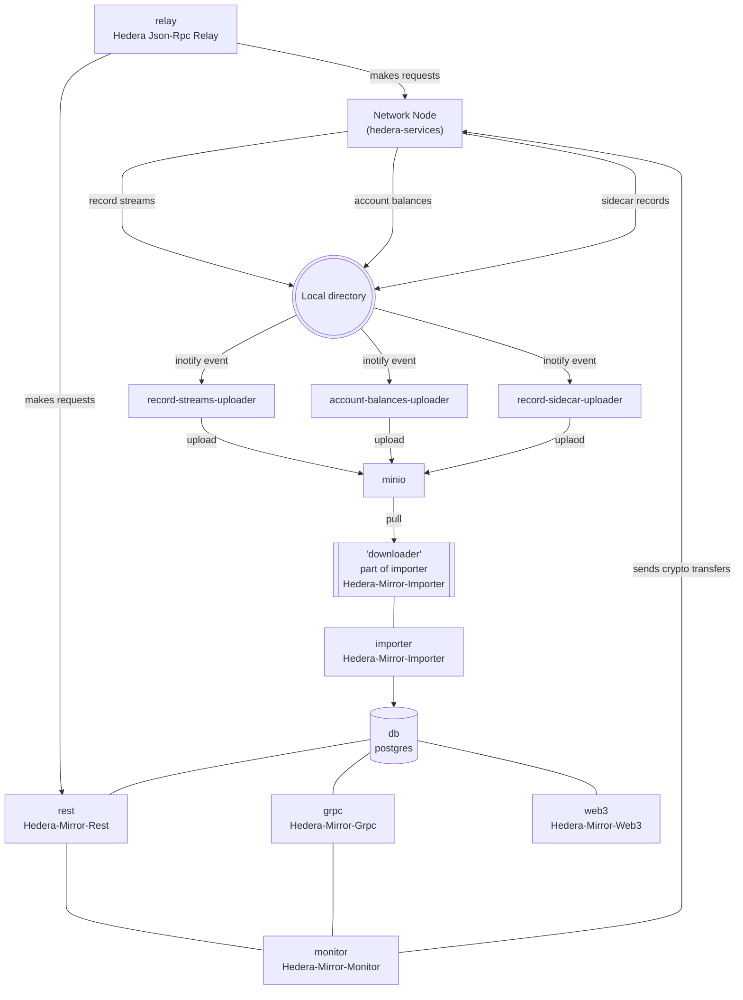
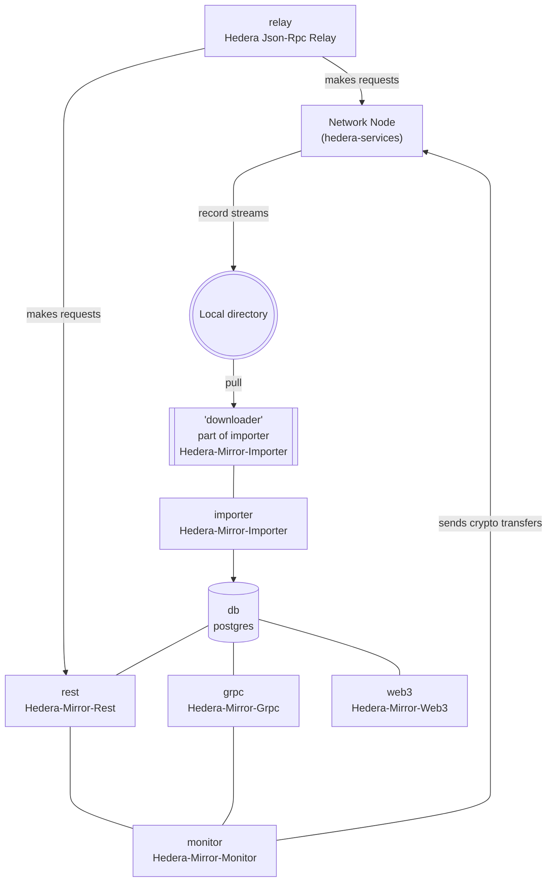
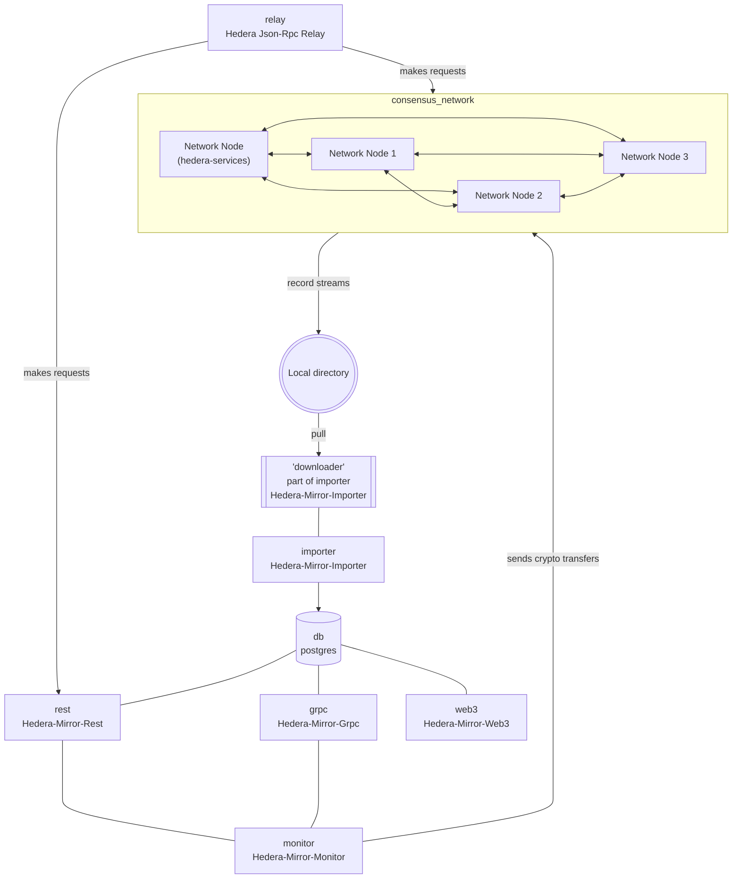

<!-- Filename: README.md -->
<div align="center">

[](https://github.com/hashgraph/hedera-local-node/actions/workflows/flow-pull-request-checks.yaml)[](https://www.npmjs.com/package/@hashgraph/hedera-local)
[](docs/environment-variables.md)
[](https://github.com/hashgraph/hederajson-rpc-relay/)
[](LICENSE)

</div>
The Hiero Local Node project allows developers to set up their own Hiero based local network. The local network is composed of one mirror node and one consensus node. You can set this up by either using the CLI tool or by running Docker.
</br></br>

> [!NOTE]  
> The project has been transfered from the https://github.com/hashgraph org and therefore the namespace is at several locations still based on `hashgraph` and `hedera`.
> We are working activly on migration the namespace fully to hiero.

> **_NOTE:_**  It's recommended to start using the CLI Tool.

- [Docker](#docker)
- [CLI Tool](#cli-tool---hashgraphhedera-local)
- [Environment Variables](./docs/environment-variables.md)
- [Grafana & Prometheus](#grafana--prometheus)

# Requirements

- [Node.js](https://nodejs.org/) `>= v20.11.0`
  - Node version check: `node -v`
- NPM `>= v10.2.4`
  - NPM version check: `npm -v`
- [Docker](https://www.docker.com/) `>= v27.3.1`
  - Docker version check: `docker -v`
- [Docker Compose](https://docs.docker.com/compose/) `=> v2.29.7`
  - Docker Compose version check: `docker compose version`
- Minimum 16GB RAM

### Note:

- Ensure the **VirtioFS** file sharing implementation is enabled in the docker settings

**Note**: The image may look different if you are on a different version


- Ensure the following configurations are set at minimum in Docker **Settings -> Resources** and are available for use.
  - **CPUs:** 6
  - **Memory:** 8 GB
  - **Swap:** 1 GB
  - **Disk Image Size:** 64 GB

**Note**: The image may look different if you are on a different version


- Ensure the hiero-local-node folder is added to Docker File Sharing **Settings -> Resources -> File Sharing**.
  - If you're using hiero-local as npm package - running 'npm root -g' should output the path you have to add under File Sharing Docker's Setting.
  - If you're using hiero-local as cloned repo - running 'pwd' in the project's root should output the path you have to add under File Sharing Docker's Setting.

**Note**: The image may look different if you are on a different version


- Ensure the *Allow the default Docker sockets to be used (requires password)* is enabled in Docker **Settings -> Advanced**.

**Note**: The image may look different if you are on a different version


# CLI Tool - @hashgraph/hedera-local

> [!NOTE]  
> As already mentioned the project has been transfered from the https://github.com/hashgraph org and therefore the namespace is still based on `hashgraph` and `hedera`.
> We are working activly on migration the namespace fully to hiero and publish the CLI tool under the hiero namespace to NPMJS.

## What

This package defines cli commands, that can be executed via node (npx), for interacting with the Local Hedera
Network.

## Installation

#### Official NPM Release

The command below can be used to install the official release from the NPM repository. This version may not reflect
the most recent changes to the `main` branch of this repository.

This version uses a baked in version of the Docker Compose definitions and will not reflect any local changes made to
the repository.

```bash
npm install @hashgraph/hedera-local -g
```

#### Local Development Installation

The command below can be used to install the `hedera-local` module as a symlink against your locally checked out copy of
this repository.

This is the recommended method for testing against the latest changes or a point in time version from a branch/tag.

```bash
npm install && npm install -g
```

## Using npm

`npm run start` to start the network
`npm run restart` to restart the network
`npm run stop` to stop the network
`npm run generate-accounts` to generate new account for already started network

> **_NOTE:_**  If you want to use any of the CLI options listed below, you'd need to pass `--` after `npm run start` (for example) and then specify the wanted option.

> **_WARNING:_** While stopping the networks, we will first list all Docker networks with the `hedera-` prefix in their names. This operation may affect not only the networks initiated by the `npm run start` command from this repository but also any other networks you have created with this prefix. Network termination can be triggered both by a direct `npm run stop` call and by the `npm run start` script if the initial startup process fails and failover recovery is activated. One of the recovery steps includes attempting to close all previously started networks with the `hedera-` prefix.

## Using hedera-local

```
$ hedera

Local Hedera Package - Runs consensus and mirror nodes on localhost:
- consensus node url - 127.0.0.1:50211
- node id - 0.0.3
- mirror node url - http://127.0.0.1:5551

Available commands:
    start - Starts the local hedera network.
        options:
            --verbose to set the verbose level. Defaults to 'info' choices are "info" & "trace"
            --h or --host to override the default host.
            --l or --limits to enable/disable the JSON-RPC relay rate limits. Defaults to true.
            --dev to enable/disable developer mode.
            --full to enable/disable full mode. Production local-node.
            --multinode to enable or disable multi-node mode.
            --enable-block-node to enable or disable block node.
            --balance to set starting hbar balance of the created accounts.
            --async to enable or disable asynchronous creation of accounts.
            --b or --blocklist to enable or disable account blocklisting. Depending on how many private keys are blocklisted, this will affect the generated on startup accounts.
            --network-tag to select custom network node tag [string] [defaults: predefined selected configuration]
            --mirror-tag to select custom mirror node tag [string] [defaults: predefined selected configuration]
            --relay-tag to select custom hedera-json-rpc relay tag [string] [defaults: predefined selected configuration]
            --block-node-tag to select custom block node tag [string] [defaults: predefined selected configuration]
            --workdir path to the working directory for local node [string] [default: "[USER APP DATA]/hedera-local"]
    stop - Stops the local hedera network and delete all the existing data.
    restart - Restarts the local hedera network.
    generate-accounts <n> - Generates N accounts, default 10.
        options:
            --h or --host to override the default host.
            --balance to set starting hbar balance of the created accounts.
            --async to enable or disable asynchronous creation of accounts.
```

Note: Generated accounts are 3 types (ECDSA, Alias ECDSA and ED25519). All of them are usable via HederaSDK. Only Alias ECDSA accounts can be imported into wallet like Metamask or used in ethers.

Note: Read more about `developer mode` [here](https://github.com/hashgraph/hedera-json-rpc-relay/blob/main/docs/dev-mode.md)

### Commands

#### `hedera start <options>`

```bash
$ hedera start
[Hedera-Local-Node] INFO (StateController) Starting start procedure!
[Hedera-Local-Node] INFO (InitState) Making sure that Docker is started and it's correct version...
[Hedera-Local-Node] INFO (InitState) Setting configuration for local network with latest images on host 127.0.0.1 with dev mode turned off using turbo mode in single node configuration...
[Hedera-Local-Node] INFO (InitState) Hedera JSON-RPC Relay rate limits were disabled.
[Hedera-Local-Node] INFO (InitState) Needed environment variables were set for this configuration.
[Hedera-Local-Node] INFO (InitState) Needed bootstrap properties were set for this configuration.
[Hedera-Local-Node] INFO (InitState) Needed mirror node properties were set for this configuration.
[Hedera-Local-Node] INFO (StartState) Starting Hedera Local Node...
[Hedera-Local-Node] INFO (StartState) Detecting network...
[Hedera-Local-Node] INFO (StartState) Hedera Local Node successfully started!
[Hedera-Local-Node] INFO (NetworkPrepState) Starting Network Preparation State...
[Hedera-Local-Node] INFO (NetworkPrepState) Imported fees successfully
[Hedera-Local-Node] INFO (NetworkPrepState) Topic was created!
[Hedera-Local-Node] INFO (AccountCreationState) Starting Account Creation state in synchronous mode...
[Hedera-Local-Node] INFO (AccountCreationState) |-----------------------------------------------------------------------------------------|
[Hedera-Local-Node] INFO (AccountCreationState) |-----------------------------| Accounts list ( ECDSA  keys) |----------------------------|
[Hedera-Local-Node] INFO (AccountCreationState) |-----------------------------------------------------------------------------------------|
[Hedera-Local-Node] INFO (AccountCreationState) |    id    |                            private key                            |  balance |
[Hedera-Local-Node] INFO (AccountCreationState) |-----------------------------------------------------------------------------------------|
[Hedera-Local-Node] INFO (AccountCreationState) | 0.0.1002 - 0x2c55a65b9ae99b5aee790f3f07634896627a26c9fd8460c97058b32579684b60 - 10000 ℏ |
[Hedera-Local-Node] INFO (AccountCreationState) | 0.0.1003 - 0x0e2161b2e6f2d801ef364042e6c0792aa10e07fa38680de06d4db0036c44f4b6 - 10000 ℏ |
[Hedera-Local-Node] INFO (AccountCreationState) | 0.0.1004 - 0x30173710e439883b329042c1a5e15b0e982a2caf3e9c7e93e3c88b953addd651 - 10000 ℏ |
[Hedera-Local-Node] INFO (AccountCreationState) | 0.0.1005 - 0x3ee101ae0556279500bcb276d80db192ffe7a36d9a3e5530dcdc9ba30c88f96c - 10000 ℏ |
[Hedera-Local-Node] INFO (AccountCreationState) | 0.0.1006 - 0x755c4df6c25868d47d734a2567cc2b40e23cc6b042ae9c1e9906750fadb715fa - 10000 ℏ |
[Hedera-Local-Node] INFO (AccountCreationState) | 0.0.1007 - 0xf5ca2d9f83c42f37091b0b28536f95bbfaca637f3eca99491184c6bf893897ec - 10000 ℏ |
[Hedera-Local-Node] INFO (AccountCreationState) | 0.0.1008 - 0xc1e9e486450d8f2a7f6a211ae8e9fce9b9807f593fe853fe1a29a2204907d946 - 10000 ℏ |
[Hedera-Local-Node] INFO (AccountCreationState) | 0.0.1009 - 0x5881aa6c3af348248c4a18d5fa876dd973c5308f2fb818dbb857e742d9dbfa6d - 10000 ℏ |
[Hedera-Local-Node] INFO (AccountCreationState) | 0.0.1010 - 0x28f6c9477a68e7082d4bae82a1333acdf90463e3a33cef9eec45500d449a855a - 10000 ℏ |
[Hedera-Local-Node] INFO (AccountCreationState) | 0.0.1011 - 0x1e3cc555262836a8b19fe0d42dc597f61299ab08a916df31d0bc0a4286e3969b - 10000 ℏ |
[Hedera-Local-Node] INFO (AccountCreationState) |-----------------------------------------------------------------------------------------|
[Hedera-Local-Node] INFO (AccountCreationState) |--------------------------------------------------------------------------------------------------------------------------------------|
[Hedera-Local-Node] INFO (AccountCreationState) |------------------------------------------------| Accounts list (Alias ECDSA keys) |--------------------------------------------------|
[Hedera-Local-Node] INFO (AccountCreationState) |--------------------------------------------------------------------------------------------------------------------------------------|
[Hedera-Local-Node] INFO (AccountCreationState) |    id    |               public address               |                             private key                            | balance |
[Hedera-Local-Node] INFO (AccountCreationState) |--------------------------------------------------------------------------------------------------------------------------------------|
[Hedera-Local-Node] INFO (AccountCreationState) | 0.0.1012 - 0x67D8d32E9Bf1a9968a5ff53B87d777Aa8EBBEe69 - 0x105d050185ccb907fba04dd92d8de9e32c18305e097ab41dadda21489a211524 - 10000 ℏ |
[Hedera-Local-Node] INFO (AccountCreationState) | 0.0.1013 - 0x05FbA803Be258049A27B820088bab1cAD2058871 - 0x2e1d968b041d84dd120a5860cee60cd83f9374ef527ca86996317ada3d0d03e7 - 10000 ℏ |
[Hedera-Local-Node] INFO (AccountCreationState) | 0.0.1014 - 0x927E41Ff8307835A1C081e0d7fD250625F2D4D0E - 0x45a5a7108a18dd5013cf2d5857a28144beadc9c70b3bdbd914e38df4e804b8d8 - 10000 ℏ |
[Hedera-Local-Node] INFO (AccountCreationState) | 0.0.1015 - 0xc37f417fA09933335240FCA72DD257BFBdE9C275 - 0x6e9d61a325be3f6675cf8b7676c70e4a004d2308e3e182370a41f5653d52c6bd - 10000 ℏ |
[Hedera-Local-Node] INFO (AccountCreationState) | 0.0.1016 - 0xD927017F5a6a7A92458b81468Dc71FCE6115B325 - 0x0b58b1bd44469ac9f813b5aeaf6213ddaea26720f0b2f133d08b6f234130a64f - 10000 ℏ |
[Hedera-Local-Node] INFO (AccountCreationState) | 0.0.1017 - 0x5C41A21F14cFe9808cBEc1d91b55Ba75ed327Eb6 - 0x95eac372e0f0df3b43740fa780e62458b2d2cc32d6a440877f1cc2a9ad0c35cc - 10000 ℏ |
[Hedera-Local-Node] INFO (AccountCreationState) | 0.0.1018 - 0xcdaD5844f865F379beA057fb435AEfeF38361B68 - 0x6c6e6727b40c8d4b616ab0d26af357af09337299f09c66704146e14236972106 - 10000 ℏ |
[Hedera-Local-Node] INFO (AccountCreationState) | 0.0.1019 - 0x6e5D3858f53FC66727188690946631bDE0466B1A - 0x5072e7aa1b03f531b4731a32a021f6a5d20d5ddc4e55acbb71ae202fc6f3a26d - 10000 ℏ |
[Hedera-Local-Node] INFO (AccountCreationState) | 0.0.1020 - 0x29cbb51A44fd332c14180b4D471FBBc6654b1657 - 0x60fe891f13824a2c1da20fb6a14e28fa353421191069ba6b6d09dd6c29b90eff - 10000 ℏ |
[Hedera-Local-Node] INFO (AccountCreationState) | 0.0.1021 - 0x17b2B8c63Fa35402088640e426c6709A254c7fFb - 0xeae4e00ece872dd14fb6dc7a04f390563c7d69d16326f2a703ec8e0934060cc7 - 10000 ℏ |
[Hedera-Local-Node] INFO (AccountCreationState) |--------------------------------------------------------------------------------------------------------------------------------------|
[Hedera-Local-Node] INFO (AccountCreationState) |-----------------------------------------------------------------------------------------|
[Hedera-Local-Node] INFO (AccountCreationState) |-----------------------------| Accounts list (ED25519 keys) |----------------------------|
[Hedera-Local-Node] INFO (AccountCreationState) |-----------------------------------------------------------------------------------------|
[Hedera-Local-Node] INFO (AccountCreationState) |    id    |                            private key                            |  balance |
[Hedera-Local-Node] INFO (AccountCreationState) |-----------------------------------------------------------------------------------------|
[Hedera-Local-Node] INFO (AccountCreationState) | 0.0.1022 - 0x44162cd9b9a2f5582bd13b43cfd8be3bc20b8a81ee77f6bf77391598bcfbae4c - 10000 ℏ |
[Hedera-Local-Node] INFO (AccountCreationState) | 0.0.1023 - 0x50426a7375c3e033608e48a62db7bb8da8be27dc1c9034c5961a1ad15545c3d2 - 10000 ℏ |
[Hedera-Local-Node] INFO (AccountCreationState) | 0.0.1024 - 0x28c014594a9dad332bf2fb50fb2aaeca8553fc5c7b48fe06494db6d682cac365 - 10000 ℏ |
[Hedera-Local-Node] INFO (AccountCreationState) | 0.0.1025 - 0xb297f0babbf300340fece9985ecf1e9d9b6a2e862043d439075cc88e042760cf - 10000 ℏ |
[Hedera-Local-Node] INFO (AccountCreationState) | 0.0.1026 - 0xe253b897329ef661bbf9af82f669519ce567b69ccc5ae5fead06258ccd1c7cb3 - 10000 ℏ |
[Hedera-Local-Node] INFO (AccountCreationState) | 0.0.1027 - 0x2acb0b3ed8ca6af74edb24078d88901a311f735e25df13ce9494579838345a74 - 10000 ℏ |
[Hedera-Local-Node] INFO (AccountCreationState) | 0.0.1028 - 0x1a0afad1f38f10514afa5698706cdd19db7ec8e345a416dd66826dd039824ada - 10000 ℏ |
[Hedera-Local-Node] INFO (AccountCreationState) | 0.0.1029 - 0x0d758d68de1c88a785e38b5d23c9459137dd5ae2b79c89b570307f5d35d5039e - 10000 ℏ |
[Hedera-Local-Node] INFO (AccountCreationState) | 0.0.1030 - 0x80bb2f571d08f301f0b4b651c0d249bff6db6c7b727afe74bc8b9b3f0ad11579 - 10000 ℏ |
[Hedera-Local-Node] INFO (AccountCreationState) | 0.0.1031 - 0xd26a61159018a3c9824388368cb4ecae278f9244724fd93ecb965fc7e2d9808e - 10000 ℏ |
[Hedera-Local-Node] INFO (AccountCreationState) |-----------------------------------------------------------------------------------------|
[Hedera-Local-Node] INFO (CleanUpState) Initiating clean up procedure. Trying to revert unneeded changes to files...
[Hedera-Local-Node] INFO (CleanUpState) Clean up of consensus node properties finished.
[Hedera-Local-Node] INFO (CleanUpState) Clean up of mirror node properties finished.

```

- --accounts - Default is 10 per type. Specify the number of accounts to generate at startup. The first 10 are with predefined
  private keys, and the next ones are with random generated private keys.

- --h / --host - Override the default host.

```bash
$ hedera start --accounts=2
[Hedera-Local-Node] INFO (StateController) Starting start procedure!
[Hedera-Local-Node] INFO (InitState) Making sure that Docker is started and it's correct version...
[Hedera-Local-Node] INFO (InitState) Setting configuration for local network with latest images on host 127.0.0.1 with dev mode turned off using turbo mode in single node configuration...
[Hedera-Local-Node] INFO (InitState) Hedera JSON-RPC Relay rate limits were disabled.
[Hedera-Local-Node] INFO (InitState) Needed environment variables were set for this configuration.
[Hedera-Local-Node] INFO (InitState) Needed bootstrap properties were set for this configuration.
[Hedera-Local-Node] INFO (InitState) Needed mirror node properties were set for this configuration.
[Hedera-Local-Node] INFO (StartState) Starting Hedera Local Node...
[Hedera-Local-Node] INFO (StartState) Detecting network...
[Hedera-Local-Node] INFO (StartState) Hedera Local Node successfully started!
[Hedera-Local-Node] INFO (NetworkPrepState) Starting Network Preparation State...
[Hedera-Local-Node] INFO (NetworkPrepState) Imported fees successfully
[Hedera-Local-Node] INFO (NetworkPrepState) Topic was created!
[Hedera-Local-Node] INFO (AccountCreationState) Starting Account Creation state in synchronous mode...
[Hedera-Local-Node] INFO (AccountCreationState) |-----------------------------------------------------------------------------------------|
[Hedera-Local-Node] INFO (AccountCreationState) |-----------------------------| Accounts list ( ECDSA  keys) |----------------------------|
[Hedera-Local-Node] INFO (AccountCreationState) |-----------------------------------------------------------------------------------------|
[Hedera-Local-Node] INFO (AccountCreationState) |    id    |                            private key                            |  balance |
[Hedera-Local-Node] INFO (AccountCreationState) |-----------------------------------------------------------------------------------------|
[Hedera-Local-Node] INFO (AccountCreationState) | 0.0.1002 - 0x2c55a65b9ae99b5aee790f3f07634896627a26c9fd8460c97058b32579684b60 - 10000 ℏ |
[Hedera-Local-Node] INFO (AccountCreationState) | 0.0.1003 - 0x0e2161b2e6f2d801ef364042e6c0792aa10e07fa38680de06d4db0036c44f4b6 - 10000 ℏ |
[Hedera-Local-Node] INFO (AccountCreationState) |-----------------------------------------------------------------------------------------|
[Hedera-Local-Node] INFO (AccountCreationState) |--------------------------------------------------------------------------------------------------------------------------------------|
[Hedera-Local-Node] INFO (AccountCreationState) |------------------------------------------------| Accounts list (Alias ECDSA keys) |--------------------------------------------------|
[Hedera-Local-Node] INFO (AccountCreationState) |--------------------------------------------------------------------------------------------------------------------------------------|
[Hedera-Local-Node] INFO (AccountCreationState) |    id    |               public address               |                             private key                            | balance |
[Hedera-Local-Node] INFO (AccountCreationState) |--------------------------------------------------------------------------------------------------------------------------------------|
[Hedera-Local-Node] INFO (AccountCreationState) | 0.0.1004 - 0x67D8d32E9Bf1a9968a5ff53B87d777Aa8EBBEe69 - 0x105d050185ccb907fba04dd92d8de9e32c18305e097ab41dadda21489a211524 - 10000 ℏ |
[Hedera-Local-Node] INFO (AccountCreationState) | 0.0.1005 - 0x05FbA803Be258049A27B820088bab1cAD2058871 - 0x2e1d968b041d84dd120a5860cee60cd83f9374ef527ca86996317ada3d0d03e7 - 10000 ℏ |
[Hedera-Local-Node] INFO (AccountCreationState) |--------------------------------------------------------------------------------------------------------------------------------------|
[Hedera-Local-Node] INFO (AccountCreationState) |-----------------------------------------------------------------------------------------|
[Hedera-Local-Node] INFO (AccountCreationState) |-----------------------------| Accounts list (ED25519 keys) |----------------------------|
[Hedera-Local-Node] INFO (AccountCreationState) |-----------------------------------------------------------------------------------------|
[Hedera-Local-Node] INFO (AccountCreationState) |    id    |                            private key                            |  balance |
[Hedera-Local-Node] INFO (AccountCreationState) |-----------------------------------------------------------------------------------------|
[Hedera-Local-Node] INFO (AccountCreationState) | 0.0.1006 - 0x44162cd9b9a2f5582bd13b43cfd8be3bc20b8a81ee77f6bf77391598bcfbae4c - 10000 ℏ |
[Hedera-Local-Node] INFO (AccountCreationState) | 0.0.1007 - 0x50426a7375c3e033608e48a62db7bb8da8be27dc1c9034c5961a1ad15545c3d2 - 10000 ℏ |
[Hedera-Local-Node] INFO (AccountCreationState) |-----------------------------------------------------------------------------------------|
[Hedera-Local-Node] INFO (CleanUpState) Initiating clean up procedure. Trying to revert unneeded changes to files...
[Hedera-Local-Node] INFO (CleanUpState) Clean up of consensus node properties finished.
[Hedera-Local-Node] INFO (CleanUpState) Clean up of mirror node properties finished.
```

---

#### `hedera stop`

```bash
$ hedera stop
[Hedera-Local-Node] INFO (StateController) Starting stop procedure!
[Hedera-Local-Node] INFO (StopState) Initiating stop procedure. Trying to stop docker containers and clean up volumes...
[Hedera-Local-Node] INFO (StopState) Stopping the network...
[Hedera-Local-Node] INFO (StopState) Hedera Local Node was stopped successfully.
```

No available options

---

#### `hedera restart <options>`

```bash
$ hedera restart
[Hedera-Local-Node] INFO (StateController) Starting restart procedure!
[Hedera-Local-Node] INFO (StopState) Initiating stop procedure. Trying to stop docker containers and clean up volumes...
[Hedera-Local-Node] INFO (StopState) Stopping the network...
[Hedera-Local-Node] INFO (StopState) Hedera Local Node was stopped successfully.
[Hedera-Local-Node] INFO (InitState) Making sure that Docker is started and it's correct version...
[Hedera-Local-Node] INFO (InitState) Setting configuration for local network with latest images on host 127.0.0.1 with dev mode turned off using turbo mode in single node configuration...
[Hedera-Local-Node] INFO (InitState) Hedera JSON-RPC Relay rate limits were disabled.
[Hedera-Local-Node] INFO (InitState) Needed environment variables were set for this configuration.
[Hedera-Local-Node] INFO (InitState) Needed bootstrap properties were set for this configuration.
[Hedera-Local-Node] INFO (InitState) Needed mirror node properties were set for this configuration.
[Hedera-Local-Node] INFO (StartState) Starting Hedera Local Node...
[Hedera-Local-Node] INFO (StartState) Detecting network...
[Hedera-Local-Node] INFO (StartState) Hedera Local Node successfully started!
[Hedera-Local-Node] INFO (NetworkPrepState) Starting Network Preparation State...
[Hedera-Local-Node] INFO (NetworkPrepState) Imported fees successfully
[Hedera-Local-Node] INFO (NetworkPrepState) Topic was created!
[Hedera-Local-Node] INFO (AccountCreationState) Starting Account Creation state in synchronous mode...
[Hedera-Local-Node] INFO (AccountCreationState) |-----------------------------------------------------------------------------------------|
[Hedera-Local-Node] INFO (AccountCreationState) |-----------------------------| Accounts list ( ECDSA  keys) |----------------------------|
[Hedera-Local-Node] INFO (AccountCreationState) |-----------------------------------------------------------------------------------------|
[Hedera-Local-Node] INFO (AccountCreationState) |    id    |                            private key                            |  balance |
[Hedera-Local-Node] INFO (AccountCreationState) |-----------------------------------------------------------------------------------------|
[Hedera-Local-Node] INFO (AccountCreationState) | 0.0.1002 - 0x2c55a65b9ae99b5aee790f3f07634896627a26c9fd8460c97058b32579684b60 - 10000 ℏ |
[Hedera-Local-Node] INFO (AccountCreationState) | 0.0.1003 - 0x0e2161b2e6f2d801ef364042e6c0792aa10e07fa38680de06d4db0036c44f4b6 - 10000 ℏ |
[Hedera-Local-Node] INFO (AccountCreationState) | 0.0.1004 - 0x30173710e439883b329042c1a5e15b0e982a2caf3e9c7e93e3c88b953addd651 - 10000 ℏ |
[Hedera-Local-Node] INFO (AccountCreationState) | 0.0.1005 - 0x3ee101ae0556279500bcb276d80db192ffe7a36d9a3e5530dcdc9ba30c88f96c - 10000 ℏ |
[Hedera-Local-Node] INFO (AccountCreationState) | 0.0.1006 - 0x755c4df6c25868d47d734a2567cc2b40e23cc6b042ae9c1e9906750fadb715fa - 10000 ℏ |
[Hedera-Local-Node] INFO (AccountCreationState) | 0.0.1007 - 0xf5ca2d9f83c42f37091b0b28536f95bbfaca637f3eca99491184c6bf893897ec - 10000 ℏ |
[Hedera-Local-Node] INFO (AccountCreationState) | 0.0.1008 - 0xc1e9e486450d8f2a7f6a211ae8e9fce9b9807f593fe853fe1a29a2204907d946 - 10000 ℏ |
[Hedera-Local-Node] INFO (AccountCreationState) | 0.0.1009 - 0x5881aa6c3af348248c4a18d5fa876dd973c5308f2fb818dbb857e742d9dbfa6d - 10000 ℏ |
[Hedera-Local-Node] INFO (AccountCreationState) | 0.0.1010 - 0x28f6c9477a68e7082d4bae82a1333acdf90463e3a33cef9eec45500d449a855a - 10000 ℏ |
[Hedera-Local-Node] INFO (AccountCreationState) | 0.0.1011 - 0x1e3cc555262836a8b19fe0d42dc597f61299ab08a916df31d0bc0a4286e3969b - 10000 ℏ |
[Hedera-Local-Node] INFO (AccountCreationState) |-----------------------------------------------------------------------------------------|
[Hedera-Local-Node] INFO (AccountCreationState) |--------------------------------------------------------------------------------------------------------------------------------------|
[Hedera-Local-Node] INFO (AccountCreationState) |------------------------------------------------| Accounts list (Alias ECDSA keys) |--------------------------------------------------|
[Hedera-Local-Node] INFO (AccountCreationState) |--------------------------------------------------------------------------------------------------------------------------------------|
[Hedera-Local-Node] INFO (AccountCreationState) |    id    |               public address               |                             private key                            | balance |
[Hedera-Local-Node] INFO (AccountCreationState) |--------------------------------------------------------------------------------------------------------------------------------------|
[Hedera-Local-Node] INFO (AccountCreationState) | 0.0.1012 - 0x67D8d32E9Bf1a9968a5ff53B87d777Aa8EBBEe69 - 0x105d050185ccb907fba04dd92d8de9e32c18305e097ab41dadda21489a211524 - 10000 ℏ |
[Hedera-Local-Node] INFO (AccountCreationState) | 0.0.1013 - 0x05FbA803Be258049A27B820088bab1cAD2058871 - 0x2e1d968b041d84dd120a5860cee60cd83f9374ef527ca86996317ada3d0d03e7 - 10000 ℏ |
[Hedera-Local-Node] INFO (AccountCreationState) | 0.0.1014 - 0x927E41Ff8307835A1C081e0d7fD250625F2D4D0E - 0x45a5a7108a18dd5013cf2d5857a28144beadc9c70b3bdbd914e38df4e804b8d8 - 10000 ℏ |
[Hedera-Local-Node] INFO (AccountCreationState) | 0.0.1015 - 0xc37f417fA09933335240FCA72DD257BFBdE9C275 - 0x6e9d61a325be3f6675cf8b7676c70e4a004d2308e3e182370a41f5653d52c6bd - 10000 ℏ |
[Hedera-Local-Node] INFO (AccountCreationState) | 0.0.1016 - 0xD927017F5a6a7A92458b81468Dc71FCE6115B325 - 0x0b58b1bd44469ac9f813b5aeaf6213ddaea26720f0b2f133d08b6f234130a64f - 10000 ℏ |
[Hedera-Local-Node] INFO (AccountCreationState) | 0.0.1017 - 0x5C41A21F14cFe9808cBEc1d91b55Ba75ed327Eb6 - 0x95eac372e0f0df3b43740fa780e62458b2d2cc32d6a440877f1cc2a9ad0c35cc - 10000 ℏ |
[Hedera-Local-Node] INFO (AccountCreationState) | 0.0.1018 - 0xcdaD5844f865F379beA057fb435AEfeF38361B68 - 0x6c6e6727b40c8d4b616ab0d26af357af09337299f09c66704146e14236972106 - 10000 ℏ |
[Hedera-Local-Node] INFO (AccountCreationState) | 0.0.1019 - 0x6e5D3858f53FC66727188690946631bDE0466B1A - 0x5072e7aa1b03f531b4731a32a021f6a5d20d5ddc4e55acbb71ae202fc6f3a26d - 10000 ℏ |
[Hedera-Local-Node] INFO (AccountCreationState) | 0.0.1020 - 0x29cbb51A44fd332c14180b4D471FBBc6654b1657 - 0x60fe891f13824a2c1da20fb6a14e28fa353421191069ba6b6d09dd6c29b90eff - 10000 ℏ |
[Hedera-Local-Node] INFO (AccountCreationState) | 0.0.1021 - 0x17b2B8c63Fa35402088640e426c6709A254c7fFb - 0xeae4e00ece872dd14fb6dc7a04f390563c7d69d16326f2a703ec8e0934060cc7 - 10000 ℏ |
[Hedera-Local-Node] INFO (AccountCreationState) |--------------------------------------------------------------------------------------------------------------------------------------|
[Hedera-Local-Node] INFO (AccountCreationState) |-----------------------------------------------------------------------------------------|
[Hedera-Local-Node] INFO (AccountCreationState) |-----------------------------| Accounts list (ED25519 keys) |----------------------------|
[Hedera-Local-Node] INFO (AccountCreationState) |-----------------------------------------------------------------------------------------|
[Hedera-Local-Node] INFO (AccountCreationState) |    id    |                            private key                            |  balance |
[Hedera-Local-Node] INFO (AccountCreationState) |-----------------------------------------------------------------------------------------|
[Hedera-Local-Node] INFO (AccountCreationState) | 0.0.1022 - 0x44162cd9b9a2f5582bd13b43cfd8be3bc20b8a81ee77f6bf77391598bcfbae4c - 10000 ℏ |
[Hedera-Local-Node] INFO (AccountCreationState) | 0.0.1023 - 0x50426a7375c3e033608e48a62db7bb8da8be27dc1c9034c5961a1ad15545c3d2 - 10000 ℏ |
[Hedera-Local-Node] INFO (AccountCreationState) | 0.0.1024 - 0x28c014594a9dad332bf2fb50fb2aaeca8553fc5c7b48fe06494db6d682cac365 - 10000 ℏ |
[Hedera-Local-Node] INFO (AccountCreationState) | 0.0.1025 - 0xb297f0babbf300340fece9985ecf1e9d9b6a2e862043d439075cc88e042760cf - 10000 ℏ |
[Hedera-Local-Node] INFO (AccountCreationState) | 0.0.1026 - 0xe253b897329ef661bbf9af82f669519ce567b69ccc5ae5fead06258ccd1c7cb3 - 10000 ℏ |
[Hedera-Local-Node] INFO (AccountCreationState) | 0.0.1027 - 0x2acb0b3ed8ca6af74edb24078d88901a311f735e25df13ce9494579838345a74 - 10000 ℏ |
[Hedera-Local-Node] INFO (AccountCreationState) | 0.0.1028 - 0x1a0afad1f38f10514afa5698706cdd19db7ec8e345a416dd66826dd039824ada - 10000 ℏ |
[Hedera-Local-Node] INFO (AccountCreationState) | 0.0.1029 - 0x0d758d68de1c88a785e38b5d23c9459137dd5ae2b79c89b570307f5d35d5039e - 10000 ℏ |
[Hedera-Local-Node] INFO (AccountCreationState) | 0.0.1030 - 0x80bb2f571d08f301f0b4b651c0d249bff6db6c7b727afe74bc8b9b3f0ad11579 - 10000 ℏ |
[Hedera-Local-Node] INFO (AccountCreationState) | 0.0.1031 - 0xd26a61159018a3c9824388368cb4ecae278f9244724fd93ecb965fc7e2d9808e - 10000 ℏ |
[Hedera-Local-Node] INFO (AccountCreationState) |-----------------------------------------------------------------------------------------|
[Hedera-Local-Node] INFO (CleanUpState) Initiating clean up procedure. Trying to revert unneeded changes to files...
[Hedera-Local-Node] INFO (CleanUpState) Clean up of consensus node properties finished.
[Hedera-Local-Node] INFO (CleanUpState) Clean up of mirror node properties finished.
```

- --accounts - Default is 10. Specify the number of accounts to generate at startup. The first 10 are with predefined
  private keys, and the next ones are with random generated private keys.

- --h / --host - Override the default host.

```bash
$ hedera restart --accounts=2
[Hedera-Local-Node] INFO (StateController) Starting restart procedure!
[Hedera-Local-Node] INFO (StopState) Initiating stop procedure. Trying to stop docker containers and clean up volumes...
[Hedera-Local-Node] INFO (StopState) Stopping the network...
[Hedera-Local-Node] INFO (StopState) Hedera Local Node was stopped successfully.
[Hedera-Local-Node] INFO (InitState) Making sure that Docker is started and it's correct version...
[Hedera-Local-Node] INFO (InitState) Setting configuration for local network with latest images on host 127.0.0.1 with dev mode turned off using turbo mode in single node configuration...
[Hedera-Local-Node] INFO (InitState) Hedera JSON-RPC Relay rate limits were disabled.
[Hedera-Local-Node] INFO (InitState) Needed environment variables were set for this configuration.
[Hedera-Local-Node] INFO (InitState) Needed bootstrap properties were set for this configuration.
[Hedera-Local-Node] INFO (InitState) Needed mirror node properties were set for this configuration.
[Hedera-Local-Node] INFO (StartState) Starting Hedera Local Node...
[Hedera-Local-Node] INFO (StartState) Detecting network...
[Hedera-Local-Node] INFO (StartState) Hedera Local Node successfully started!
[Hedera-Local-Node] INFO (NetworkPrepState) Starting Network Preparation State...
[Hedera-Local-Node] INFO (NetworkPrepState) Imported fees successfully
[Hedera-Local-Node] INFO (NetworkPrepState) Topic was created!
[Hedera-Local-Node] INFO (AccountCreationState) Starting Account Creation state in synchronous mode...
[Hedera-Local-Node] INFO (AccountCreationState) |-----------------------------------------------------------------------------------------|
[Hedera-Local-Node] INFO (AccountCreationState) |-----------------------------| Accounts list ( ECDSA  keys) |----------------------------|
[Hedera-Local-Node] INFO (AccountCreationState) |-----------------------------------------------------------------------------------------|
[Hedera-Local-Node] INFO (AccountCreationState) |    id    |                            private key                            |  balance |
[Hedera-Local-Node] INFO (AccountCreationState) |-----------------------------------------------------------------------------------------|
[Hedera-Local-Node] INFO (AccountCreationState) | 0.0.1002 - 0x2c55a65b9ae99b5aee790f3f07634896627a26c9fd8460c97058b32579684b60 - 10000 ℏ |
[Hedera-Local-Node] INFO (AccountCreationState) | 0.0.1003 - 0x0e2161b2e6f2d801ef364042e6c0792aa10e07fa38680de06d4db0036c44f4b6 - 10000 ℏ |
[Hedera-Local-Node] INFO (AccountCreationState) |-----------------------------------------------------------------------------------------|
[Hedera-Local-Node] INFO (AccountCreationState) |--------------------------------------------------------------------------------------------------------------------------------------|
[Hedera-Local-Node] INFO (AccountCreationState) |------------------------------------------------| Accounts list (Alias ECDSA keys) |--------------------------------------------------|
[Hedera-Local-Node] INFO (AccountCreationState) |--------------------------------------------------------------------------------------------------------------------------------------|
[Hedera-Local-Node] INFO (AccountCreationState) |    id    |               public address               |                             private key                            | balance |
[Hedera-Local-Node] INFO (AccountCreationState) |--------------------------------------------------------------------------------------------------------------------------------------|
[Hedera-Local-Node] INFO (AccountCreationState) | 0.0.1004 - 0x67D8d32E9Bf1a9968a5ff53B87d777Aa8EBBEe69 - 0x105d050185ccb907fba04dd92d8de9e32c18305e097ab41dadda21489a211524 - 10000 ℏ |
[Hedera-Local-Node] INFO (AccountCreationState) | 0.0.1005 - 0x05FbA803Be258049A27B820088bab1cAD2058871 - 0x2e1d968b041d84dd120a5860cee60cd83f9374ef527ca86996317ada3d0d03e7 - 10000 ℏ |
[Hedera-Local-Node] INFO (AccountCreationState) |--------------------------------------------------------------------------------------------------------------------------------------|
[Hedera-Local-Node] INFO (AccountCreationState) |-----------------------------------------------------------------------------------------|
[Hedera-Local-Node] INFO (AccountCreationState) |-----------------------------| Accounts list (ED25519 keys) |----------------------------|
[Hedera-Local-Node] INFO (AccountCreationState) |-----------------------------------------------------------------------------------------|
[Hedera-Local-Node] INFO (AccountCreationState) |    id    |                            private key                            |  balance |
[Hedera-Local-Node] INFO (AccountCreationState) |-----------------------------------------------------------------------------------------|
[Hedera-Local-Node] INFO (AccountCreationState) | 0.0.1006 - 0x44162cd9b9a2f5582bd13b43cfd8be3bc20b8a81ee77f6bf77391598bcfbae4c - 10000 ℏ |
[Hedera-Local-Node] INFO (AccountCreationState) | 0.0.1007 - 0x50426a7375c3e033608e48a62db7bb8da8be27dc1c9034c5961a1ad15545c3d2 - 10000 ℏ |
[Hedera-Local-Node] INFO (AccountCreationState) |-----------------------------------------------------------------------------------------|
[Hedera-Local-Node] INFO (CleanUpState) Initiating clean up procedure. Trying to revert unneeded changes to files...
[Hedera-Local-Node] INFO (CleanUpState) Clean up of consensus node properties finished.
[Hedera-Local-Node] INFO (CleanUpState) Clean up of mirror node properties finished.
```

---

#### `hedera generate-accounts <num>`

```bash
$ hedera generate-accounts 2
[Hedera-Local-Node] INFO (AccountCreationState) |------------------------------------------------------------------------------------------|
[Hedera-Local-Node] INFO (AccountCreationState) |------------------------------| Accounts list (ECDSA keys) |------------------------------|
[Hedera-Local-Node] INFO (AccountCreationState) |    id    |                            private key                             |  balance |
[Hedera-Local-Node] INFO (AccountCreationState) |------------------------------------------------------------------------------------------|
[Hedera-Local-Node] INFO (AccountCreationState) | 0.0.1008 - 0x626404782c00c1b6b865a43a8de0680296951564fd6c3b3945e04383d24e3c52 - 100000 ℏ |
[Hedera-Local-Node] INFO (AccountCreationState) | 0.0.1009 - 0x227641ce4807f719560627825d9799135e849689eb1c863add1682161970efd6 - 100000 ℏ |
[Hedera-Local-Node] INFO (AccountCreationState) |------------------------------------------------------------------------------------------|
[Hedera-Local-Node] INFO (AccountCreationState) |--------------------------------------------------------------------------------------------------------------------------------------|
[Hedera-Local-Node] INFO (AccountCreationState) |--------------------------------------------------| Accounts list (Alias ECDSA keys) |------------------------------------------------|
[Hedera-Local-Node] INFO (AccountCreationState) |    id    |              public address                |                             private key                            | balance |
[Hedera-Local-Node] INFO (AccountCreationState) |--------------------------------------------------------------------------------------------------------------------------------------|
[Hedera-Local-Node] INFO (AccountCreationState) | 0.0.1010 - 0xeBaea5B3BB2f7C96C035804C7913eC79593f3097 - 0xa44cbbd0d48c6b534fc7b243b267bae73f5843df71c73628c9883ff20c660b04 - 10000 ℏ |
[Hedera-Local-Node] INFO (AccountCreationState) | 0.0.1011 - 0x58a2452e618586c439325d549Ef9d1549e3c7A26 - 0x79a9bcb39994373774c06bb0a5e8289ffe8f8a734e2c01e32186196fb68abccf - 10000 ℏ |
[Hedera-Local-Node] INFO (AccountCreationState) |--------------------------------------------------------------------------------------------------------------------------------------|
[Hedera-Local-Node] INFO (AccountCreationState) |------------------------------------------------------------------------------------------|
[Hedera-Local-Node] INFO (AccountCreationState) |-----------------------------| Accounts list (ED25519 keys) |-----------------------------|
[Hedera-Local-Node] INFO (AccountCreationState) |    id    |                            private key                             |  balance |
[Hedera-Local-Node] INFO (AccountCreationState) |------------------------------------------------------------------------------------------|
[Hedera-Local-Node] INFO (AccountCreationState) | 0.0.1012 - 0x5f608a35c956fbb1d932c0f3fc113d308041a595351adeddf4e93cee59c1b978 - 100000 ℏ |
[Hedera-Local-Node] INFO (AccountCreationState) | 0.0.1013 - 0x3fcd5855969a881dcaad4446101a3241ccb5d6e7237f3a55b19268bfcbfdfa91 - 100000 ℏ |
[Hedera-Local-Node] INFO (AccountCreationState) |------------------------------------------------------------------------------------------|
```

- --h / --host - Override the default host.

---

#### You can use it in a hardhat project by adding the following config:

```bash
defaultNetwork: 'local',
  networks: {
    local: {
      url: 'http://localhost:7546',
      accounts: [
        0x105d050185ccb907fba04dd92d8de9e32c18305e097ab41dadda21489a211524,
        0x2e1d968b041d84dd120a5860cee60cd83f9374ef527ca86996317ada3d0d03e7
      ],
      chainId: 298,
    },
    testnet: {
      url: 'https://testnet.hashio.io/api',
      accounts: [],
      chainId: 296,
    },
  },
```

---

# Docker

> **_NOTE:_**  This will not create accounts on startup, nor will perform any kind of checks.

## Start Your Local Network

1. Clone the `hedera-local-node` repo

```bash
git clone https://github.com/hashgraph/hedera-local-node.git
```

2. CD to the hedera-local-node directory

```bash
    cd hedera-local-node
```

For Windows users: You will need to update the file endings of `compose-network/mirror-node/init.sh` by running this in WSL:

```bash
    dos2unix compose-network/mirror-node/init.sh
```

3. Run `docker compose up -d` from the terminal to get the network up and running
4. Set-up your local network client by following this [tutorial](https://docs.hedera.com/guides/docs/sdks/set-up-your-local-network)

## Stop Your Local Network

1. Run `docker compose down -v; git clean -xfd; git reset --hard` to stop and remove the containers, volumes and clean manually generated files. If you would like to keep any files created manually in the working directory please save them before executing this command.

## Network Variables

These are the local network variables to interact with the consensus and mirror node.

- Consensus Node Endpoint

  - `127.0.0.1:50211`
  - The IP address and port of the local consensus node.
    > **_NOTE:_** To connect to the local consensus node from a browser you will have to use the Envoy proxy at `http://127.0.0.1:50213`.

- Consensus Node Account ID
  - `0.0.3`
  - The node account ID to submit transactions and queries to
- Mirror Node GRPC Endpoint
  - `127.0.0.1:5600`
  - The mirror node network to use
- Mirror Node REST API Endpoint
  - `127.0.0.1:5551`
  - The endpoint to submit rest API requests to
- Account ID
  - `0.0.2`
  - The account ID to use to pay for transactions and queries
- Account Key
  - `302e020100300506032b65700422042091132178e72057a1d7528025956fe39b0b847f200ab59b2fdd367017f3087137`
  - The private key to account 0.0.2 to sign transactions and queries with

## Folder set up

1. `compose-network` folder has the static files needed for starting Local network.
2. `compose-network/grafana/dashboards` folder contains the Grafana dashboard definitions in JSON format which will be automatically provisioned at startup.
3. `compose-network/grafana/datasources` folder contains the Grafana datasource definitions in YAML format which wil be automatically provisioned at startup.
4. `network-logs` folder will be created at runtime in the working directory and will have all the log files generated after starting local node.

The local node writes its ephemeral data to a `working directory` which can be set using the `--workdir` flag, and has a default value dependant on the OS of the user

| OS      | Default Working Directory                    |
|---------|----------------------------------------------|
| MacOS   | `~/Library/Application Support/hedera-local` |
| Linux   | `~/.local/share/hedera-local`                |
| Windows | `%USERPROFILE%\AppData\Local\hedera-local`   |

## Steps to change the memory limits, properties and other configurations

The following environment variables can be changed in the `.env` file for various memory limits

1. Platform
   - PLATFORM_JAVA_HEAP_MIN
   - PLATFORM_JAVA_HEAP_MAX
2. Consensus node
   - NETWORK_NODE_MEM_LIMIT
3. Mirror node
   - MIRROR_GRPC_MEM_LIMIT - memory limit for mirror node gRPC
   - MIRROR_IMPORTER_MEM_LIMIT - memory limit for mirror node importer
   - MIRROR_REST_MEM_LIMIT - memory limit for mirror node rest api
   - MIRROR_WEB3_MEM_LIMIT - memory limit for mirror node web3
4. To change `application.properties`, `api-permission.properties` or `bootstrap.properties` properties, update the `APPLICATION_CONFIG_PATH` to the location of updated config folder in `.env` file

**IMPORTANT :** Ensure to do `docker compose down -v; git clean -xfd; git reset --hard` and then `docker compose up -d` for the new changes to take any effect.

&#10008; The keys under `network-node` (`hedera.key`, `hedera.crt` and the `keys` folder) are only intended to be used for testing with this docker based local network. These keys should not be used with any other networks.

# Exposed Endpoints

| Type                              | Endpoint                                         |
| --------------------------------- | ------------------------------------------------ |
| Consensus Node Endpoint           | [http://localhost:50211](http://localhost:50211) |
| Mirror Node GRPC Endpoint         | [http://localhost:5600](http://localhost:5600)   |
| Mirror Node REST API Endpoint     | [http://localhost:5551](http://localhost:5551)   |
| JSON RPC Relay Endpoint           | [http://localhost:7546](http://localhost:7546)   |
| JSON RPC Relay Websocket Endpoint | [http://localhost:8546](http://localhost:8546)   |
| Mirror Node Explorer              | [http://localhost:8090](http://localhost:8090)   |
| Block Node                        | [http://localhost:8080](http://localhost:8080)   |
| Grafana UI                        | [http://localhost:3000](http://localhost:3000)   |
| Prometheus UI                     | [http://localhost:9090](http://localhost:9090)   |

# Grafana & Prometheus

## Accessing Prometheus

The deployed Prometheus instance may be accessed from [http://localhost:9090](http://localhost:9090) and no credentials are required.

## Accessing Grafana

The deployed Grafana instance may be accessed from [http://localhost:3000](http://localhost:3000) and the following default credentials are needed at first login:

| User Name | Password |
| --------- | -------- |
| admin     | admin    |

## Adding New Dashboards

Creating new dashboards may be accomplished using the Grafana visual editor; however, these dashboards will not persist after a `docker compose down -v` command
or any other command which removes the named volumes.

Dashboards may be exported as JSON definitions and placed under the `compose-network/grafana/dashboards` folder to ensure they are automatically restored after a `docker compose down -v` or equivalent operation.

Any dashboard definitions placed into the root of the `compose-network/grafana/dashboards` folder will appear under the `General` folder in the Grafana dashboard list
Placing dashboards under a subfolder will result in a new folder in the Grafana dashboard list and the dashboards will be deployed under the folder.

# FAQ

- Can I run the local node on a Windows machine?
- Yes but you will need WSL v2 to be installed.


- Can I run the local node on MacOS with an Intel CPU?
- Yes but make sure that the minimum system requirements are met.


- Can I stop the local node, save its state then start it again after a while?
- No, currently the local node doesn't support network freezing. Once you stop it, the next start will be with a genesis state and all of your accounts/contracts/tokens will be wiped.


- What should I do if this error appears on Windows?
```
Postgres error:
/usr/local/bin/docker-entrypoint.sh: /docker-entrypoint-initdb.d/init.sh: /bin/bash: bad interpreter: No such file or directory
Solution:
```
- You have to set a global git config then clone the local node repository again.
```
git config --global core.autocrlf input
Delete your local repository.
Clone it again.
```

## Contributing

Whether you’re fixing bugs, enhancing features, or improving documentation, your contributions are important — let’s build something great together!

Please read our [contributing guide](https://github.com/hiero-ledger/.github/blob/main/CONTRIBUTING.md) to see how you can get involved.

## Code of Conduct

Hiero uses the Linux Foundation Decentralised Trust [Code of Conduct](https://www.lfdecentralizedtrust.org/code-of-conduct).

## License

[Apache License 2.0](LICENSE)
<!-- Filename: docs/codespaces-setup.md -->

# Codespaces setup instructions 

---
**NOTE**

Please review first the [Quickstart for GitHub Codespaces](https://docs.github.com/en/codespaces/getting-started/quickstart) guide.

In order Mirror Node Web Explorer to work, please use [Visual Studio Code application](https://docs.github.com/en/codespaces/setting-your-user-preferences/setting-your-default-editor-for-github-codespaces#setting-your-default-editor)

---

Codespaces is a development environment that's hosted in the cloud. You can customize your project for GitHub Codespaces by committing configuration files to your repository (often known as Configuration-as-Code), which creates a repeatable codespaces configuration for all users of your project. [GitHub Codespaces overview](https://docs.github.com/en/codespaces/overview)

## Getting Started

### Change Editor preference

In [Editor preference](https://github.com/settings/codespaces) change your client to `Visual Studio Code` (Should not be `Visual Studio Code for the Web`)

### Check the billing information

Get to know what are the free and paid plans includes: [About billing for GitHub Codespaces](https://docs.github.com/en/billing/managing-billing-for-github-codespaces/about-billing-for-github-codespaces)

### Run codespaces against the hedera local node
Open the [Hedela Local Node repo](https://github.com/hashgraph/hedera-local-node) and click on the `Code`->`Codespaces`->`...`-> `New with options...` button and choose the appropriate settings:


### Services

The following ports are setup to be accessed:
| Type                              | Endpoint                                         |
| --------------------------------- | ------------------------------------------------ |
| Consensus Node Endpoint           | [http://localhost:50211](http://localhost:50211) |
| Mirror Node GRPC Endpoint         | [http://localhost:5600](http://localhost:5600)   |
| Mirror Node REST API Endpoint     | [http://localhost:5551](http://localhost:5551)   |
| JSON RPC Relay Endpoint           | [http://localhost:7546](http://localhost:7546)   |
| JSON RPC Relay Websocket Endpoint | [http://localhost:8546](http://localhost:8546)   |
| Mirror Node Explorer (Hashscan)              | [http://localhost:8080/devnet/dashboard](http://localhost:8080/devnet/dashboard)|
| Grafana UI                        | [http://localhost:3000](http://localhost:3000)   |
| Prometheus UI                     | [http://localhost:9090](http://localhost:9090)   |

They will be redirected automatically to the localhost of your computer if you are using desktop VS Code.

### Config file
`.devcontainer/devcontainer.json` is the configuration file for Codespaces: [`devcontainer.json`](https://containers.dev/implementors/json_reference/)

### Testing

#### Mirror Node REST API

The following command queries the Mirror Node for a list of accounts on your Hedera network.

```shell
curl "http://localhost:5551/api/v1/accounts" \
  -X GET
```

See the [Mirror Node interact API docs](https://testnet.mirrornode.hedera.com/api/v1/docs/)
for a full list of available APIs.

#### JSON RPC Relay

The following command queries the RPC Relay for the latest block on your Hedera network.

```shell
curl "http://localhost:7546" \
  -X POST \
  -H "Content-Type: application/json" \
  --data '{"method":"eth_getBlockByNumber","params":["latest",false],"id":1,"jsonrpc":"2.0"}'
```

See the [endpoint table](https://github.com/hashgraph/hedera-json-rpc-relay/blob/main/docs/rpc-api.md#endpoint-table)
in `hedera-json-rpc-relay` for a full list of available RPCs.

#### Mirror Node Explorer (Hashscan)

Simply visit the URL in your browser.

Ensure that `LOCALNET` is selected, as this will show you
the Hedera network running within your Codespaces environment,
and not one of the public nodes.

## Referenced Documents  

* [Quickstart for GitHub Codespaces](https://docs.github.com/en/codespaces/getting-started/quickstart)
* [GitHub Codespaces overview](https://docs.github.com/en/codespaces/overview)
* [About billing for GitHub Codespaces](https://docs.github.com/en/billing/managing-billing-for-github-codespaces/about-billing-for-github-codespaces)
* [devcontainer.json](https://containers.dev/implementors/json_reference/)

<!-- Filename: docs/custom-sub-system-builds.md -->
# Custom builds  of components


The following guide will provide information on how to build images of the sub systems such as consensus/network node, mirror node importer/rest/grpc and relay.

### Prerequisite

- [Node.js](https://nodejs.org/) `>= v18.x`
  - Node version check: `node -v`
- NPM `>= v10.5.0`
  - NPM version check: `npm -v`
- [Docker](https://www.docker.com/) `>= v20.10.x`
  - Docker version check: `docker -v`
- [Docker Compose](https://docs.docker.com/compose/) `=> v2.12.2`
  - Docker Compose version check: `docker compose version`
- Minimum 16GB RAM


## The Hedera Local Node
To setup Hedera Local Node project using custom images, please first clone the repo:

```
git clone https://github.com/hashgraph/hedera-local-node.git
```

In the following guide we have chosen to use tag `local` for the locally created images. This value should be set in `value` key in `./src/configuration/local.json` for the corresponding image. The example below will set all images to be the one that are locally built:

```
{"key": "NETWORK_NODE_IMAGE_TAG", "value": "local"},
{"key": "HAVEGED_IMAGE_TAG", "value": "local"},
{"key": "MIRROR_IMAGE_TAG", "value": "local"},
{"key": "RELAY_IMAGE_TAG", "value": "local"},
{"key": "MIRROR_NODE_EXPLORER_IMAGE_TAG", "value": "local"}
```

Please review the steps below on how to build each image. When they are created and `local.json` is populated accordingly, you can proceed with running The Hedera Local Node as usual.

## Building Custom images
### Build Consensus/Network node image

  - For building consensus/network image clone `hedera-services` repo:
    ```
    git clone https://github.com/hashgraph/hedera-services.git
    ```

 - Change current directory to `hedera-services` repo:
    ```
    cd hedera-services
    ```

- Please run the following commands:
  ```
  ./gradlew clean
  ./gradlew assemble
  ```

 - Create directory `docker/main-network-node/sdk`:
    ```
    mkdir -p ./hedera-node/infrastructure/docker/containers/local-node/main-network-node/sdk
    ```

 - Copy needed artifacts:
    ```
    cp -r ./hedera-node/data ./hedera-node/infrastructure/docker/containers/local-node/main-network-node/sdk
    ```

 - Build `network-node-base` image:
    ```
    BUILD_PATH="./hedera-node/infrastructure/docker/containers/local-node/network-node-base/"

    docker build -t gcr.io/hedera-registry/network-node-base:local \
      -f $BUILD_PATH/Dockerfile \
      $BUILD_PATH
    ```

 - Build `main-network-node` image:
    ```
    BUILD_PATH="./hedera-node/infrastructure/docker/containers/local-node/main-network-node/"

    docker build --build-arg IMAGE_TAG=local \
      -t gcr.io/hedera-registry/main-network-node:local \
      -f $BUILD_PATH/Dockerfile \
      $BUILD_PATH
    ```

## Build Haveged image
  - For building haveged image clone `hedera-services` repo:

    ```
    git clone https://github.com/hashgraph/hedera-services.git
    ```

 - Change current directory to `hedera-services` repo:

    ```
    cd hedera-services
    ```
  
  - Build `network-node-haveged` image:

    ```
    BUILD_PATH="./hedera-node/infrastructure/docker/containers/local-node/network-node-haveged/"

    docker build \
      -t gcr.io/hedera-registry/network-node-haveged:local \
      -f $BUILD_PATH/Dockerfile \
      $BUILD_PATH
    ```

## Build Mirror node images
  - For building mirror images clone `hedera-mirror-node` repo:
    
    ```
    git clone https://github.com/hashgraph/hedera-mirror-node.git
    ```

  - Change current directory to `hedera-mirror-node` repo:
    
    ```
    cd hedera-mirror-node
    ```

  - Please run the following commands:
    
    ```
    ./gradlew clean
    ./gradlew assemble
    ```

  - Build `hedera-mirror-monitor`, `hedera-mirror-grpc`,`hedera-mirror-web3`,`hedera-mirror-rest`,`hedera-mirror-importer` images:

    ```
  
    docker build -t gcr.io/mirrornode/hedera-mirror-monitor:local -f ./hedera-mirror-monitor/Dockerfile ./hedera-mirror-monitor

    docker build -t gcr.io/mirrornode/hedera-mirror-grpc:local -f ./hedera-mirror-grpc/Dockerfile ./hedera-mirror-grpc

    docker build -t gcr.io/mirrornode/hedera-mirror-web3:local -f ./hedera-mirror-web3/Dockerfile ./hedera-mirror-web3

    docker build -t gcr.io/mirrornode/hedera-mirror-rest:local -f ./hedera-mirror-rest/Dockerfile ./hedera-mirror-rest

    docker build -t gcr.io/mirrornode/hedera-mirror-importer:local -f ./hedera-mirror-importer/Dockerfile ./hedera-mirror-importer
    ```

## Build Relay node image
  - For building relay image clone `hedera-json-rpc-relay` repo:

    ```
    git clone https://github.com/hashgraph/hedera-json-rpc-relay.git
    ```

  - Change current directory to `hedera-json-rpc-relay` repo:

    ```
    cd hedera-json-rpc-relay
    ```

  - Build `hedera-json-rpc-relay` images:

    ```
    docker build -t ghcr.io/hashgraph/hedera-json-rpc-relay:local -f Dockerfile .
    ```

## Build Mirror node Explorer image
  - For building explorer image clone `hedera-mirror-node-explorer` repo:

    ```
    git clone https://github.com/hashgraph/hedera-mirror-node-explorer.git
    ```

  - Change current directory to `hedera-mirror-node-explorer` repo:

    ```
    cd hedera-mirror-node-explorer
    ```

  - Change current directory to `hedera-mirror-node-explorer` repo:

    ```
    cd hedera-mirror-node-explorer
    ```

  - Build `hedera-mirror-node-explorer` images:

    ```
    npm i 
    npm run build
    docker build -t gcr.io/hedera-registry/hedera-mirror-node-explorer:local .
    ```


<!-- Filename: docs/custom-sub-system-configs.md -->
# Customizing Local Node Configuration

This document describes how to change the default configurations of the sub systems components.

# Relay configuration

In the file `src/configuration/local.json` you can set the following values for the Relay:

| Envariable variable                            | Description |
| --------                                       | -------     | 
| RELAY_FEE_HISTORY_MAX_RESULTS                  | The maximum number of results to returns as part of `eth_feeHistory`. |
| RELAY_DEFAULT_RATE_LIMIT                       | Default fallback rate limit, if no other is configured. |
| RELAY_MIRROR_NODE_RETRIES                      | The maximum number of retries on a GET request to the mirror node when an acceptable error code is returned. |
| RELAY_MIRROR_NODE_RETRY_DELAY                  | The delay in ms between retry requests. |
| RELAY_TIER_1_RATE_LIMIT                        | Maximum restrictive request count limit used for expensive endpoints rate limiting. |
| RELAY_TIER_2_RATE_LIMIT                        | Maximum moderate request count limit used for non expensive endpoints. |
| RELAY_TIER_3_RATE_LIMIT                        | Maximum relaxed request count limit used for static return endpoints. |
| RELAY_ETH_CALL_DEFAULT_TO_CONSENSUS_NODE       | Flag to set if eth_call logic should first query the mirror node. |
| RELAY_LIMIT_DURATION                           | The maximum duration in ms applied to IP-method based rate limits. |
| RELAY_HBAR_RATE_LIMIT_TINYBAR                  | Total hbar budget in tinybars (110 hbars). |
| RELAY_HBAR_RATE_LIMIT_DURATION                 | hbar budget limit duration. This creates a timestamp, which resets all limits, when it's reached. Default is to 80000 (80 seconds). |
| RELAY_ETH_GET_LOGS_BLOCK_RANGE_LIMIT           | The maximum block number range to consider during an eth_getLogs call. |
| RELAY_WS_CONNECTION_LIMIT_PER_IP               | Maximum amount of connections from a single IP address. |
| RELAY_WS_CONNECTION_LIMIT                      | Maximum amount of concurrent web socket connections allowed. |
| RELAY_WS_MAX_INACTIVITY_TTL                    | Time in ms that the web socket connection is allowed to stay open without any messages sent or received, currently 5 minutes. |
| RELAY_WS_MULTIPLE_ADDRESSES_ENABLED            | If enabled eth_subscribe will allow subscription to multiple contract address. |
| RELAY_WS_SUBSCRIPTION_LIMIT                    | Maximum amount of subscriptions per single connection. |
| RELAY_MIRROR_NODE_GET_CONTRACT_RESULTS_RETRIES | Maximun amount of retries to repeat on `GetContractResults` `contracts/results/` requests when fetching contract results after eth_sendRawTransaction submission. *Note that this in addition and multiplies the configured Axios retries values.    |

# Mirror Node configuration

For choosing different image version for the Mirror Node containers, you can add the following variables in `src/configuration/local.json` file inside `imageTagConfiguration` section:

- `MIRROR_MONITOR_IMAGE_TAG`
- `MIRROR_GRPC_IMAGE_TAG`
- `MIRROR_GRPC_IMAGE_TAG`
- `MIRROR_REST_IMAGE_TAG`
- `MIRROR_WEB3_IMAGE_TAG`
- `MIRROR_IMPORTER_IMAGE_TAG`

A full example where every Mirror Node image is specified, would look like this:

```
  "imageTagConfiguration": [
    {"key": "NETWORK_NODE_IMAGE_TAG", "value": "0.49.7"},
    {"key": "HAVEGED_IMAGE_TAG", "value": "0.49.7"},
    {"key": "MIRROR_IMAGE_TAG", "value": "0.106.0"},
    {"key": "MIRROR_MONITOR_IMAGE_TAG", "value": "0.102.0"},
    {"key": "MIRROR_GRPC_IMAGE_TAG", "value": "0.102.0"},
    {"key": "MIRROR_REST_IMAGE_TAG", "value": "0.102.0"},
    {"key": "MIRROR_WEB3_IMAGE_TAG", "value": "0.102.0"},
    {"key": "MIRROR_IMPORTER_IMAGE_TAG", "value": "0.102.0"},
    {"key": "RELAY_IMAGE_TAG", "value": "0.47.0"},
    {"key": "MIRROR_NODE_EXPLORER_IMAGE_TAG", "value": "24.4.0"}
  ],
```

If the variables above are not set ( are missing in `local.json` file ) or their values are null, `MIRROR_IMAGE_TAG` will be used as default.


The configuration file of the Mirror Node is stored in `compose-network/mirror-node/application.yml`

> **_NOTE:_**  Please note that settings below are just the ones present in the Local node's `application.yml` file. For complete reference and default values (including for REST API, REST Java API, Rosetta API, Web3 API) please review: [Mirror Node Configuration](https://github.com/hashgraph/hedera-mirror-node/blob/main/docs/configuration.md)

## Importer

The following table lists the available properties along with their default values.

| Name                                                                             | Default                                              | Description                                                                                                                                                                                                                                                        |
| -------------------------------------------------------------------------------- | ---------------------------------------------------- | ------------------------------------------------------------------------------------------------------------------------------------------------------------------------------------------------------------------------------------------------------------------ |
| `hedera.mirror.importer.importHistoricalAccountInfo`                             | true                                                 | Import historical account information that occurred before the last stream reset. Skipped if `startDate` is unset or after 2019-09-14T00:00:10Z.                                                                                                                   |
| `hedera.mirror.importer.parser.record.entity.persist.transactionBytes`           | false                                                | Persist raw transaction bytes to the database                                                                                                                                                                                                                      |
| `hedera.mirror.importer.parser.record.entity.persist.transactionRecordBytes`     | false                                                | Persist raw transaction record bytes to the database                                                                                                                                                                                                               |
| `hedera.mirror.importer.parser.record.entity.redis.enabled`                      | true                                                 | Whether to use Redis to send messages to the gRPC process. Requires `spring.redis.*` [properties](https://docs.spring.io/spring-boot/docs/current/reference/html/appendix-application-properties.html#data-properties)                                             |
| `hedera.mirror.importer.parser.record.sidecar.enabled`                           | false                                                | Whether to download and read sidecar record files                                                                                                                                                                                                                  |
| `hedera.mirror.importer.downloader.accessKey`                                    | ""                                                   | The cloud storage access key                                                                                                                                                                                                                                       |
| `hedera.mirror.importer.downloader.cloudProvider`                                | S3                                                   | The cloud provider to download files from. Either `GCP`, `LOCAL`, or `S3`.                                                                                                                                                                                         |
| `hedera.mirror.importer.downloader.secretKey`                                    | ""                                                   | The cloud storage secret key                                                                                                                                                                                                                                       |
| `hedera.mirror.importer.downloader.bucketName`                                   |                                                      | The cloud storage bucket name to download streamed files. This value takes priority over network hardcoded bucket names regardless of `hedera.mirror.importer.network` value.                                                                                      |
| `hedera.mirror.importer.downloader.endpointOverride`                             |                                                      | Can be specified to download streams from a source other than S3 and GCP. Should be S3 compatible                                                                                                                                                                  |
| `hedera.mirror.importer.initialAddressBook`                                      | ""                                                   | The path to the bootstrap address book used to override the built-in address book                                                                                                                                                                                  |
| `hedera.mirror.importer.network`                                                 | demo                                                 | Which Hedera network to use. Recognized names are `demo`, `mainnet`, `other`, `testnet`, and `previewnet`. Other names are allowed but are treated as development or test networks.                                                                                |
| `hedera.mirror.monitor.publish.scenarios.<name>.type`              |          | The type of transaction to publish. See the [`TransactionType`](/hedera-mirror-monitor/src/main/java/com/hedera/mirror/monitor/publish/transaction/TransactionType.java) enum for a list of possible values |

## GRPC API

The following table lists the available properties along with their default values.

| Name                                                        | Default          | Description                                                                                                                      |
| ----------------------------------------------------------- | ---------------- | -------------------------------------------------------------------------------------------------------------------------------- |
| `hedera.mirror.grpc.listener.type`                          | REDIS            | The type of listener to use for incoming messages. Accepts either NOTIFY, POLL, REDIS or SHARED_POLL                             |

## Monitor

The following table lists the available properties along with their default values.

| Name                                                               | Default  | Description                                                                                                                                                                                                 |
| ------------------------------------------------------------------ | -------- | ----------------------------------------------------------------------------------------------------------------------------------------------------------------------------------------------------------- |
| `hedera.mirror.monitor.mirrorNode.grpc.host`                       | ""       | The hostname of the mirror node's gRPC API                                                                                                                                                                  |
| `hedera.mirror.monitor.mirrorNode.grpc.port`                       | 5600     | The port of the mirror node's gRPC API                                                                                                                                                                      |
| `hedera.mirror.monitor.mirrorNode.rest.host`                       | ""       | The hostname of the mirror node's REST API                                                                                                                                                                  |
| `hedera.mirror.monitor.mirrorNode.rest.port`                       | 443      | The port of the mirror node's REST API                                                                                                                                                                      |
| `hedera.mirror.monitor.publish.scenarios.<name>.properties`        | {}       | Key/value pairs used to configure the [`TransactionSupplier`](/hedera-mirror-monitor/src/main/java/com/hedera/mirror/monitor/publish/transaction) associated with this scenario type                        |
| `hedera.mirror.monitor.publish.scenarios.<name>.receiptPercent`    | 0.0      | The percentage of receipts to retrieve from HAPI. Accepts values between 0-1                                                                                                                                |
| `hedera.mirror.monitor.publish.scenarios.<name>.tps`               | 1.0      | The rate at which transactions will publish                                                                                                                                                                 |
| `hedera.mirror.monitor.subscribe.grpc.<name>.enabled`              | true     | Whether this subscribe scenario is enabled                                                                                                                                                                  |
| `hedera.mirror.monitor.subscribe.rest.<name>.enabled`              | true     | Whether this subscribe scenario is enabled                                                                                                                                                                  |
| `hedera.mirror.monitor.subscribe.rest.<name>.samplePercent`        | 1.0      | The percentage of transactions to verify against the API. Accepts values between 0-1                                                                                                                        |
| `hedera.mirror.monitor.network`                                    | TESTNET  | Which network to connect to. Automatically populates the main node & mirror node endpoints. Can be `MAINNET`, `PREVIEWNET`, `TESTNET` or `OTHER`                                                            |
| `hedera.mirror.monitor.nodes[].accountId`                          | ""       | The main node's account ID                                                                                                                                                                                  |
| `hedera.mirror.monitor.nodes[].host`                               | ""       | The main node's hostname  |
| `hedera.mirror.monitor.operator.accountId`                         | ""       | Operator account ID used to pay for transactions                                                                                                                                                            |
| `hedera.mirror.monitor.operator.privateKey`                        | ""       | Operator ED25519 private key used to sign transactions in hex encoded DER format |

## Web3 API

The following table lists the available properties along with their default values.

| Name                                       | Default | Description                                                                        |
|--------------------------------------------|---------|------------------------------------------------------------------------------------|
| `hedera.mirror.web3.opcode.tracer.enabled` | true    | Whether the `/contracts/results/{transactionIdOrHash}/opcodes` endpoint is exposed |
<!-- Filename: docs/environment-variables.md -->
# Environment variables

### Image Names & Prefixes

The following variables control the docker registries for the containers.

- `HAVEGED_IMAGE_PREFIX`: The registry address for the Haveged image
- `NETWORK_NODE_IMAGE_PREFIX`: The registry address for the Consensus node image
- `NETWORK_NODE_IMAGE_NAME`: The name of the Consensus node image
- `UPLOADER_IMAGE_PREFIX`: The registry address for the Uploader image
- `MIRROR_IMAGE_PREFIX`: The registry address for the Mirror node image
- `RELAY_IMAGE_PREFIX`: The registry address for the JSON-RPC relay image
- `MIRROR_POSTGRES_IMAGE`: The name of the postgres image
- `ENVOY_IMAGE_PREFIX`: The registry address for the Envoy image

### Image Tags/Hashes

The following variables control the versions of the containers.

- `NETWORK_NODE_IMAGE_TAG`
- `HAVEGED_IMAGE_TAG`
- `UPLOADER_IMAGE_TAG`
- `MIRROR_IMAGE_TAG`
- `RELAY_IMAGE_TAG`
- `ENVOY_IMAGE_TAG`

### Java Process Settings

JAVA settings for the Consensus node

- `PLATFORM_JAVA_HEAP_MIN`
- `PLATFORM_JAVA_HEAP_MAX`
- `PLATFORM_JAVA_OPTS`

### Bind Mount Settings

- `NETWORK_NODE_LOGS_ROOT_PATH`: Root path of logs directory for Consensus node
- `APPLICATION_ROOT_PATH`
- `APPLICATION_CONFIG_PATH`: Path to Consensus node configuration files

### Memory Limits

- `NETWORK_NODE_MEM_LIMIT`
- `MIRROR_GRPC_MEM_LIMIT`
- `MIRROR_IMPORTER_MEM_LIMIT`
- `MIRROR_REST_MEM_LIMIT`
- `MIRROR_WEB3_MEM_LIMIT`
- `MIRROR_MONITOR_MEM_LIMIT`
- `RELAY_MEM_LIMIT`

### Uploader settings

- `PYTHON_VERSION`: Python version for the Uploader image

### MINIO settings

- `MINIO_ROOT_USER`
- `MINIO_ROOT_PASSWORD`

### JSON RPC Relay settings

- `RELAY_HEDERA_NETWORK`: Network configuration string in JSON format
- `RELAY_OPERATOR_ID_MAIN`: The operator account id
- `RELAY_OPERATOR_KEY_MAIN`: The private key of the operator
- `RELAY_CHAIN_ID`: Chain id in hex format. Default is 0x12a (298)
- `RELAY_MIRROR_NODE_URL`: The Mirror node url to be used by the relay
- `RELAY_LOCAL_NODE`: Should the relay work in `local` mode
- `RELAY_SERVER_PORT`: The port on which to run the relay
- `RELAY_E2E_HOST`: The full relay url address
- `FEE_HISTORY_MAX_RESULTS`: Max number of results returned by `eth_feeHistory`. Defaults to 10.
- `DEFAULT_RATE_LIMIT`: Default fallback rate limit, if no other is configured. Default is to `200` (200 request per IP).
- `MIRROR_NODE_RETRIES`: Default mirror node retries, if no other is configured. Default is set to `10` for local and `3` for mainnet/testnet/previewnet.
- `MIRROR_NODE_RETRY_DELAY`: Default mirror node retry delay, if no other is configured. Default is set to `150ms` for local and `500ms` for mainnet/testnet/previewnet.
- `TIER_1_RATE_LIMIT`: Restrictive limiting tier, for expensive endpoints. Default is to `100` (100 request per IP).
- `TIER_2_RATE_LIMIT`: Moderate limiting tier, for non expensive endpoints. Default is to `200` (200 request per IP).
- `TIER_3_RATE_LIMIT`: Relaxed limiting tier. Default is to `400` (400 request per IP).
- `ETH_CALL_DEFAULT_TO_CONSENSUS_NODE`: Force redirect contract calls to services instead of mirror node. Default is false.
- `LIMIT_DURATION`: Reset limit duration in ms. This creates a timestamp, which resets all limits, when it's reached. Default is to `60000` (1 minute).
- `HBAR_LIMIT_TOTAL_TINYBAR`: Total hbar budget in tinybars. Default is to `5000_000_000` (50 HBAR).
- `BAR_RATE_LIMIT_DURATION`: Hbar limit duration in ms. This creates a timestamp, which resets all limits, when it's reached. Defaults to `60000` (1 minute).
- `ETH_GET_LOGS_BLOCK_RANGE_LIMIT`: `eth_getLogs` fromBlock - toBlock range limit. Defaults to 1000 blocks.
- `RELAY_RATE_LIMIT_DISABLED`: If set to `true` the relay will not perform any rate limiting.
- `RELAY_INPUT_SIZE_LIMIT`: The function input size limit in mb. Defaults to 1.
- `DEV_MODE`: Allows the asserting of contract call revert messages
- `MIRROR_NODE_GET_CONTRACT_RESULTS_RETRIES`: Number of retries for `contracts/results/` endpoint. Defaults to 20

### JSON RPC Relay Websocket settings

- `RELAY_WS_CONNECTION_LIMIT_PER_IP`: Limit of active connections per IP
- `RELAY_WS_CONNECTION_LIMIT`: Global limit of active connections
- `RELAY_WS_MAX_INACTIVITY_TTL`: Time in ms before a connection is terminated
- `RELAY_WS_MULTIPLE_ADDRESSES_ENABLED`: Flag for allowing subscribing to multiple contract addresses in a single subscription
- `RELAY_WS_SUBSCRIPTION_LIMIT`: Maximum allowed subscriptions per single connection

### Record Stream Uploader settings

- `STREAM_EXTENSION`: File extension for record files

### Mirror Node Explorer

- `DOCKER_LOCAL_MIRROR_NODE_MENU_NAME`: Name of the custom network.
- `DOCKER_LOCAL_MIRROR_NODE_URL`: URL for the mirror node endpoint on custom network.

### Block Node Variables

- `BLOCK_NODE_IMAGE_PREFIX`: The registry address for the Block node image
- `BLOCK_NODE_IMAGE_NAME`: The name of the Block node image
- `BLOCK_NODE_IMAGE_TAG`: The version tag for the Block node image
- `BLOCK_NODE_MEM_LIMIT`: Memory limit for the Block node container
- `BLOCK_NODE_LOGS_ROOT_PATH`: Root path of logs directory for Block node
<!-- Filename: docs/evm-optimized.md -->
# Summary

Currently Local Node supports optimized evm mode for better developer experience. Purpose of this is to allow for faster node startup, faster transactions, which allows for faster testing.
<br><br>

# Modes

## Full Mode

This mode support full local node experience. Same as mainnet, testnet and previewnet. This includes all the components of a production network - network node, mirror node, minio and uploaders.
<br>
Note: This is optional startup mode for local-node. Can be turned on by passing following options at startup `--full` or `--full=true`.
<br><br>

## Turbo Mode

This mode enables faster local node experience. It differs from other production environment by turning off and working around couple of components. We are using fewer docker containers responsible for handling export and import of record files, by bypassing them and saving the files directly to the disk. This saves time because we don't need to export the files to minio component and import them from there.
<br>
Note: This is the default startup mode for local-node. Can be turned off by passing following options at startup `--full` or `--full=true`.
<br><br>

# Diagrams

## Full mode diagram



<br><br>

## Turbo mode diagram


<!-- Filename: docs/gitpod-setup.md -->
# Gitpod Setup Instructions

Gitpod provides Cloud Development Environments (CDEs),
and allows developer to work from any device without the need to maintain
static and brittle local development environments.

These instructions walk you through how to run `hedera-local-node`
via Gitpod.

## Before You Start

- Ensure that you have a Github account,
  and you are signed into in in your browser.
- If this is your first time using Gitpod, please read the
  [Gitpod getting started](https://www.gitpod.io/docs/introduction/getting-started) guide.
- The Mirror Node Web Explorer requires
  [VS Code Desktop](https://www.gitpod.io/docs/references/ides-and-editors/vscode)
  to be installed, as [VS Code Browser](https://www.gitpod.io/docs/references/ides-and-editors/vscode-browser)
  has limitations related to communicating with local ports, e.g. `http://127.0.0.1:5551/`.

## Getting Started

### Login

Register a Gitpod account by logging with your GitLab/GitHub/Bitbucket account:
Gitpod Login](https://gitpod.io/login/)

### Check the billing information

Gitpod has both free and paid plans:
[Gitpod Pricing](https://www.gitpod.io/pricing)

### Set proper permissions

Enable `public_repo` permission for Github provider:
[Gitpod Git Providers](https://gitpod.io/user/integrations)


### Install Browser extension

Install the browser extension:
[Gitpod browser extension](https://www.gitpod.io/docs/configure/user-settings/browser-extension)

### IDEs & Editors

You can review the support for the popular IDE/editors:
[Gitpod IDEs & Editors](https://www.gitpod.io/docs/references/ides-and-editors)

For example, JetBrains and VS Code.

## Run Hedera Local Node

The `hedera-local-node` project already has a gitpod configuration,
which makes it easy to run it within a workspace on Gitpod.

### Open via Gitpod

Open the [Hedera Local Node repo](https://github.com/hashgraph/hedera-local-node).

Click on the Gitpod `Open` button.


The Gitpod browser extension modifies the Github UI to add this button.

This will run Gitpod workspace with CDE of your choice which runs the hedera local node.

You should see several dialogs requesting permissions to connect to the CDE,
from your IDE (e.g. within VS Code Desktop).

### Services

Various services are run within `hedera-local-node`.
These are the endpoints for each service:

| Type                              | Endpoint                                         |
| --------------------------------- | ------------------------------------------------ |
| Consensus Node Endpoint           | [http://localhost:50211](http://localhost:50211) |
| Mirror Node GRPC Endpoint         | [http://localhost:5600](http://localhost:5600)   |
| Mirror Node REST API Endpoint     | [http://localhost:5551](http://localhost:5551)   |
| JSON RPC Relay Endpoint           | [http://localhost:7546](http://localhost:7546)   |
| JSON RPC Relay Websocket Endpoint | [http://localhost:8546](http://localhost:8546)   |
| Mirror Node Explorer (Hashscan)   | [http://localhost:8080/devnet/dashboard](http://localhost:8080/devnet/dashboard)   |
| Grafana UI                        | [http://localhost:3000](http://localhost:3000)   |
| Prometheus UI                     | [http://localhost:9090](http://localhost:9090)   |

You may access these services on `localhost`,
and these have redirects set up such that they are redirected through to the services
running on the gitpod workspace.

### Testing

#### Mirror Node REST API

The following command queries the Mirror Node for a list of accounts on your Hedera network.

```shell
curl "http://localhost:5551/api/v1/accounts" \
  -X GET
```

See the [Mirror Node interact API docs](https://testnet.mirrornode.hedera.com/api/v1/docs/)
for a full list of available APIs.

#### JSON RPC Relay

The following command queries the RPC Relay for the latest block on your Hedera network.

```shell
curl "http://localhost:7546" \
  -X POST \
  -H "Content-Type: application/json" \
  --data '{"method":"eth_getBlockByNumber","params":["latest",false],"id":1,"jsonrpc":"2.0"}'
```

See the [endpoint table](https://github.com/hashgraph/hedera-json-rpc-relay/blob/main/docs/rpc-api.md#endpoint-table)
in `hedera-json-rpc-relay` for a full list of available RPCs.

#### Mirror Node Explorer (Hashscan)

Simply visit the URL in your browser.

Ensure that `LOCALNET` is selected, as this will show you
the Hedera network running within your Gitpod,
and not one of the public nodes.

### Shut down the Gitpod workspace

Note that Gitpod usage is billed by the hour on paid plans,
and hours are limited on the free plans.
Therefore, once completed, do remember to stop the Gitpod workspace.


## Config file

`.gitpod.yml` is the configuration file for Gitpod:
[.gitpod.yml reference](https://www.gitpod.io/docs/references/gitpod-yml)

## Referenced Documents

* [Getting started](https://www.gitpod.io/docs/introduction/getting-started)
* [Learn Gitpod](https://www.gitpod.io/docs/introduction/learn-gitpod)
* [Browser & Desktop](https://www.gitpod.io/docs/introduction/learn-gitpod/browser-desktop)
* [Tasks](https://www.gitpod.io/docs/configure/workspaces/tasks)
* [Ports](https://www.gitpod.io/docs/configure/workspaces/ports)
* [Browser Extension](https://www.gitpod.io/docs/configure/user-settings/browser-extension)
* [.gitpod.yml](https://www.gitpod.io/docs/references/gitpod-yml)
* [IDEs & Editors](https://www.gitpod.io/docs/references/ides-and-editors)
* [Github Integration](https://www.gitpod.io/docs/integrations/github)
* [Plans and pricing](https://www.gitpod.io/pricing)
<!-- Filename: docs/multinode-mode.md -->
# Summary

Local Node's default mode is the single node mode. In addition to that it also supports multinode mode `--multinode`.

You can invoke it for such cases as:
- testing more complex use-cases
- different scenarios with healthy/unhealthy nodes
- node catchup when going out of sync.

In this mode multiple instances of the Hedera network node are run on the same machine. A decentralized setup where each node runs on a separate machine is **not** supported by Local Node.  
Generally speaking multinode mode is an advanced mode, that should be used only for specific use cases that require multiple consensus nodes. Due to its increased resource requirements and complexity it is not recommended for day to day use.
<br><br>

# Requirements

Running Local Node in multinode mode requires more resources and has a bigger memory footprint than running in single-node mode. Ensure that local node works properly in the default single node mode, before trying to run it in multinode. To run the multinode mode it's required that at least 14 GB of memory are available to Docker.  
 If using Docker Desktop some changes to its settings need to be made.

### Note:

- Ensure the following configurations are set at minimum in Docker **Settings** -> **Resources** and are available for use
  - **CPUs:** 6
  - **Memory:** 14 GB
  - **Swap:** 1 GB
  - **Disk Image Size:** 64 GB

# Using Multinode mode
To start Hedera Local Node in multinode mode use the `--multinode` flag togerther with your start command, for example.

```bash
hedera start -d --multinode
```
You can confirm that multinode mode has been started sucessfully, by checking either the output of `docker ps --format "table {{.Names}}" | grep network` or your Docker Desktop dashboard.  
You should see 4 nodes runnning
```
network-node
network-node-1
network-node-2
network-node-3
```

## Stopping/Starting nodes
You can start or stop individual nodes to test different aspects of consensus, sync and node selection logic or for whatever use case you need by utilizing standard docker management commands.  
For example:
```bash
# To stop an individual node you can use
docker stop network-node-3
# To start it back 
docker start network-node-3
# You can check logs of the individual node by calling
docker logs network-node-3 -f
```

In mutlinode mode you need at least 3 healthy nodes for operational network.

# Full and Turbo Modes

When running the Local Node in mutlinode mode both **Full Mode** `--full` and **Turbo Mode** are supported. When running in full mode each node's record stream files are uploaded to its own directory in the `minio` bucket by the correpsonding uploader containers (`record-streams-uploader-N`, `account-balances-uploader-N`,`record-sidecar-uploader-N`). When running in turbo mode (the default) they are read from the corresponding local directory.

# Diagram


## Multinode mode diagram


<!-- Filename: docs/ubuntu-setup.md -->

# Ubuntu setup instructions 

---
**NOTE**

Please first review the main [README](https://github.com/hashgraph/hedera-local-node/blob/main/README.md) file.

---

This guide shows example steps for setting up Ubuntu and running Hedera Local Node on it. We are assuming clean install of Ubuntu 22.04. 

## Getting Started

### Requirements

* CPUs: 6
* Memory: 8GB
* Swap: 1 GB
* Disk space for docker: 64 GB


### Installing Docker Engine

The following steps are following the official guide. Please review it first for any updates or changes: [Install Docker Engine on Ubuntu](https://docs.docker.com/engine/install/ubuntu/)

1. Set up Docker's `apt` repository.

```
# Add Docker's official GPG key:
sudo apt-get update
sudo apt-get install -y ca-certificates curl gnupg
sudo install -m 0755 -d /etc/apt/keyrings
curl -fsSL https://download.docker.com/linux/ubuntu/gpg | sudo gpg --dearmor -o /etc/apt/keyrings/docker.gpg
sudo chmod a+r /etc/apt/keyrings/docker.gpg

# Add the repository to Apt sources:
echo \
  "deb [arch=$(dpkg --print-architecture) signed-by=/etc/apt/keyrings/docker.gpg] https://download.docker.com/linux/ubuntu \
  $(. /etc/os-release && echo "$VERSION_CODENAME") stable" | \
  sudo tee /etc/apt/sources.list.d/docker.list > /dev/null
sudo apt-get update
```
2. Install the Docker packages
```
sudo apt-get -y install docker-ce docker-ce-cli containerd.io docker-buildx-plugin docker-compose-plugin
```
3. Add your user to the docker group
 ```
 sudo usermod -aG docker $USER
 sudo su - $USER
 ```
### Install Node.js
1. Installing the latest availble LTS version at the time of the writing. Please check [NodeSource Node.js Binary Distributions](https://github.com/nodesource/distributions) for specific or the current one:
```
curl -fsSL https://deb.nodesource.com/setup_lts.x | sudo -E bash - &&\
sudo apt-get install -y nodejs
sudo chown -R $USER /usr/lib/node_modules
```

### Local Development Installation

1. Installing the `hedera-local` module. For more information or options check [main README](https://github.com/hashgraph/hedera-local-node#installation)

```
git clone https://github.com/hashgraph/hedera-local-node.git
cd hedera-local-node

npm install &&  npm run build && sudo npm install -g

hedera start -d
```


## Referenced Documents  

* [Install Docker Engine on Ubuntu](https://docs.docker.com/engine/install/ubuntu/)
* [Linux post-installation steps for Docker Engine](https://docs.docker.com/engine/install/linux-postinstall/)
* [Installing Node.js via package manager](https://nodejs.org/en/download/package-manager)
* [NodeSource Node.js Binary Distributions](https://github.com/nodesource/distributions)
* [README file of hedera-local-node repo](https://github.com/hashgraph/hedera-local-node/blob/main/README.md)
<!-- Filename: src/configuration/README.md -->
# Local Node Environment Setup

This guide will help you set up a local-node environment with initial resources that are auto-created on startup using the `initialResources.json` file.

This allows you to have a pre-configured environment ready for use as soon as the local node starts.

## 1. Introduction

The `initialResources.json` file is a configuration file that defines the initial resources to be created when the local node environment starts up. These resources can include various entities like accounts, tokens, files, etc.

To use the `initialResources.json` file, follow these steps:

1. Locate the `initialResources.json` file in the `./src/configuration` directory.
2. Open the file in a text editor. You will see a JSON object where each key represents a type of resource (e.g., "accounts", "tokens"), and the value is an array of objects, each representing a resource to be created.
3. Modify the file to include the resources you want to be created on startup. Ensure that the JSON syntax is correct (as described below).
4. Save the file and restart the local node environment passing the argument `--createInitialResources=true`. 
5. The resources from the JSON file will be auto-created on startup by the `ResourceCreationState`.

## 2. Resource Creation State

The `ResourceCreationState` manages the state of resource creation during the startup of the local node environment. It uses the `initialResources.json` file to determine which resources need to be created.

When the local node environment starts, if the `createInitialResources` is set to `true` the `ResourceCreationState` will initiate the creation of the specified resources.

Please note that changes to the `initialResources.json` file will only take effect after restarting the local node environment.

## 3. How to Configure `initialResources.json`

### 3.1. Accounts

Here's an example of how to specify an account:

```json
{
  "balance": 1000,
  "privateKey": {
    "value": "0xbc6340d8b24bc70cd8826e43a8cce477756a7c0456a438c6cafab1fdacc0e647",
    "type": "ECDSA"
  },
  "associatedTokens": [
    "TestNFT",
    "TestFT"
  ]
}
```

For each account to be created, you need to specify the following fields:

- **`balance`**: The initial balance of the account in tinybars. This should be a number.
- **`privateKey?`**: A unique private key for the account. This should be an object with the fields:
  - **`value`**: The value of the private key. This should be a string.
  - **`type`**: The type of the private key. This should be a string. Possible types are `"ECDSA"`, `"ED25519"`, and `"DER"`.
- **`associatedTokens?`**: An array of token symbols that the account is associated with. This should be an array of strings.

Edge cases to consider:

- If you don't specify `initialBalance`, the account will be created with a `balance` of `0`.
- If you don't specify `privateKey`, a random `"ECDSA"` private key will be generated for the account. It will be printed in the logs.
- If you don't specify `associatedTokens`, the account will not be associated with any tokens on start of the local node.

_For more details on the account fields, please refer to the `IAccountProps` interface and the `AccountUtils` class._

### 3.2. Tokens

Here's an example of how to specify an NFT token:

```json
{
  "tokenName": "Random NFT Token",
  "tokenSymbol": "RNFT",
  "decimals": 0,
  "maxSupply": 1000,
  "supplyKey": {
    "value": "0xbc6340d8b24bc70cd8826e43a8cce477756a7c0456a438c6cafab1fdacc0e647",
    "type": "ECDSA"
  },
  "mints": [
    {
      "CID": "QmNPCiNA3Dsu3K5FxDPMG5Q3fZRwVTg14EXA92uqEeSRXn"
    },
    {
      "CID": "QmZ4dgAgt8owvnULxnKxNe8YqpavtVCXmc1Lt2XajFpJs9"
    }
  ],
  "tokenMemo": "Random NFT token",
  "tokenType": "NON_FUNGIBLE_UNIQUE",
  "supplyType": "FINITE"
}
```

For each token to be created, you need to specify the following fields:

- **`tokenName`**: The name of the token. This should be a string.
- **`tokenSymbol`**: The symbol of the token. This should be a string.
- **`tokenType`**: The type of the token. This should be a string. Possible types are `"NON_FUNGIBLE_UNIQUE"`/`"FUNGIBLE_COMMON"`.
- **`supplyType`**: The supply type of the token. This should be a string. Possible types are `"FINITE"`/`"INFINITE"`.
- **`decimals?`**: The number of decimal places for the token. This should be a number.
- **`initialSupply?`**: The initial supply of the token. This should be a number.
- **`maxSupply?`**: The maximum supply of the token. This should be a number.
- **`mints?`**: An array of objects representing the mints of the token. Each object should have the fields:
  - **`CID`**: Specifies the content ID of the mint file.
- **`treasuryKey?`**: A private key for the treasury account of the token. This should be an object with the fields:
  - **`value`**: The value of the private key. This should be a string.
  - **`type`**: The type of the private key. This should be one of `"ECDSA"`, `"ED25519"`, and `"DER"`.
- **`supplyKey?`**: A private key for the supply account of the token. This should be an object with the fields:
  - **`value`**: The value of the private key. This should be a string.
  - **`type`**: The type of the private key. This should be one of `"ECDSA"`, `"ED25519"`, and `"DER"`.
- **`adminKey?`**: A private key for the admin account of the token. This should be an object with the fields:
  - **`value`**: The value of the private key. This should be a string.
  - **`type`**: The type of the private key. TThis should be one of `"ECDSA"`, `"ED25519"`, and `"DER"`.
- **`kycKey?`**: A private key for the KYC account of the token. This should be an object with the fields:
  - **`value`**: The value of the private key. This should be a string.
  - **`type`**: The type of the private key. This should be one of `"ECDSA"`, `"ED25519"`, and `"DER"`.
- **`freezeKey?`**: A private key for the freeze account of the token. This should be an object with the fields:
  - **`value`**: The value of the private key. This should be a string.
  - **`type`**: The type of the private key. This should be one of `"ECDSA"`, `"ED25519"`, and `"DER"`.
- **`pauseKey?`**: A private key for the pause account of the token. This should be an object with the fields:
  - **`value`**: The value of the private key. This should be a string.
  - **`type`**: The type of the private key. This should be one of `"ECDSA"`, `"ED25519"`, and `"DER"`.
- **`wipeKey?`**: A private key for the wipe account of the token. This should be an object with the fields:
  - **`value`**: The value of the private key. This should be a string.
  - **`type`**: The type of the private key. This should be one of `"ECDSA"`, `"ED25519"`, and `"DER"`.
- **`feeScheduleKey?`**: A private key for the fee schedule account of the token. This should be an object with the fields:
  - **`value`**: The value of the private key. This should be a string.
  - **`type`**: The type of the private key. This should be one of `"ECDSA"`, `"ED25519"`, and `"DER"`.
- **`freezeDefault?`**: A boolean value indicating whether the token is frozen by default. This should be a boolean.
- **`autoRenewAccountId?`**: The account ID that will pay for the auto-renewal of the token. This should be a string.
- **`expirationTime?`**: The expiration time of the token. This should be a string in the format `YYYY-MM-DDTHH:MM:SS`.
- **`autoRenewPeriod?`**: The auto-renewal period of the token in seconds. This should be a number `>=2_592_000` (>= 30 days) and `<=8_000_000` (<= 3 months).
- **`tokenMemo?`**: A memo for the token. This should be a string.
- **`customFees?`**: An array of custom fees for the token. Each custom fee should be an object with the fields:
  - **One of**:
    - **`fixedFee`**: The fixed fee to be charged. This should be an object with the fields:
      - **`amount`**: The amount of units to assess as a fixed fee. This should be a number.
      - **`denominatingTokenId?`**: The token ID denominating the fee; taken as hbar if left unset and, in a TokenCreate, taken as the id of the newly created token if set to the sentinel value of 0.0.0
    - **`fractionalFee`**: The fractional fee to be charged. This should be an object with the fields:
      - **`fractionalAmount?`**: The fractional amount of the fee. This should be an object with the fields:
        - **`numerator`**: The numerator of the fractional fee. This should be a number.
        - **`denominator`**: The denominator of the fractional fee. This should be a number.
      - **`minimumAmount`**: The minimum amount of the fee. This should be a number.
      - **`maximumAmount`**: The maximum amount of the fee. This should be a number.
      - **`netOfTransfers`**: A boolean value indicating whether the fee is net of transfers. 
        - **`true`**: assesses the fee to the sender, so the receiver gets the full amount from the token transfer list, and the sender is charged an additional fee; 
        - **`false`**: the receiver does NOT get the full amount, but only what is left over after paying the fractional fee
    - **`royaltyFee`**: The royalty fee to be charged. This should be an object with the fields:
      - **`exchangeValueFraction?`**: The fraction of the exchange value to be charged as a royalty fee. This should be an object with the fields:
        - **`numerator`**: The numerator of the fractional fee. This should be a number.
        - **`denominator`**: The denominator of the fractional fee. This should be a number.
      - **`fallbackFee?`**: If present, the fixed fee to assess to the NFT receiver when no fungible value is exchanged with the sender. This should be an object with the fields:
        - `amount`: The amount of units to assess as a fixed fee. This should be a number.
        - `denominatingTokenId?`: The token ID denominating the fee; taken as hbar if left unset and, in a TokenCreate, taken as the id of the newly created token if set to the sentinel value of 0.0.0
  - **`feeCollectorAccountId?`**: The account ID that will collect the custom fee. This should be an object with the fields:
    - **`shardNum`**: The shard number (non-negative).
    - **`realmNum`**: The realm number (non-negative).
    - **`accountNum`**: An account number unique within its realm (non-negative).
   - **`allCollectorsAreExempt?`**: A boolean value indicating whether all collectors are exempt from the custom fee:
     - **`true`**: exempts all the token's fee collection accounts from this fee.
     - **`false`**: does not exempt the token's fee collection accounts from this fee. 
     - The token's `treasuryAccountId` and the above `feeCollectorAccountId` will always be exempt. Please see [HIP-573](https://hips.hedera.com/hip/hip-573) for details.

Edge cases to consider:
- **`supplyKey`**:
  - if not specified, the `ResourceCreationState` will use the operator account as the supply account of the token.
- **`treasuryKey`**:
  - if not specified, the `ResourceCreationState` will use the operator account as the treasury account of the token.
- **`initialSupply`**: 
  - if the `tokenType` is `NON_FUNGIBLE_UNIQUE`, the `initialSupply` field **must** be unspecified or set to `0`.
  - if the `tokenType` is `FUNGIBLE_COMMON`, the `initialSupply` field **must** be provided.
- **`maxSupply`**:
  - if the `supplyType` is `FINITE`, the `maxSupply` **must** be provided.
  - if the `supplyType` is `INFINITE`, the `maxSupply` field **must** be unspecified.
- **`decimals`**: 
  - if the `tokenType` is `NON_FUNGIBLE_UNIQUE`, the `decimals` field **must** be unspecified or set to `0`.
  - if the `tokenType` is `FUNGIBLE_COMMON`, the `decimals` field **must** be provided.
- **`mints`**:
  - if the `tokenType` is `NON_FUNGIBLE_UNIQUE`, the `mints` array can be provided.
  - if the `tokenType` is `FUNGIBLE_COMMON`, the `mints` array is ignored.

_For more details on the token fields, please refer to the `ITokenProps` interface and the `TokenUtils` class._
